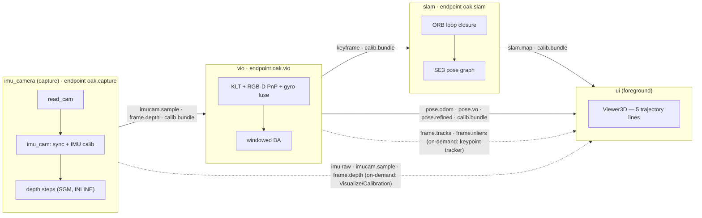

# oak-d

Companion-computer project to turn an **OAK-D W** stereo camera into a 6-DoF
position source for the flight-controller. Runs on a Mac mini today, will move
to a Raspberry Pi 5 later.

The from-scratch VIO/SLAM pipeline (formerly the `ours/` monolith) is now split
into **five independent projects** + a launcher + a verification harness. The
DepthAI/Basalt reference (`baseline/`) is kept for ATE comparison.

```
oak-d/
  imu_camera/   capture process: owns the OAK-D, syncs cam+IMU, applies IMU
                calibration, computes dense depth (SGM, INLINE). main.py = the
                capture process.
                publishes: cam.sync, imu.raw, imucam.sample, frame.depth, calib.bundle
  depth/        SGM stereo SOURCE-OF-TRUTH + the 2 depth steps. imu_camera vendors
                a byte-identical copy and runs depth inline; depth/ is a standalone
                depth-as-a-process harness (cam.sync -> frame.depth) + the tree a
                future 5th process graduates from.
  vio/          KLT frontend + RGB-D PnP (+ gyro fusion) + windowed bundle
                adjustment. main.py = the VIO process.
                publishes: pose.odom, pose.vo, pose.refined, keyframe,
                           frame.tracks, frame.inliers
  slam/         ORB loop closure + SE(3) pose-graph optimisation; a PURE VIO
                consumer (subscribes VIO's keyframes, never closes back into VIO).
                main.py = the SLAM process.
                publishes: loop.correction, slam.map
  ui/           PyQt6 single-view GUI: one Viewer3D drawing 5 trajectory lines
                (VO / VIO / VIO-BA / SLAM-corrected VIO / SLAM) + per-line toggles
                + Restart, plus Visualize / Calibration windows fed over IPC.
                main.py = the UI process.
  launcher/     process lifecycle only: spawns imu_camera + vio + slam (background)
                and ui (foreground); restart loop + orphan SHM/socket cleanup.
                ./run.sh (--proc) -> python -m launcher.main
  verification/ in-process byte-parity oracle (vs the frozen baseline_metrics.json)
                + cross-copy comms parity gate + selftests.
  baseline/     DepthAI library pipeline (BasaltVIO + RTABMapSLAM); ATE baseline.
    oakd/                baseline-only core (its Pose/frames/pngio/sources/ui)
    depthai_vio.py       real stereo-inertial VIO (dai.node.BasaltVIO)
    depthai_slam.py      VIO + SLAM with loop closure (BasaltVIO + RTABMapSLAM)
    tools/               live viewer, recorder, offline replay, ATE/RPE compare
  run.sh
  requirements.txt
```

Each of the five projects **vendors a byte-identical `comms/` package** (the
cross-project contract). One project = one self-contained, independently portable
Python package. See [The `comms/` contract](#the-comms-contract) below.

See `docs/PIPELINE_CHECKPOINTS.md` for the recording schema + migration plan, and
`docs/GOLD_SESSIONS.md` for the regression suite scenarios.

## Camera mount

- Body of camera mounts on the FRONT of the drone, looking FORWARD.
- USB connector of the camera block points UP.
- The "WIDE" label on the front of the lens block reads correctly when viewed
  from above.

This gives camera-frame axes (right-handed, OpenCV convention):
  `Xc = right`, `Yc = down`, `Zc = forward` — already aligned with the drone's
  body FRD frame, so `R_body_cam = I`.

## Coordinate conventions

- World: **NED** (North-East-Down), origin = start pose.
- Body:  **FRD** (Forward-Right-Down).
- Viewer renders ENU (East, North, Up) for natural pilot perspective; the
  underlying state stays NED.

## Quick start

`run.sh` launches the **5-project live pipeline** through the launcher:

```bash
./run.sh                                          # live: imu_camera + vio + slam + ui
./run.sh --proc                                   # explicit; identical to the default
./run.sh --no-ui                                  # headless: imu_camera + vio + slam, no GUI
./run.sh --session sessions/gold/lab_loop_30s     # replay a recorded session through the pipeline
./run.sh --width 1280 --height 800 --fps 15       # capture-resolution overrides (live)
```

`run.sh` forwards to `python -m launcher.main --auto-suffix "$@"`. The launcher
spawns `imu_camera` (capture), then `vio`, then `slam` in the background (each
subscriber boots after its publisher's endpoint exists), and runs `ui` in the
foreground so the Qt event loop owns GUI focus and a clean Ctrl-C / window-close
tears the whole pipeline down. `imu_camera.main` **defaults to replay** and takes
an explicit `--live` for hardware; the launcher's live branch passes `--live`, the
replay branch passes `--session`.

Runtime = **4 processes** (`imu_camera`, `vio`, `slam`, `ui`); depth runs INLINE
on the capture process's `imu_cam` thread, so the launcher never spawns a depth
process. `depth/` is an independent SOURCE TREE — promotable to a 5th process via
its own `depth.main` harness (see [depth/README.md](depth/README.md)).

The **baseline** (DepthAI/Basalt) viewer is a separate entry point that opens the
device directly (run it only when the live pipeline is not holding the OAK-D):

```bash
.venv/bin/python baseline/tools/view_pose3d.py --source oak    # BasaltVIO
.venv/bin/python baseline/tools/view_pose3d.py --source slam   # BasaltVIO + RTABMapSLAM
```

### Bootstrap

```bash
python3.13 -m venv .venv && .venv/bin/pip install -r requirements.txt
```

## The five projects

Each project is a standalone Python package with its own `main.py` (the process),
`comms/` (the vendored contract), `mathlib/` (the algorithm code it owns), and
`modules/` (its reactive pipeline). The data flow between processes is fixed by
the topic strings on the `comms` bus:

```
imu_camera.main ──(oak.capture)──▶ vio.main ──(oak.vio)──▶ slam.main ──(oak.slam)──▶ ui.main
   capture proc        IPC          VIO proc      IPC        SLAM proc      IPC        UI proc
                                                               (depth runs INLINE inside imu_camera)
```



| Project | main.py owns | Subscribes (IPC) | Publishes (IPC) |
|---|---|---|---|
| `imu_camera` | OAK-D (or session replay), cam+IMU sync, IMU calibration, **inline SGM depth** | — | `cam.sync`, `imu.raw`, `imucam.sample`, `frame.depth`, `calib.bundle` |
| `vio` | RGB-D visual odometry (+ gyro prior) + windowed BA | `imucam.sample`, `frame.depth`, `calib.bundle` | `pose.odom`, `pose.vo` (live-only), `pose.refined`, `keyframe`, `frame.tracks`, `frame.inliers` |
| `slam` | ORB loop closure + SE(3) pose-graph (the SLAM map) | `keyframe`, `calib.bundle` (from VIO) | `loop.correction`, `slam.map` (live-only) |
| `ui` | Qt `MainWindow`, one 5-line `Viewer3D`, Visualize/Calibration windows | `pose.odom`/`pose.vo`/`pose.refined`/`calib.bundle` (vio); `slam.map`/`calib.bundle` (slam); on-demand `imu.raw`/`imucam.sample`/`frame.depth` (capture) + `frame.tracks`/`frame.inliers` (vio) | — (sink) |
| `launcher` | process lifecycle (spawn / restart loop / orphan cleanup) | — | — |
| `depth` | standalone SGM depth-as-a-process harness | `cam.sync`, `calib.bundle` (capture) | `frame.depth` |

The architecture, endpoints, invariants, and byte-parity story are in
[docs/PROC4_ARCHITECTURE.md](docs/PROC4_ARCHITECTURE.md).

## The `comms/` contract

Every project vendors a **byte-identical** `comms/` package — the single source of
truth is `imu_camera/comms/`, copied verbatim into `depth`, `vio`, `slam`, `ui`,
and `launcher`. A `diff -r` CI gate keeps the copies in lock-step; all its internal
imports are RELATIVE, and it pulls **no depthai / no PyQt6 / no cv2** (headless-safe),
so the package drops into any project unchanged. This is what makes each project
independently portable.

`comms/` is the merge + rename of the pre-split runtime layer. **The word "flow"
is gone**; the topic strings are unchanged (the frozen contract).

| New name | Was | Role |
|---|---|---|
| `LocalPubSub` | `Bus` | in-process pub/sub — passes Python objects **directly** (zero serialization); the deterministic offline / replay / oracle path |
| `IPCPubSub(role="server"\|"client")` | `IpcServerBus` + `IpcClientBus` | cross-process pub/sub over a Unix-domain socket |
| `Module` / `SourceModule` / `ModuleContext` | `Flow` / `SourceFlow` / `FlowContext` | the threaded reactive substrate |
| `Step` | `Task` | the smallest input→output stage |
| `IPCPublisher` / `IPCSubscriber` | `IpcPublisherFlow` / `IpcSubscriberFlow` | bridge a `LocalPubSub` ↔ an `IPCPubSub` at a process boundary |
| `SharedArrayRing` / `SharedArrayRef` | (unchanged) | single-segment shared-memory ring for large image payloads |

**The wire codec replaces pickle.** `pickle` bakes the publisher's module path into
the bytes, so a decoder in a *different* vendored copy (`vio.comms.wire.WirePoseMsg`
vs `slam.comms.wire.WirePoseMsg`) could fail to resolve. The new `comms.codec`
(`encode`/`decode`) is **class-path-INDEPENDENT**: it is keyed by
`(topic → Wire* class, dataclass-field-order)` from `wire.TOPIC_WIRE`, never the
module path, so any copy decodes any other copy's bytes bit-identically into the
*decoder's own* `Wire*` type. Large arrays travel through `SharedArrayRing` shared
memory; only the metadata rides the codec. Full byte layout + the rename map are in
[imu_camera/comms/README.md](imu_camera/comms/README.md).

## The single 5-trajectory view (UI)

The UI is a **single view** (one `Viewer3D`, no tabs) drawing **five trajectory
lines**, each with its own enable/disable toggle on the Controls toolbar. The lines
form a progression — pure vision → +IMU → +windowed BA → +loop closure on the dense
path → the corrected keyframe map:

1. **VO** (grey) — `pose.vo`, the PURE-VISION frame-to-frame path (raw PnP R/t, no
   IMU, no BA); drifts most.
2. **VIO** (green) — `pose.odom`, frame-to-frame RGB-D PnP + gyro fusion; the
   responsive live marker + trail (never lags — never waits on a back-end).
3. **VIO-BA** (blue/violet) — `pose.refined`, the windowed **Bundle Adjustment**
   keyframe trajectory.
4. **SLAM-corrected VIO** (orange) — the dense VIO trail rubber-sheeted by SLAM's
   per-keyframe pose-graph corrections; segments where loop closure pulled the path
   far (correction > ~0.15 m) are flagged "teleport" and drawn in red.
5. **SLAM** (cyan) — the loop-corrected keyframe path + amber keyframe dots from
   the continuous `slam.map` stream, with a flash on each loop closure.

**Two different optimisers back the map: VIO runs windowed Bundle Adjustment (BA —
landmarks + poses) → `pose.refined`; SLAM runs Pose-Graph Optimization (PGO —
poses only, no landmarks) on loop closure, distributing drift over the whole
trajectory → `slam.map`.** SLAM keyframe motion-gating is on live
(`kf_min_trans_m=0.1`, `kf_min_rot_deg=5.0`): a keyframe joins the pose graph only
if the camera moved ≥10 cm OR rotated ≥5° since the last one.

Everything is fed over IPC — the UI imports no depthai and never opens the device
(capture owns it). SLAM stays responsive because its live module uses a
**latest-only (coalescing) inbox**: it drops a keyframe backlog and always solves
the freshest keyframe, so `slam.map` stays current instead of lagging as the pose
graph grows. The heavy BA/SLAM solves run **in-process by default**; `--worker`
(forwarded by the launcher) moves them to GIL-free child subprocesses.

The **Controls toolbar** carries the five per-line toggle buttons (all checkable,
default visible), then **Clear Trail** (clears the live trajectory trail) and
**Restart**. The IPC bus is one-way (server→client), so the UI can't reset vio/slam
in place; Restart quits with `RESTART_EXIT_CODE = 42` and the launcher's restart
loop cleans up and respawns `imu_camera + vio + slam + ui` from scratch.

The menu bar renders **in-window on every platform** (`setNativeMenuBar(False)`):

- **View** — camera presets and Follow Camera.
- **Visualize** — *Camera + Depth + IMU (triplet)* and *Keypoint Depth Tracker*,
  reusing the unchanged `ui/qt` windows, fed over IPC by the adapters in
  `ui/modules/ipc_sources.py` (capture's `imucam.sample` / `frame.depth`; for the
  tracker also VIO's `frame.tracks` / `frame.inliers`).
- **Calibration** — *Gyroscope Bias* and *Accelerometer (6-position)*, fed by
  capture's **raw** `imu.raw`. Because capture (not the UI) owns the device, a
  saved calibration is keyed per device (`device_id` from the calib bundle) and
  **takes effect on the next capture start**, not live mid-run.

## VIO algorithm notes

The accelerometer levels roll/pitch to gravity at rest, while the **gyroscope**
drives the inter-frame rotation prior: vision (PnP) corrects that rotation weighted
by its inlier confidence, *and* by how far it disagrees with the gyro — so when a
fast yaw makes the KLT tracker slip the gyro takes over the rotation. When vision
fails outright (too few tracks to even attempt PnP) the gyro still propagates the
rotation, so the body frame keeps turning instead of freezing. On a healthy frame
the fusion collapses to pure vision, so there is no accuracy cost on good data.
Position is still vision-only — this is **loosely-coupled VIO**, not Basalt's
tight-coupled optimisation.

Because position is vision-only, three **opt-in `OdometryConfig` guards** (off by
default → offline gold scoring stays byte-identical; the live VIO process turns
them on) stop the PnP solver from injecting *phantom* translation when vision
cannot be trusted. Each was tuned by measurement on the gold sessions:

- **`max_translation_speed`** (live 4.0 m/s) — under a hard shake or very fast yaw
  the surviving KLT tracks are low-parallax and PnP reads rotational image flow as a
  per-frame translation jump. A hand cannot move the camera faster than a few m/s,
  so the per-frame translation is clamped to that physical bound — caps only the
  non-physical spikes, real in-budget motion is untouched.
- **`min_inliers_for_translation`** (live 12) — pointing at a textureless surface
  KLT still fills its corner budget with garbage corners, but PnP keeps only a
  handful of inliers. Below the gate the translation is **frozen** (rotation still
  tracked by the gyro). **IMU-gated** (`imu_moving`): a motion-blurred shake also
  starves PnP of inliers, but there the camera is genuinely moving, so the
  accelerometer residual vs its EMA vetoes the freeze when actually in motion.
- **`resolve_translation_on_disagree`** — kept available but **left off live**:
  measured ineffective on the gold sessions (the freeze under hard shake is the
  missing tight-accel term, not this gate).

Own pure-NumPy frontend: pyramidal **Lucas-Kanade** optical flow + **Shi-Tomasi**
corners (no cv2). The KLT inner loop is JIT-compiled with **Numba** (optional dep)
so it runs in real time live (~15 ms/frame, vs ~140 ms pure-NumPy); without numba it
falls back to a lighter live preset. PnP, the dense **SGM** stereo matcher, the
**ORB** loop-closure frontend, and the 8-bit PNG codec are all library-free too.

The pipeline auto-scales its pixel-unit vision thresholds from the 640×400
baseline, so a lower capture resolution co-tunes automatically; the per-resolution
knobs are documented in [docs/RESOLUTION_TUNING.md](docs/RESOLUTION_TUNING.md).

**How the pipeline differs from BasaltVIO** (and the ordered roadmap to match it)
is in [docs/OURS_VS_BASALT.md](docs/OURS_VS_BASALT.md) — read that first before any
tight-coupling work.

## Verification

The live pipeline is separate OS processes over IPC, so process scheduling is
nondeterministic and the live path cannot give byte-parity. `verification/` proves
the split preserved the numerical behaviour **byte-for-byte** with an **in-process
oracle** that imports each project's verbatim-ported math directly (single
`LocalPubSub`, no `IPCPubSub`) and reproduces the pre-split deterministic scoring
loop:

```bash
# end-to-end math parity: split-project math through the frozen ATE baseline
.venv/bin/python verification/vio_oracle_runner.py \
    --session sessions/gold/lab_loop_30s --backend vio --max-frames 20
.venv/bin/python verification/oracle_replay_selftest.py        # byte-parity gate (gap = 0)

# IPC contract parity: 5-copy comms dir-diff + codec sha256 + ring + bridge round-trip
.venv/bin/python verification/ipc_comms_selftest.py
```

End-to-end byte-parity was verified live on a real OAK-D: the observed gap vs the
pre-split baseline is `0.000e+00`. The tolerance (`1e-6` mm) is a guard, never
weakened to force a pass — a divergence is a release VETO. Backends: `f2f`, `ba`,
`slam`, `vio`. Details in [verification/README.md](verification/README.md).

## Self-tests

Per-project selftests run without an OAK-D (offline gold sessions). Each project's
README lists its own; the headline gates:

```bash
# comms / codec contract (each project's copy must produce identical bytes)
.venv/bin/python -m imu_camera.tests.codec_roundtrip_selftest   # codec round-trip + frozen sha256

# math byte-parity vs the pre-split numbers
.venv/bin/python -m vio.tests.vio_ba_selftest                   # windowed BA + tight-coupled VIO
.venv/bin/python -m vio.tests.odometry_selftest                 # KLT + RGB-D PnP frontend
.venv/bin/python -m slam.tests.loop_closure_selftest            # SE(3) pose graph + loop closure
.venv/bin/python -m depth.tests.stereo_sgm_selftest             # SGM dense depth vs chip depth

# multi-process smokes over a gold session (replay; no device)
.venv/bin/python -m slam.tests.proc3_smoke_selftest \
    --session sessions/gold/lab_loop_30s --expect-loops 4       # imu_camera + vio + slam

# comms byte-identical across copies (build caches excluded)
diff -r -x '__pycache__' -x '*.pyc' -x '*.nbc' -x '*.nbi' vio/comms imu_camera/comms
```

## Status

- [x] Project scaffold + dark 3D viewer
- [x] Real visual-inertial odometry from OAK-D (baseline BasaltVIO) + SLAM (RTABMapSLAM)
- [x] From-scratch RGB-D VIO: frame-to-frame VO → windowed BA → ORB loop closure +
      SE(3) pose graph; gravity-leveled, scored vs Basalt (corridor ATE 0.61%, see
      `docs/SKYSLAM_ROADMAP.md`)
- [x] Gyro complementary fusion (loosely-coupled): gyro rotation prior + vision
      correction gated on inliers AND vision/gyro disagreement; no-op on
      well-tracked frames (gold ATE unchanged)
- [~] Tight-coupled VIO core (`vio/mathlib/backend/vio_window.py`): Forster
      on-manifold IMU preintegration + joint visual-inertial window solve, self-test
      validated, wired offline as the `vio` backend. Experimental: still regresses
      vs `ba` on healthy gold; needs online gravity estimation
- [x] Own pure-NumPy optical flow + Shi-Tomasi corners (Numba-JIT KLT, optional)
      replacing cv2; own library-free PnP, SGM dense depth, ORB loop closure, and
      8-bit PNG codec — no cv2 in any runtime path
- [x] Logging + offline replay (`baseline/tools/record_session.py` +
      `baseline/tools/viz_session.py`)
- [x] Gold regression suite (see `docs/GOLD_SESSIONS.md`)
- [x] **5-project split**: `imu_camera` / `depth` / `vio` / `slam` / `ui` + launcher,
      each vendoring a byte-identical `comms/` (codec replaces pickle); 4-process
      live runtime (depth inline); UI fault never kills capture; VIO and SLAM each
      own their own map; `./run.sh`, see [docs/PROC4_ARCHITECTURE.md](docs/PROC4_ARCHITECTURE.md)
- [x] End-to-end byte-parity vs the pre-split baseline (gap = 0), verified live on
      a real OAK-D; harness in `verification/`
- [ ] UDP / UART link to flight-controller
- [ ] Tracking-lost UI badge
- [ ] Calibration check tool
- [ ] Port to RPi5
- [ ] `skyslam` Python package (replace Basalt + RTABMap)

## Long-term

- **Software plan (research-backed)**: [docs/SKYSLAM_RESEARCH.md](docs/SKYSLAM_RESEARCH.md)
  — plan v3 with 9 phases, `numpy + opencv + gtsam + pyDBoW3`, acceptance gates.
- **Pipeline checkpoints (debug contract)**: [docs/PIPELINE_CHECKPOINTS.md](docs/PIPELINE_CHECKPOINTS.md)
  — schema C0–C9 used to compare against the baseline while building.
- **Hardware vision (long-term)**: [docs/SKYSLAM_ROADMAP.md](docs/SKYSLAM_ROADMAP.md)
  — read only the HW V1 / V2 / FC link parts (Section 3 software architecture has
  been superseded by SKYSLAM_RESEARCH.md).
</content>
</invoke>
