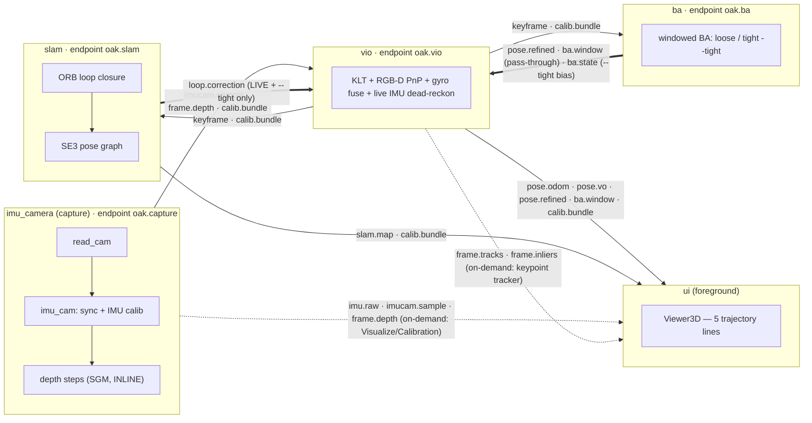

# flight-vio

Companion-computer project to turn an **OAK-D-class** stereo camera (OAK-D W or
OAK-D Lite) into a 6-DoF position source for the flight-controller. Runs on a Mac
mini today, will move to a Raspberry Pi 5 later.

The live device path is **capability auto-detecting** (`imu_camera/device/probe.py`):
it probes the connected device at open time and builds the pipeline to match —
the IMU node is created only when the device reports an IMU (an OAK-D Lite
Kickstarter unit has none; retail Lite has a BMI270; OAK-D W has a BNO086) and the
requested mono resolution is clamped to the sensor's max (the Lite's OV7251 tops
out at 640×480). No IMU → the stack runs **vision-only** automatically. When
several OAK devices are plugged into one host, pick one with **`--model`** (a
product-name substring like `lite`, or an exact `deviceId`).

> **OAK-D Lite IMU extrinsic (one-time fix).** The Lite's BMI270 EEPROM ships a
> *wrong nominal* IMU→camera rotation (`Rx(90°)`) that **flips the gravity-aligned
> startup attitude ~180° in roll** (the OAK-D W's BNO086 value is correct). Fix it
> once per device with the pose wizard — it measures the true rotation from the
> accelerometer in a few held poses and stores it per `deviceId`; every later live
> run auto-uses it (overriding the bad EEPROM value, for both the gravity seed and
> the gyro prior):
> ```bash
> .venv/bin/python -m imu_camera.tools.imu_cam_calib            # or --model lite
> ```

The from-scratch VIO/SLAM pipeline (formerly the `ours/` monolith) is now split
into **six independent projects** + a launcher + a verification harness. The
windowed-BA backend was extracted from `vio` into its own `ba` process (ADR 0001:
[docs/adr/0001-extract-windowed-ba-into-ba-process.md](docs/adr/0001-extract-windowed-ba-into-ba-process.md));
the topology is **capture → vio → ba → slam → ui**. The DepthAI/Basalt reference
(`baseline/`) is kept for ATE comparison.

```
flight-vio/
  imu_camera/   capture process: owns the OAK-D, syncs cam+IMU, applies IMU
                calibration, computes dense depth (SGM, INLINE). main.py = the
                capture process.
                publishes: cam.sync, imu.raw, imucam.sample, frame.depth, calib.bundle
  depth/        the 2 depth steps + a standalone depth-as-a-process harness
                (cam.sync -> frame.depth). The SGM stereo math is the shared
                sky.depth.stereo (imu_camera runs the same matcher inline); depth/ a
                future 5th process graduates from.
  vio/          KLT frontend + RGB-D PnP (+ gyro fusion) + live IMU dead-reckon.
                The windowed-BA backend moved to ba/; vio now opens a read-only
                --ba-endpoint client and re-emits ba's pose.refined / ba.window on
                its own endpoint (pass-through, so the UI reads one endpoint) +
                feeds ba.state (--tight bias) into propagate_imu. main.py = VIO proc.
                publishes: pose.odom, pose.vo, keyframe, frame.tracks, frame.inliers,
                           pose.refined + ba.window (re-emitted from ba)
  ba/           the windowed-BA backend (loose WindowedBAMap / tight WindowedVIOMap,
                --tight) as its OWN process; a PURE VIO consumer (subscribes VIO's
                keyframes, never closes back except the bias feed-forward).
                main.py = the BA process. 7th vendored comms/ copy.
                publishes: pose.refined, ba.window (--ba-window, loose-only),
                           ba.state (--tight bias feed-forward)
  slam/         ORB loop closure + SE(3) pose-graph optimisation; a PURE VIO
                consumer (subscribes VIO's keyframes, never closes back into VIO).
                main.py = the SLAM process.
                publishes: loop.correction, slam.map
  ui/           PyQt6 single-view GUI: one Viewer3D drawing 5 trajectory lines
                (VO / VIO / VIO-BA / SLAM-corrected VIO / SLAM) + per-line toggles
                + Restart, plus Visualize / Calibration windows fed over IPC.
                main.py = the UI process.
  lidar/        OPTIONAL downward rangefinder process: reads a VL53L1X (TOF400F)
                over I2C and publishes lidar.range on its own oak.lidar endpoint.
                A PURE producer (no capture/vio dependency, no rings). The fc sender
                BUNDLES the range into the dblink VIO-pose frame (NOT a separate
                channel). cv2-free (pimoroni-vl53l1x + smbus2). See lidar/README.md.
                publishes: lidar.range (WireRange: seq, ts_ns, range_m, valid)
  launcher/     process lifecycle only: spawns imu_camera + vio + ba + slam (+ lidar
                + fc when wired) (background) and ui (foreground); restart loop +
                orphan SHM/socket cleanup. --no-ba / --no-slam / --no-lidar are spawn gates.
                ./run.sh (--proc) -> python -m launcher.main
  verification/ in-process byte-parity oracle (vs the frozen baseline_metrics.json)
                + cross-copy comms parity gate + selftests.
  netbridge/    OPTIONAL cross-machine TCP bridge: runs the flight stack on a Pi
                (capture + vio + ba + slam) and the UI on a Mac, live over WiFi.
                forward.py (Pi: local IPC -> TCP) + receive.py (Mac: TCP -> local
                IPC re-serve) + tcp_transport.py (HMAC-authed AF_INET transport).
                Vendors comms/ as another byte-identical copy (ba/ added a 7th, so
                netbridge is now the 8th on disk); the UI is byte-for-byte unchanged.
                See netbridge/README.md + docs/RPI5_DEPLOY.md §3a.
  baseline/     DepthAI library pipeline (BasaltVIO + RTABMapSLAM); ATE baseline.
    frames.py            NED/ENU/quat math
    pose.py              Pose + PoseHistory
    sources/             PoseSource ABC + fake + the two real device sources
      base.py              PoseSource ABC
      fake.py              FakePoseSource (UI bring-up, no device)
      basalt_vio.py        OakBasaltVioSource — stereo-inertial VIO (dai.node.BasaltVIO)
      basalt_slam.py       OakBasaltSlamSource — VIO + loop closure (BasaltVIO + RTABMapSLAM)
    capture/             session recorder + PNG codec
      recorder.py          SessionRecorder
      pngio.py             PNG codec
    ui/                  baseline-only Qt UI (theme, viewer3d, mainwindow, panels)
    tools/               live viewer, recorder, offline replay, ATE/RPE compare
  run.sh                 6-project live pipeline launcher
  run-baseline.sh        DepthAI/Basalt reference launcher
  requirements.txt
```

Each of the six projects **vendors a byte-identical `comms/` package** (the
cross-project contract). One project = one self-contained, independently portable
Python package. See [The `comms/` contract](#the-comms-contract) below.

See `docs/PIPELINE_CHECKPOINTS.md` for the recording schema + migration plan, and
`docs/GOLD_SESSIONS.md` for the regression suite scenarios.

## Camera mount

- Body of camera mounts on the FRONT of the drone, looking FORWARD.
- USB connector of the camera block points UP.
- The "WIDE" label on the front of the lens block reads correctly when viewed
  from above.

This gives camera-frame axes (right-handed, OpenCV convention):
  `Xc = right`, `Yc = down`, `Zc = forward` — already aligned with the drone's
  body FRD frame, so `R_body_cam = I`.

## Coordinate conventions

- World: **NED** (North-East-Down), origin = start pose.
- Body:  **FRD** (Forward-Right-Down).
- Viewer renders ENU (East, North, Up) for natural pilot perspective; the
  underlying state stays NED.

## Quick start

`run.sh` launches the **6-project live pipeline** through the launcher:

```bash
./run.sh                                          # live: imu_camera + vio + ba + slam + ui
./run.sh --proc                                   # explicit; identical to the default
./run.sh --no-ui                                  # headless: imu_camera + vio + ba + slam, no GUI
./run.sh --no-ba                                  # lean: skip the BA process (no pose.refined / bias feed)
./run.sh --session sessions/gold/lab_loop_30s     # replay a recorded session through the pipeline
./run.sh --width 320 --height 200                 # lower capture resolution (see "Resolution presets")
```

`run.sh` forwards to `python -m launcher.main --auto-suffix "$@"`. The launcher
spawns `imu_camera` (capture), then `vio`, then `ba`, then `slam` in the background
(each subscriber boots after its publisher's endpoint exists — `ba` and `slam` both
consume vio's `keyframe`), and runs `ui` in the foreground so the Qt event loop owns
GUI focus and a clean Ctrl-C / window-close tears the whole pipeline down.
`imu_camera.main` **defaults to replay** and takes an explicit `--live` for hardware;
the launcher's live branch passes `--live`, the replay branch passes `--session`.

Runtime = **5 processes** (`imu_camera`, `vio`, `ba`, `slam`, `ui`); the windowed BA
runs in its own `ba` process and `vio` re-emits its `pose.refined` on the VIO endpoint
(pass-through, so the UI reads one endpoint — see ADR 0001). Depth runs INLINE on the
capture process's `imu_cam` thread, so the launcher never spawns a depth process.
`depth/` is an independent SOURCE TREE — promotable to its own process via a
`depth.main` harness (see [depth/README.md](depth/README.md)).

### Key live recipes

```bash
# the 54x42 VL53-class ToF recipe (low-res odometry that beats sparse VIO at 54x42)
./run.sh --vl53l9cx --direct

# headless flight path (Pi / FC): no GUI, logs raw pose for the flight controller
./run.sh --no-ui

# stream the VIO pose to the drone FC over UART (dblink); --direct gives usable pos_sigma_m
./run.sh --vl53l9cx --direct --fc /dev/ttyAMA0

# remote UI over WiFi: Pi runs the flight stack, Mac runs the UI
./run.sh --no-ui --forward HOST:PORT          # on the Pi
./deploy/pi-ui.sh --connect <pi-host>:PORT   # on the Mac (same OAKD_NETBRIDGE_KEY)
```

- **`--vl53l9cx --direct` — the 54×42 ToF recipe.** `--vl53l9cx` feeds the
  ToF-sim depth at the fixed 54×42 grid (below); `--direct` selects the **dense
  direct photometric** front-end (frame-to-keyframe photometric alignment + an
  IMU-seeded dead-reckon prior + a divergence guard) instead of the sparse KLT/PnP
  path. This is the low-res odometry that actually tracks (and beats sparse VIO) at
  54×42, where features are starved by design. Both are **OPT-IN** (default = the
  loose sparse path); the offline/oracle path never sees `--direct`, so byte-parity
  stays `gap = 0`.
- **`--tight` — the tight-coupled VIO backend (opt-in).** Swaps the loose
  gyro-fusion BA for a Basalt-style joint window solve (pose + velocity + bias +
  landmarks with true IMU preintegration factors). Its LM solve carries a four-link
  optimisation chain, all ON by default inside `--tight`: an exact **landmark Schur
  complement**, an **absolute-velocity gauge regulariser** (fixes the rank-3
  null-space round-off chaos that made the old tight solve explode on shake), an
  always-on **divergence guard** (bounds a diverged keyframe and raises a
  `vio_degraded` health flag), and an **njit IMU-Jacobian kernel** (coupled to the
  guard; `SKY_VIO_IMU_NJIT=0` to force pure-Python). Loose is the default and the
  recommended Pi flight path; `--tight` is still slower than loose. Details in
  [docs/TIGHT_COUPLED_PLAN.md](docs/TIGHT_COUPLED_PLAN.md) §4(g–j).
- **`--no-ui` — headless flight.** Runs capture + vio + ba + slam headless (once, no
  Restart loop; pair with `--no-ba` / `--no-slam` for the leanest stack) and starts a
  read-only pose logger on the VIO endpoint that prints the **raw pose** (position +
  quaternion in the gravity-aligned WORLD frame; the FC derives heading itself),
  throttled to ~2 Hz — a *preview*, not the FC link itself (the actual FC output is
  `--fc`, below). Independent of `--fc`.
- **`--fc PORT[:BAUD]` — stream the pose to the drone FC over UART (dblink).** Spawns
  the consumer-only `fc` process (after `slam`), which converts each VIO pose to the
  FC's NED earth frame and writes it as a **dblink `DB_CMD_VIO_POSE`** frame over
  the serial port — the in-house FC protocol, **not** MAVLink. Additive + **non-fatal**
  (a bad / missing port logs + exits without taking the stack down). The position
  noise `pos_sigma_m` is only populated on `--direct`, so the recipe for a *usable* FC
  position fix is `--vl53l9cx --direct --fc /dev/ttyAMA0`; on the loose path the sigma
  is inflated and the FC ignores VIO position. `--fc-rate` (Hz, clamped `[10,50]`) and
  `--fc-mount` (`R_body_cam` extrinsic) tune it. Full contract, payload, and the `age`
  time model: [fc/README.md](fc/README.md).
- **Downward rangefinder (`lidar`) — bundled into the FC link.** When `--fc` is set the
  launcher ALSO spawns the consumer-free **`lidar`** process (after `slam`, before `fc`):
  it reads a downward **VL53L1X** (a TOF400F breakout) over **I2C** (default
  `/dev/i2c-1`, address `0x29`) and publishes the gated AGL range on `lidar.range`. `fc`
  subscribes it and **bundles** `range_m` (+ a `range_valid` flag) **into the dblink
  VIO-pose frame** — it is NOT a separate dblink channel; the payload grew from 38→**42 B**
  (`'<8fIBBf'`, `range_m` @ offset 38, `VIO_FLAG_RANGE_VALID=0x08`). Two gates: the sensor
  side (`range_status==0` AND 30–4000 mm) and an fc-side 200 ms freshness gate; a stale /
  rejected / absent reading sends `range_valid=0`. **`--no-lidar`** skips the process (mirror
  `--no-slam`) for a rig with no rangefinder; **`--lidar-mock`** runs the hardware-free
  reader for a deviceless dry-run. Before flight run **`python -m lidar.tools.characterize`**
  on the ground to set the FC `disarm_range`. Full I2C wiring + bring-up:
  [lidar/README.md](lidar/README.md).
- **Remote UI over WiFi (`netbridge`).** With `--forward HOST:PORT` the launcher
  ALSO spawns `netbridge.forward` on the Pi (one more managed flight subprocess) to
  bridge the local IPC graph to TCP; on the Mac `./deploy/pi-ui.sh --connect
  <pi>:PORT` starts `netbridge.receive`, which re-serves the same `oak.*` endpoints
  into Mac-local rings so the **UI is byte-for-byte unchanged**. Auth is the
  `OAKD_NETBRIDGE_KEY` HMAC secret (a one-time connect handshake, not per-frame, and
  **not** encryption); if it is unset both ends fall back to a built-in **default
  key** so the bridge connects with no setup on a trusted LAN (export a real secret
  on both hosts for an untrusted network). Full setup:
  [docs/RPI5_DEPLOY.md §3a](docs/RPI5_DEPLOY.md) +
  [netbridge/README.md](netbridge/README.md).
- **RPi5 deploy.** The intended flight target is a Raspberry Pi 5; the flight
  runtime is **cv2-free and Qt-free** (`requirements-flight.txt`: numpy + numba +
  pyserial + depthai, **no OpenCV, no PyQt6**), so the Pi never installs opencv/Qt.
  The full setup runbook is [docs/RPI5_DEPLOY.md](docs/RPI5_DEPLOY.md).

## Resolution presets (suggested run params)

You only ever pass `--width/--height`, `--fps`, and `--kf-every`. Everything else —
the SGM disparity range, the corner budget, the KLT window, the ORB budget — is
**auto-scaled from the width** by
`ResolutionProfile` ([comms/lib/config/resolution.py](imu_camera/comms/lib/config/resolution.py)),
so there is nothing else to hand-tune. Append `--session sessions/gold/<name>`
to replay instead of going live, or `--no-ui` for headless.

| Resolution | fps | kf-every | Use case |
|---|---|---|---|
| 1280×800 | 10 | 8 | Max accuracy. **Not CPU-realtime** (192-disparity SGM) |
| 640×400  | 20 | 5 | Best quality + realtime on a good CPU — the tuning baseline |
| 320×200  | 20 | 5 | Balanced; light CPU — good default for a modest machine |
| 160×100  | 20 | 4 | **Practical VIO floor** (SBC / low-power); pose noisier but tracks |

```bash
./run.sh --width 1280 --height 800 --fps 10 --kf-every 8
./run.sh --width 640  --height 400 --fps 20 --kf-every 5
./run.sh --width 320  --height 200 --fps 20 --kf-every 5
./run.sh --width 160  --height 100 --fps 20 --kf-every 4
```

What auto-scales with width (for reference — **not** CLI knobs):

| Resolution | SGM disparities | corners | KLT window | ORB feats | ~near-depth |
|---|---|---|---|---|---|
| 1280×800 | 192 | 800 | 43px / 3lvl | 1600 | ~0.40 m |
| 640×400  | 96  | 400 | 21px / 3lvl | 800  | ~0.40 m |
| 320×200  | 48  | 200 | 11px / 2lvl | 400  | ~0.40 m |
| 160×100  | 32  | 100 | 7px / 1lvl  | 200  | ~0.30 m |

Tips:
- **Every project is its own process and runs its solve in-process** — capture, vio,
  `ba` (windowed BA), and `slam` (loop closure + pose graph) are four separate OS
  processes, so the heavy BA/SLAM solves are already off the vio/frontend GIL with no
  flag to toggle. SLAM keeps its live map current via a latest-only inbox (it drops a
  backlog instead of lagging).
- **Watch `src fps`** in the UI telemetry panel — if it sits well below `--fps`,
  the CPU is not keeping up; drop the resolution or the fps.
- **`--kf-every`** ↑ at high resolution to lighten BA/SLAM; ↓ at low resolution
  for a denser keyframe map.
- **`--recalibrate-bias`** on a new device (hold still ~1 s, once); **`--no-gyro`**
  for pure-vision if the IMU calibration is untrusted.
- **`--use-camera-calib`** to apply your **own** saved stereo calib instead of the
  factory one (default OFF — the OAK-D factory calib is the trusted metrology
  reference). Opt in only after running the camera wizard.
- **`--model NAME`** (live) picks which OAK device to open when several are plugged
  into the host — a product-name substring (`--model lite`) or an exact `deviceId`.
  With a single device connected it is optional. Capabilities (IMU presence, mono
  resolution) are **always** auto-detected from the selected device; `--model` only
  chooses *which* device, not *what* it can do. On an OAK-D Lite without an IMU the
  stack runs vision-only — for the low-res ToF recipe pair it with `--vl53l9cx
  --direct` (dense direct VO carries its own seed and needs no IMU).
- The half-res live SGM preset (`depth_fast`) is always on — no flag needed.
- ⚠️ **160×100 is the practical stereo VIO floor.** Below it the depth map is
  structurally starved (the disparity-search floor spans an ever-larger fraction
  of the width), too few corners survive, and PnP finds no inliers — *information*-
  starved, not CPU-starved. Going below 160×100 for real odometry needs a
  different strategy (on-chip / ToF depth + IMU-led odometry), not a tuning tweak.

## VL53L9CX ToF simulation (`--vl53l9cx`)

We have no real ToF sensor, so we **simulate a VL53L9CX-class ToF camera using
the OAK-D as the stand-in**. The flag publishes an accurate per-pixel depth map +
a synced intensity (gray) frame + IMU at the fixed ToF grid **54×42**.

The trick is **compute high, downsample** — *not* a direct low-res stereo solve:
depth is computed on the OAK-D at the normal source resolution
(`--width`/`--height`, default 640×400, where SGM actually works), then the
rectified-left gray and the metric depth are downsampled to 54×42 before publish.
Gray is reduced by area averaging; depth by a **block-median of the valid (>0)
source pixels per output cell** (median-of-valid fills the small holes a low-res
solve would leave and averages the noise, the way a real ToF returns dense depth)
— never a linear resize, which would blend across object edges and holes. The
published `imucam.sample` gray, `frame.depth`, and the retained `calib.bundle` K
are all at 54×42 and consistent (K is scaled **anisotropically**: `fx,cx ×54/W`,
`fy,cy ×42/H`; depth metres are unchanged). Measured valid coverage is ~99 % at
54×42 (vs ~19 % for direct low-res stereo). The same downsample stage runs on both
**live** (OAK-D) and **replay** (gold session) sources.

```bash
./run.sh --vl53l9cx                                          # live
./run.sh --session sessions/gold/lab_loop_30s --vl53l9cx     # replay
```

> This is the **sensor simulation** — the deliverable here is the accurate 54×42
> ToF frame + depth flowing through the pipeline. Making VIO actually *track* at
> 54×42 is a separate WIP (54×42 is feature-starved by design); VIO logging `LOST`
> at this resolution is expected and not a regression.

The **baseline** (DepthAI/Basalt) reference pipeline has its own launcher,
`run-baseline.sh`, the sibling of `run.sh` (run.sh = the 6-project from-scratch
pipeline; run-baseline.sh = the DepthAI/Basalt reference). It opens the OAK-D
directly, so run it only when the live pipeline is not holding the device.
Runs on any OAK-D-class device with a stereo pair **and an IMU** — verified on the
OAK-D W (BNO086) and the OAK-D Lite retail (BMI270 @ 640×400). (The Lite shipped a
wrong EEPROM IMU extrinsic that flipped the startup attitude ~180°; fixed by flashing
the corrected `diag(1,-1,-1)` into the device EEPROM — see `baseline/sources/basalt_vio.py`.
That fixes BasaltVIO AND the from-scratch stack, since both read the device EEPROM.)

```bash
./run-baseline.sh                          # Basalt VIO (oak)  — default
./run-baseline.sh --source slam            # Basalt VIO + RTABMap SLAM
./run-baseline.sh --width 320 --height 200 # lower res (160/80 are below Basalt's envelope)
./run-baseline.sh --source fake            # UI bring-up, no device
```

`run-baseline.sh` forwards to `baseline/tools/view_pose3d.py`, which accepts
`--source {fake,oak,slam}` plus `--width/--height/--fps` (and the advanced
`--vio-config`, below).

#### Baseline (Basalt) tuning

- **640×400 is the FAIR comparison point.** Stock `dai.node.BasaltVIO`
  auto-reads its full calibration (intrinsics, stereo + IMU extrinsics, noise)
  from the device EEPROM, and its optical-flow constants (grid_size=50,
  levels=3, image_safe_radius=472) are tuned for ~VGA. It is already
  well-configured there — **don't hand-tune it at 640×400.**
- **Below ~VGA it falls apart, by design.** Those VGA-tuned pixel constants
  starve features at 160×100 / 80×50 (a 50 px grid on a 160-wide image is only
  ~3×2 cells), so Basalt drifts / loses tracking. This is **out of its design
  envelope**, NOT a bug and NOT a calibration issue (intrinsics *do* auto-scale
  with resolution). Our pipeline wins at low resolution because it is
  resolution-adaptive by design — a real advantage for the embedded target, but a
  **low-res-only** result. The honest head-to-head is at **640×400**, where Basalt
  is the strong reference our `verification/` ATE numbers are scored against.
- **`--vio-config PATH` (advanced, rarely worth it).** Forwarded to
  `BasaltVIO.setConfigPath`. Basalt's cereal loader needs a **COMPLETE**
  `vio_config.json` (a `value0` wrapper, every field keyed `config.<name>`, ALL
  fields present) — a partial file fails with `JSON Parsing failed - provided NVP
  (config.optical_flow_type) not found`. The only reliable way to get a valid one
  is to dump a known-good config from your depthai/Basalt build and edit it, then
  A/B it against stock on the device. Don't expect it to make 160×100 competitive
  — that is below Basalt's floor regardless.
- **Do NOT hand-set IMU noise / extrinsics.** The stock auto-config from EEPROM
  is correct, and `setGyroNoiseStd` / `setAccelNoiseStd` carry an undocumented
  square-root units trap. Leave them alone.

### Bootstrap

```bash
# Full dev/UI/tools/calib install (includes OpenCV for the Qt overlays, the
# calibration wizard, the PnP A/B oracle, and the parity/bench tooling):
python3.13 -m venv .venv && .venv/bin/pip install -r requirements.txt

# Lean FLIGHT install for the Pi -- NO OpenCV (numpy + numba + pyserial +
# depthai + pimoroni-vl53l1x + smbus2 for the downward rangefinder, both
# pure-Python/cv2-free). The whole imu_camera -> vio -> ba -> slam (+ lidar)
# runtime runs with cv2 uninstalled; proven by
# `python -m verification.cv2_absent_flight_litmus`:
.venv/bin/pip install -r requirements-flight.txt
```

## The six projects

Each project is a standalone Python package with its own `main.py` (the process),
`comms/` (the vendored contract), `modules/` (its pipeline), and its
process-coupled glue organised **by concern** at the project root — e.g.
`imu_camera/device/` (the OAK-D driver), `ba/engine/` and `slam/engine/` (the
swappable solve runners — `vio/engine/` was removed when the BA backend left for
`ba/`), `<proj>/resolution_build.py` + `<proj>/warmup.py` (the math-coupled config
builders + JIT warmup), and `ui/calib/` (the UI calib math).
The shared algorithm code those processes call lives once in the top-level
[`sky/`](#the-sky-shared-library) library (`sky.math` primitives + `sky.depth` SGM
stereo + `sky.front` / `sky.backend` / `sky.vio` / `sky.slam` / `sky.imu` /
`sky.sensors` / `sky.calib`). The data flow between processes is fixed by the
topic strings on the `comms` bus (`vio` produces `keyframe`, consumed by BOTH `ba`
and `slam`; `ba`'s `pose.refined` is re-emitted on the VIO endpoint, see ADR 0001):

```
imu_camera.main ─(oak.capture)─▶ vio.main ─(oak.vio)─┬─▶ ba.main   ─(oak.ba)─┐
   capture proc       IPC         VIO proc     IPC    └─▶ slam.main ─(oak.slam)┴─▶ ui.main
                                  (depth runs INLINE inside imu_camera)   ba.pose.refined re-emitted on oak.vio
```



| Project | main.py owns | Subscribes (IPC) | Publishes (IPC) |
|---|---|---|---|
| `imu_camera` | OAK-D (or session replay), cam+IMU sync, IMU calibration, **inline SGM depth** | — | `cam.sync`, `imu.raw`, `imucam.sample`, `frame.depth`, `calib.bundle` |
| `vio` | RGB-D visual odometry (+ gyro prior) + live IMU dead-reckon (NO backend) | `imucam.sample`, `frame.depth`, `calib.bundle` (capture); `loop.correction` (slam); `pose.refined`/`ba.window`/`ba.state` (ba, `--ba-endpoint`) | `pose.odom`, `pose.vo` (live-only), `keyframe`, `frame.tracks`, `frame.inliers`, + re-emitted `pose.refined`/`ba.window` |
| `ba` | windowed BA — loose `WindowedBAMap` / tight `WindowedVIOMap` (`--tight`) | `keyframe`, `calib.bundle` (from VIO) | `pose.refined`, `ba.window` (`--ba-window`, loose-only), `ba.state` (`--tight` bias) |
| `slam` | ORB loop closure + SE(3) pose-graph (the SLAM map) | `keyframe`, `calib.bundle` (from VIO) | `loop.correction`, `slam.map` (live-only) |
| `ui` | Qt `MainWindow`, one 5-line `Viewer3D`, Visualize/Calibration windows | `pose.odom`/`pose.vo`/`pose.refined`/`ba.window`/`calib.bundle` (vio); `slam.map`/`calib.bundle` (slam); on-demand `imu.raw`/`imucam.sample`/`frame.depth` (capture) + `frame.tracks`/`frame.inliers`/`keyframe` (vio) | — (sink) |
| `fc` | drone-FC UART output (`--fc`): pose → NED → **dblink** `DB_CMD_VIO_POSE` over serial (with the bundled downward `range_m`); consumer-only sink (no server). See [fc/README.md](fc/README.md) | `pose.odom`, `calib.bundle` (from VIO); `lidar.range` (from lidar, when wired) | — (writes UART, not IPC) |
| `lidar` | OPTIONAL downward rangefinder (`--fc`, unless `--no-lidar`): VL53L1X/TOF400F over **I2C** → `lidar.range`; pure producer (no rings). The `fc` sender bundles it into the VIO-pose frame. See [lidar/README.md](lidar/README.md) | — | `lidar.range` |
| `launcher` | process lifecycle (spawn / restart loop / orphan cleanup; `--no-ba`/`--no-slam`/`--no-lidar` spawn gates) | — | — |
| `depth` | standalone SGM depth-as-a-process harness | `cam.sync`, `calib.bundle` (capture) | `frame.depth` |

The architecture, endpoints, invariants, and byte-parity story are in
[docs/PROC4_ARCHITECTURE.md](docs/PROC4_ARCHITECTURE.md).

## The `comms/` contract

Every project vendors a **byte-identical** `comms/` package — the single source of
truth is `imu_camera/comms/`, copied verbatim into `depth`, `vio`, `slam`, `ui`,
`launcher`, and `netbridge` (a **7th** copy). A `diff -r` / sha256 CI gate keeps the
copies in lock-step; all its internal imports are RELATIVE, and it pulls **no depthai
/ no PyQt6 / no cv2** (headless-safe), so the package drops into any project
unchanged. This is what makes each project independently portable.

`comms/` is the merge + rename of the pre-split runtime layer. **The word "flow"
is gone**; the topic strings are unchanged (the frozen contract).

## The `sky/` shared library

`sky/` is the ONE shared in-tree algorithm library (importable as `import sky`).
Duplicated algorithm code is being consolidated into it one domain at a time
(see `docs/CONSOLIDATION_PLAN.md`), each step gated on the byte-parity oracle
staying `gap = 0`. Unlike `comms/` (which is *vendored* per project because it is
the wire contract), `sky/` is a single shared package and is the Python precursor
to the C `libsky*` layering. Sub-packages so far:

- **`sky.math`** (`sky/math/so3.py`, `sky/math/se3.py`) — the Lie-group /
  linear-algebra **primitives** (`so3_exp`, `so3_log`, `so3_right_jacobian`,
  `skew`, `se3_exp`, `se3_log`, `se3_inv`, `se3_adjoint`, `se3_from_Rp`) that used
  to be copy-pasted across `imu_camera/`, `vio/` and `slam/`'s `mathlib/`. This
  was the standalone `skymath/` package, re-homed under `sky` so there is ONE
  common library. Pure-`numpy`. Where the old copies had *genuine* numerical
  drift in their near-singularity handling, the variants are kept under distinct
  names rather than silently unified:
  - `so3_exp` (BA convention, `I + skew` at zero) vs `so3_exp_unit` (IMU
    convention, exact `I` at zero) — identical for any `‖φ‖ ≥ 1e-12`.
  - `so3_log` / `se3_log` (bundle/IMU) vs `so3_log_robust` / `se3_log_robust`
    (pose-graph: sign-robust near a half-turn + closed-form `V⁻¹`).
- **`sky.depth`** (`sky/depth/stereo.py`) — the from-scratch SGM dense-stereo
  matcher + rectifiers. This is the ONE canonical copy (numpy + numba): it used to
  be vendored byte-identically in both `imu_camera/mathlib/stereo` and
  `depth/mathlib/stereo` under a `diff -r` lock-step gate; consolidating to a
  single import here retired that gate.
- **`sky.front`** (`pnp`, `klt`, `klt_numba`, `corners`, `frontend`, `odometry`,
  `direct`) — the VIO front-end: library-free RGB-D PnP RANSAC, the Numba-JIT KLT
  tracker + Shi-Tomasi corners, the frame-to-frame frontend, the loose
  `RGBDVisualOdometry`, and the dense **direct** photometric VO (`--direct`; its
  Sobel gradients + Gaussian pyramid are pure-NumPy, bit-exact vs `cv2`, so the
  flight path carries no OpenCV).
- **`sky.backend`** (`bundle`, `windowed`, `marginalize`) — the optimizer core:
  the factor-agnostic Gauss-Newton/Schur `bundle`, the windowed-BA map, and the
  (opt-in) sqrt marginalization helper.
- **`sky.imu`** (`imu`, `inertial_filter`, `timed_buffer`) — the **loose** IMU
  path: Forster on-manifold preintegration, the complementary inertial filter, and
  the time-aligned sample buffer. (`vio`'s tight-VIO superset lives in
  `sky.vio` — `sky/vio/imu.py` + `sky/vio/window.py`.)
- **`sky.sensors`** (`imu_calib`, `accel_calib`, `calib_collect`, `calib_store`)
  — the IMU gyro/accel calibration math + the on-device collection / persistence.
- **`sky.slam`** (`orb`, `loopclosure`, `posegraph`, `slam`) — the loop-closure
  stack: ORB (oriented-FAST + rotated-BRIEF, no cv2), appearance+geometric loop
  verification, the SE(3) pose graph, and the `SlamMap` orchestrator.
- **`sky.calib`** (`detect`, `collector`, `solve`, `writer`, `checkerboard`) — the
  stereo camera-calibration wizard math: checkerboard detection / generation, view
  collection, the K + distortion + `T_left_right` solve, and the `calib.json` writer.

**Movability rule (enforced).** `sky.*` may import only `numpy` (+ optional
`numba` JIT) and must NEVER import any flight-vio process / `comms` / `io` module.
`cv2` is no longer in any `sky.*` flight path — the gradients/pyramids
(`sky.front.direct`), stereo denoise (`sky.depth.stereo`), ORB loop closure
(`sky.slam.orb`), KLT/corners/PnP are all pure-NumPy; cv2 is imported lazily ONLY
by the dev-only PnP A/B oracle (`OAKD_OWN_PNP=0`) and the calibration wizard
(`sky.calib`, `--use-camera-calib`). `sky.assert_import_clean()` checks the leaf
rule after a bare `import sky.*` (run by the consolidation self-tests), keeping
the library portable as-is.

What REMAINS in each project (now organised **by concern** at the project root,
the misnamed `mathlib/` grab-bag having been dissolved) is the process-coupled
glue, not the shared algorithms: `imu_camera` keeps `device/*` (live OAK-D handles
+ the IMU `imu_decode.py` + the camera-calib store) + `resolution_build.py` /
`warmup.py`; `vio` keeps `engine/` + `resolution_build.py` / `warmup.py` (its
tight-VIO Phase-4 code now lives in `sky.vio`); `slam` keeps `engine/` +
`resolution_build.py`; `ui` keeps a thin `calib/checkerboard.py` wrapper
(re-exports `sky.calib.checkerboard` plus the Qt / PNG-save side); `depth` keeps
no math at all (its SGM runs from `sky.depth`).

| New name | Was | Role |
|---|---|---|
| `LocalPubSub` | `Bus` | in-process pub/sub — passes Python objects **directly** (zero serialization); the deterministic offline / replay / oracle path |
| `IPCPubSub(role="server"\|"client")` | `IpcServerBus` + `IpcClientBus` | cross-process pub/sub over a Unix-domain socket |
| `Module` / `SourceModule` / `ModuleContext` | `Flow` / `SourceFlow` / `FlowContext` | the threaded reactive substrate |
| `Step` | `Task` | the smallest input→output stage |
| `IPCPublisher` / `IPCSubscriber` | `IpcPublisherFlow` / `IpcSubscriberFlow` | bridge a `LocalPubSub` ↔ an `IPCPubSub` at a process boundary |
| `SharedArrayRing` / `SharedArrayRef` | (unchanged) | single-segment shared-memory ring for large image payloads |

**The wire codec replaces pickle.** `pickle` bakes the publisher's module path into
the bytes, so a decoder in a *different* vendored copy (`vio.comms.wire.WirePoseMsg`
vs `slam.comms.wire.WirePoseMsg`) could fail to resolve. The new `comms.codec`
(`encode`/`decode`) is **class-path-INDEPENDENT**: it is keyed by
`(topic → Wire* class, dataclass-field-order)` from `wire.TOPIC_WIRE`, never the
module path, so any copy decodes any other copy's bytes bit-identically into the
*decoder's own* `Wire*` type. Large arrays travel through `SharedArrayRing` shared
memory; only the metadata rides the codec. Full byte layout + the rename map are in
[imu_camera/comms/README.md](imu_camera/comms/README.md).

## The single 5-trajectory view (UI)

The UI is a **single view** (one `Viewer3D`, no tabs) drawing **five trajectory
lines**, each with its own enable/disable toggle on the Controls toolbar. The lines
form a progression — pure vision → +IMU → +windowed BA → +loop closure on the dense
path → the corrected keyframe map:

1. **VO** (grey) — `pose.vo`, the PURE-VISION frame-to-frame path (raw PnP R/t, no
   IMU, no BA); drifts most.
2. **VIO** (green) — `pose.odom`, frame-to-frame RGB-D PnP + gyro fusion; the
   responsive live marker + trail (never lags — never waits on a back-end).
3. **VIO-BA** (blue/violet) — `pose.refined`, the windowed **Bundle Adjustment**
   keyframe trajectory.
4. **SLAM-corrected VIO** (orange) — the dense VIO trail rubber-sheeted by SLAM's
   per-keyframe pose-graph corrections; segments where loop closure pulled the path
   far (correction > ~0.15 m) are flagged "teleport" and drawn in red.
5. **SLAM** (cyan) — the loop-corrected keyframe path + amber keyframe dots from
   the continuous `slam.map` stream, with a flash on each loop closure.

Over the trajectory lines the viewer carries a **two-tier tracking-lost
master-warning badge** pinned top-centre, plus a recolour of the live drone
marker, driven solely by the abstract `pose.tracking_ok` / `pose.inertial_dr`
flags (kept multi-chip-generic). It latches lost only after `LOST_DEBOUNCE_POSES
= 5` consecutive lost poses (so a single dropped frame can't flash) and clears on
the first OK pose. While latched, the tier is chosen per-frame:
- **AMBER `⚠ VISION LOST · INERTIAL DR`** + amber marker when the `--tight` IMU is
  still dead-reckoning a valid pose (`pose.inertial_dr` True) — vision lost but
  the live pose keeps moving;
- **RED `⚠ TRACKING LOST`** + red marker when there is no inertial fallback (loose
  path frozen).

The amber↔red choice is a presentation flip, so the badge can switch live (e.g.
DR stops → goes red) without re-arming the debounce — the prominent main-view
counterpart to the side `TelemetryPanel`'s small OK/DR/LOST readout.

**Two different optimisers back the map: VIO runs windowed Bundle Adjustment (BA —
landmarks + poses) → `pose.refined`; SLAM runs Pose-Graph Optimization (PGO —
poses only, no landmarks) on loop closure, distributing drift over the whole
trajectory → `slam.map`.** SLAM keyframe motion-gating is on live
(`kf_min_trans_m=0.1`, `kf_min_rot_deg=5.0`): a keyframe joins the pose graph only
if the camera moved ≥10 cm OR rotated ≥5° since the last one.

Everything is fed over IPC — the UI imports no depthai and never opens the device
(capture owns it). SLAM stays responsive because its live module uses a
**latest-only (coalescing) inbox**: it drops a keyframe backlog and always solves
the freshest keyframe, so `slam.map` stays current instead of lagging as the pose
graph grows. The heavy BA and SLAM solves each run **in their own process**
(`ba` / `slam`), in-process on that process's own thread — they are already off the
vio/frontend GIL by construction (there is no internal worker child to toggle).

The **Controls toolbar** carries the five per-line toggle buttons (all checkable,
default visible), then **Clear Trail** (clears the live trajectory trail) and
**Restart**. The IPC bus is one-way (server→client), so the UI can't reset
vio/ba/slam in place; Restart quits with `RESTART_EXIT_CODE = 42` and the launcher's
restart loop cleans up and respawns `imu_camera + vio + ba + slam + ui` from scratch.

The menu bar renders **in-window on every platform** (`setNativeMenuBar(False)`):

- **View** — camera presets and Follow Camera.
- **Visualize** — *Camera + Depth + IMU (triplet)*, *Keypoint Depth Tracker*,
  *Gyro Fusion (strip chart)*, *Loop Closure*, *Pose Graph (before/after)*, *BA Window*,
  *Frontend Internals*, and *SLAM Map (3D room)*.
  - *Pose Graph (before/after)* — the **SE(3) pose-graph optimization** made visible: a
    2D top-down (world X–Z) view of the keyframe poses as graph **nodes**, **odometry
    edges** chaining consecutive keyframes, and the confirmed **loop edge(s)** as a
    magenta chord ("keyframe `cur` is back at keyframe `old`"). A **before/after toggle**
    swaps the raw/drifted VIO node positions (the loop is **open** — chord long) for the
    pose-graph-corrected ones (the loop **closes** — chord collapses), with the other
    state ghosted behind; **per-node correction arrows** spread from ~0 at the anchor to
    large near the loop, so "the drift correction is redistributed smoothly along the
    whole path, not dumped at one spot" is literal. A **timeline slider** scrubs the
    loop-closure events. It is a **pure UI consumer** of existing topics — VIO's raw
    `pose.odom` (before) + SLAM's `slam.map` corrected poses (after) + SLAM's `slam.loop`
    edges — so there is **no new IPC topic** and the byte-parity oracle stays gap=0.
  - *BA Window* (opt-in, launch with `--ba-window`) — the **real windowed-BA solve**
    on actual data, drawn 2D top-down (world X–Z): the `window` keyframe poses as
    heading triangles (newest highlighted, oldest = the BA **gauge anchor**), the
    shared 3D landmark cloud as scatter dots, and one **observation ray** per
    `{keyframe,landmark}` pixel observation coloured by its **reprojection error**
    (green sub-px → red), so "minimise reprojection error" is visible. A
    **before/after toggle** swaps the post-solve geometry for the pre-solve state
    (the relay-race drift pulled into agreement), and a **timeline slider** scrubs the
    buffered solves ("Follow latest" rolls the head LIVE; uncheck to inspect a replay
    segment solve-by-solve). It rides the pure-POD `ba.window` topic published by VIO
    only under `--ba-window`; the capture step runs the SAME frozen `run_ba`, so the
    byte-parity oracle stays gap=0 and `pose.refined` is unchanged.
  - *Frontend Internals* (opt-in, launch with `--frontend-viz`) — **how the visual
    frontend finds + tracks features**, two linked views in one window. **Top:** the
    **Shi-Tomasi (λ_min) response heatmap** (INFERNO colormap, log-scaled) with the
    **accepted corners** + their `min_distance` spacing circles + (at low res) the
    **bucket grid** + a colourbar — "why THIS pixel is a corner, not that bright
    edge". **Bottom:** the **KLT flow field** — one arrow per track from its previous
    pixel to its KLT next pixel, coloured **green→red by forward-backward error /
    threshold**, with **culled** points drawn as red X's — "how tracking follows +
    culls bad/occluded points". A **timeline slider** scrubs the buffered frames
    ("Follow latest" rolls the head LIVE; uncheck to inspect a replay frame-by-frame).
    The heatmap is **quantised producer-side** (log1p → uint8 → block-MAX downsample
    to ≤240 px) and rides the pure-POD `frame.frontend` topic published by VIO only
    under `--frontend-viz`; VIO builds a `CaptureKLTFrontend` that returns
    **byte-identical tracks** (it only adds the read-only response map + the
    forward-backward error it already computed), so the byte-parity oracle stays gap=0
    and the motion estimate is unchanged. Works on both the loose and tight paths
    (the KLT frontend is identical).
  - *SLAM Map (3D room)* — a **ModalAI/VOXL-style VOXEL OCCUPANCY map**: the room as
    clean green voxel cubes (floor grid + walls + furniture as blocky voxels), in the
    same ENU frame as the main viewer. It is built as a **probabilistic LOG-ODDS
    occupancy grid with free-space RAY CARVING** (OctoMap/Voxblox-style) — how VOXL
    gets a clean map out of *noisy stereo* (not a ToF sensor). A **PERSISTENT**
    per-voxel `{(ix,iy,iz)→log_odds}` grid accumulates across keyframes. As each
    keyframe arrives its denoised depth is back-projected by its own VIO pose (strided
    + depth-gated + edge-rejected) to the world **hit point** `P`, with the camera
    origin `C` = the keyframe translation. Then, per keyframe, every ray `C→P` does
    **two** updates: the **hit voxel** gets `+L_OCC` (occupied evidence) and every
    voxel the ray **passes through** gets `+L_FREE` (free evidence) via a **vectorised
    amanatides-woo DDA** voxel traversal; the accumulated log-odds is clamped to
    `[L_MIN, L_MAX]`. The grid is never rebuilt from scratch, only folded forward
    (`_fused_seqs`).
  - **This is the self-cleaning bit the user asked for:** a voxel that stereo noise
    wrongly added (e.g. the garbage cone on a textureless ceiling) **in reachable free
    space** is later **crossed** by rays from new viewpoints (the camera can now see
    *through* it), so its log-odds is driven back **below** `L_OCC_THRESH` and the voxel
    **disappears** — the map removes already-added points once they're detected invalid.
  - **A SEPARATE, higher RENDER confidence gate handles the noise carving _can't_
    reach:** the spray *behind a wall* is never crossed (rays stop at the wall surface;
    nothing carves the space behind it), but it is only ever hit once or twice =
    **LOW** log-odds, whereas the wall is a consistently-observed surface re-hit by many
    rays = **HIGH** log-odds that saturates near `L_MAX`. So the occupancy UPDATE math
    is left untouched (a cell is **internally OCCUPIED** when `log_odds ≥ L_OCC_THRESH`
    so carving keeps working), but the VIEW **renders only `log_odds ≥ L_DISPLAY`** (a
    new tunable set **higher**, default **+2.0** vs `L_OCC_THRESH`=+0.5). The wall clears
    `L_DISPLAY` and stays crisp; the behind-wall spray stays below it and drops out of
    the view. The gate was chosen from a PNG sweep on `corridor_60s` (top-down + side
    views at `L_DISPLAY` ∈ {+0.5, +1.5, +2.0, +2.5}; voxel count 190k → 77k → 52k → 46k):
    +2.0 removes the behind-wall tail while keeping the wall solid; +2.5 starts thinning
    the real surface for little further gain (`ui/tests/_map_display_sweep.py`).
  - **A SPATIAL OUTLIER REMOVAL (SOR) clears the remaining ISOLATED spray OUTSIDE the
    walls:** even after `L_DISPLAY`, a sparse halo of lone stereo specks can pass the
    gate around/outside the wall. A real wall is a **DENSE** surface (each occupied
    voxel has many occupied neighbours, ~10–26 in a 3×3×3 box); an isolated speck has
    **few**. So — the standard point-cloud radius-outlier filter
    (`_spatial_outlier_filter`) — a displayed voxel is KEPT only if it has `≥
    MIN_NEIGHBORS` OTHER displayed voxels inside the `(2·NEIGHBOR_RADIUS+1)³` box: the
    dense walls survive, the lone specks drop, **without eroding the walls**. Vectorised
    with NO scipy/skimage: pack each `(ix,iy,iz)` into one int64, sort that key table
    ONCE, then for each of the (26 at `r=1`) neighbour offsets pack `cell+offset` and
    binary-search membership (`np.searchsorted`) — ~92 ms over a 52k-voxel set, off the
    GUI thread within the 4 Hz (250 ms) budget. Chosen from a PNG sweep on `corridor_60s`
    (top-down + side; `MIN_NEIGHBORS` ∈ {0 = off, 3, 6, 10} at `r=1`; voxel count 52.1k →
    47.6k → 43.0k → 35.9k): **+6** cleanly removes the outside-wall spray while keeping
    the walls solid + connected; +3 leaves residual specks, +10 starts eroding the real
    walls (`ui/tests/_map_sor_sweep.py`).
  - On the gold `corridor_60s` (whole replay) carving removes **~40 %** of the occupied
    voxels vs the no-carving build (332k → 199k) — lower, cleaner — and the per-keyframe
    fuse stays **~38 ms mean / ~56 ms max** off the GUI thread.
  - *Render is deliberately LIGHT* (every prior 3D GL map lagged): the voxels are a
    single `GLScatterPlotItem` of large **SQUARE world-unit points** (`pxMode=False`,
    `size` = the voxel edge) — far cheaper to upload + paint than an N-cube
    `GLMeshItem` (12·N triangles), and at this voxel size the squares read as the
    blocky cubes. The colour is a **green-by-height** gradient (optical `+y` is
    world-down). The render is **capped** at the high `MAX_VOXELS` (=150k) runaway
    safety guard (when over, a *fair uniform-random* subsample — never a top-N drop),
    the rebuild is coalesced + throttled (`REBUILD_HZ`), runs **off the GUI thread**,
    and the source re-emits **only when the occupied set materially changed** — so the
    GUI never re-uploads an unchanged cloud.
  - All tunables (`VOXEL_M`, `STRIDE`, depth gate; `L_OCC`/`L_FREE`/`L_MIN`/`L_MAX`/
    `L_OCC_THRESH`/`L_DISPLAY`; `NEIGHBOR_RADIUS`/`MIN_NEIGHBORS`; `MAX_VOXELS`) are exposed + commented on `IpcSlamMapSource`
    (`ui/modules/ipc_sources.py`). Carving cost is mitigated by the vectorised DDA, the
    `STRIDE` ray cap, and the `MAX_DEPTH_M` carve-range cap. The window reuses the
    shared VIO `keyframe` feed via the `_KeyframeAccumulator` base (the SHM ring attach
    + keyframe stash + evict wiring), adding SLAM's `slam.map` + the log-odds fusion.
  - All reuse the unchanged `ui/qt` windows, fed over IPC by the adapters in
    `ui/modules/ipc_sources.py` (capture's `imucam.sample` / `frame.depth`; the tracker
    also VIO's `frame.tracks` / `frame.inliers`; the SLAM map VIO's `keyframe` + SLAM's
    `slam.map`).
- **Calibration** — first ***Calibration status…*** (the ONE place: a row per
  calibration with a ✓/✗ badge + detail + an *Open wizard* button), then the three
  wizards *Gyroscope Bias*, *Accelerometer (6-position)*, and *Camera (stereo)
  calibration…*. The IMU wizards are fed by capture's **raw** `imu.raw`. Because
  capture (not the UI) owns the device, a saved calibration is keyed per device
  (`device_id` from the calib bundle) and **takes effect on the next capture
  start**, not live mid-run. On launch the UI queries the unified
  `calibration_status(dev_id)` (a small **cv2/depthai-free** API in
  `imu_camera/device/calib_status.py`): if anything is missing it shows a
  **non-blocking** nag — a status-bar message naming the missing items + the
  accuracy risk, plus a persistent clickable **"⚠ CALIB INCOMPLETE"** toolbar
  indicator that opens the status dialog; when all three are done it just confirms
  "calibration OK" (no nag, no modal).

## VIO algorithm notes

The accelerometer levels roll/pitch to gravity at rest, while the **gyroscope**
drives the inter-frame rotation prior: vision (PnP) corrects that rotation weighted
by its inlier confidence, *and* by how far it disagrees with the gyro — so when a
fast yaw makes the KLT tracker slip the gyro takes over the rotation. When vision
fails outright (too few tracks to even attempt PnP) the gyro still propagates the
rotation, so the body frame keeps turning instead of freezing. On a healthy frame
the fusion collapses to pure vision, so there is no accuracy cost on good data.
Position is still vision-only — this is **loosely-coupled VIO**, not Basalt's
tight-coupled optimisation.

Because position is vision-only, three **opt-in `OdometryConfig` guards** (off by
default → offline gold scoring stays byte-identical; the live VIO process turns
them on) stop the PnP solver from injecting *phantom* translation when vision
cannot be trusted. Each was tuned by measurement on the gold sessions:

- **`max_translation_speed`** (live 4.0 m/s) — under a hard shake or very fast yaw
  the surviving KLT tracks are low-parallax and PnP reads rotational image flow as a
  per-frame translation jump. A hand cannot move the camera faster than a few m/s,
  so the per-frame translation is clamped to that physical bound — caps only the
  non-physical spikes, real in-budget motion is untouched.
- **`min_inliers_for_translation`** (live 12) — pointing at a textureless surface
  KLT still fills its corner budget with garbage corners, but PnP keeps only a
  handful of inliers. Below the gate the translation is **frozen** (rotation still
  tracked by the gyro). **IMU-gated** (`imu_moving`): a motion-blurred shake also
  starves PnP of inliers, but there the camera is genuinely moving, so the
  accelerometer residual vs its EMA vetoes the freeze when actually in motion.
- **`resolve_translation_on_disagree`** — kept available but **left off live**:
  measured ineffective on the gold sessions (the freeze under hard shake is the
  missing tight-accel term, not this gate).

Own pure-NumPy frontend: pyramidal **Lucas-Kanade** optical flow + **Shi-Tomasi**
corners (no cv2). The KLT inner loop is JIT-compiled with **Numba** (optional dep)
so it runs in real time live (~15 ms/frame, vs ~140 ms pure-NumPy); without numba it
falls back to a lighter live preset. PnP, the dense **SGM** stereo matcher, the
**ORB** loop-closure frontend, and the 8-bit PNG codec are all library-free too.

The pipeline auto-scales its pixel-unit vision thresholds from the 640×400
baseline, so a lower capture resolution co-tunes automatically; the per-resolution
knobs are documented in [docs/RESOLUTION_TUNING.md](docs/RESOLUTION_TUNING.md).

**How the pipeline differs from BasaltVIO** (and the ordered roadmap to match it)
is in [docs/OURS_VS_BASALT.md](docs/OURS_VS_BASALT.md) — read that first before any
tight-coupling work.

## Verification

The live pipeline is separate OS processes over IPC, so process scheduling is
nondeterministic and the live path cannot give byte-parity. `verification/` proves
the split preserved the numerical behaviour **byte-for-byte** with an **in-process
oracle** that imports each project's verbatim-ported math directly (single
`LocalPubSub`, no `IPCPubSub`) and reproduces the pre-split deterministic scoring
loop:

```bash
# end-to-end math parity: split-project math through the frozen ATE baseline
.venv/bin/python verification/vio_oracle_runner.py \
    --session sessions/gold/lab_loop_30s --backend vio --max-frames 20
.venv/bin/python verification/oracle_replay_selftest.py        # byte-parity gate (gap = 0)

# IPC contract parity: 5-copy comms dir-diff + codec sha256 + ring + bridge round-trip
.venv/bin/python verification/ipc_comms_selftest.py
```

End-to-end byte-parity was verified live on a real OAK-D: the observed gap vs the
pre-split baseline is `0.000e+00`. The tolerance (`1e-6` mm) is a guard, never
weakened to force a pass — a divergence is a release VETO. Backends: `f2f`, `ba`,
`slam`, `vio`. Details in [verification/README.md](verification/README.md).

## Self-tests

Per-project selftests run without an OAK-D (offline gold sessions). Each project's
README lists its own; the headline gates:

```bash
# comms / codec contract (each project's copy must produce identical bytes)
.venv/bin/python -m imu_camera.tests.codec_roundtrip_selftest   # codec round-trip + frozen sha256

# math byte-parity vs the pre-split numbers
.venv/bin/python -m vio.tests.vio_ba_selftest                   # windowed BA + tight-coupled VIO
.venv/bin/python -m vio.tests.odometry_selftest                 # KLT + RGB-D PnP frontend

# dense-ICP relative-pose factor (opt-in, Phase 4f; default OFF -> oracle gap=0)
.venv/bin/python -m vio.tests.icp_p2plane_selftest             # ICP geometry + info + degeneracy
.venv/bin/python -m vio.tests.icp_factor_fd_selftest          # FD Jacobian ordering/adjoint gate
.venv/bin/python -m vio.tests.icp_factor_gap0_selftest        # gap=0 dead branch + pose-only
.venv/bin/python -m vio.tests.icp_flatwall_degeneracy_selftest # flat-wall stays bounded
.venv/bin/python -m slam.tests.loop_closure_selftest            # SE(3) pose graph + loop closure
.venv/bin/python -m depth.tests.stereo_sgm_selftest             # SGM dense depth vs chip depth

# downward rangefinder (no I2C device): gate (incl. range_status!=0 reject) +
# mm->m + run_lidar publishes WireRange round-tripping the lidar.range contract
.venv/bin/python -m lidar.tests.lidar_mock_selftest

# multi-process smokes over a gold session (replay; no device)
.venv/bin/python -m slam.tests.proc3_smoke_selftest \
    --session sessions/gold/lab_loop_30s --expect-loops 4       # imu_camera + vio + slam

# comms byte-identical across copies (build caches excluded)
diff -r -x '__pycache__' -x '*.pyc' -x '*.nbc' -x '*.nbi' vio/comms imu_camera/comms

# calibration pre-flight / CI gate (offline; nonzero exit on FAIL)
.venv/bin/python -m imu_camera.tools.calib_check \
    --session sessions/gold/lab_loop_30s                        # validate a session's calib
.venv/bin/python -m imu_camera.tests.calib_check_selftest       # calib-check gate (good + injected faults)

# stereo camera-calibration wizard (offline; no device)
.venv/bin/python -m ui.tests.checkerboard_selftest             # board generator + cv2 detection oracle
.venv/bin/python -m ui.tests.calib_solve_selftest             # detect/collector/solve/writer + calib_check
.venv/bin/python -m ui.tests.camera_calib_dialog_selftest     # offscreen wizard end-to-end (synthetic stream)

# unified calibration status + startup nag (offline; no device)
.venv/bin/python -m imu_camera.tests.calib_status_selftest     # status API: all/none/partial combos (cache-safe)
QT_QPA_PLATFORM=offscreen .venv/bin/python -m ui.tests.calib_status_dialog_selftest  # status dialog rows + re-query
QT_QPA_PLATFORM=offscreen .venv/bin/python -m ui.tests.calib_nag_selftest            # startup nag indicator + click
```

The calib check (`imu_camera/tools/calib_check.py`, see
[imu_camera/tools/README.md](imu_camera/tools/README.md)) reuses the live loader
(`StereoCalib.from_json`), so it validates the exact object VIO/depth consume; it
touches no runtime path. Add `--strict` to also fail on WARN.

## Camera calibration

On live capture the pipeline uses the **OAK-D factory calibration by default** — it
is the trusted metrology reference, so factory is the intended default, not an error.
To run on **your own** saved stereo calib instead, start capture with
**`--use-camera-calib`**: it loads the per-device saved calib and **overrides** the
factory `K`/`StereoCalib` (logging `using SAVED camera calibration … factory calib
overridden`). If you pass `--use-camera-calib` but nothing is saved for the device, it
prints one warning (`asked for user camera calib … but none saved … using factory;
run the Camera (stereo) calibration wizard`) and falls back to factory. The wizard
solves both intrinsics + distortion and the LEFT→RIGHT extrinsic from checkerboard
views, **saves the result for this device** (applied only when you opt in with
`--use-camera-calib`), and also exports a `calib.json` the live loader
(`StereoCalib.from_json`) consumes unchanged (for replay / sharing). The saved calib
is keyed by the abstract device id, mirroring the per-device IMU calibration; the
replay/oracle path is untouched (it reads its calib from the recorded session, so
byte-parity stays gap=0). Because factory is a valid default, the unified calibration
status treats the camera row as **informational** (never a ✗ / "missing" item) — the
startup nag only fires for an uncalibrated gyro/accel, not for an empty camera store.

Operator flow:

1. **Generate the board** — `.venv/bin/python -m ui.calib.checkerboard`
   (`--cols/--rows` = INNER corners, not squares; `--square-mm`/`--dpi` for print,
   `--show` to display it fullscreen). Print at **100%** ("fit to page" OFF), or
   display it on a **second** monitor.
2. **Open the wizard** — *Calibration → Camera (stereo) calibration…* in the UI menu
   (needs the live pipeline up so capture is publishing). Enter the board's inner
   `cols`/`rows` and the **real** square size in mm.
3. **Capture** — press START and sweep the board across both cameras: near/far, corner
   to corner, and genuinely **TILTED** (not flat-on). The wizard accepts only diverse
   views and will not finish until both the count (~15) **and** tilt-coverage gates
   pass ("tilt the board more" until they do). If the live preview never appears, the
   stereo source's **no-frame watchdog** surfaces a clear status (e.g. *"connected to
   capture … but no stereo frames arrived … is capture running and producing a stereo
   pair?"*) within ~5 s instead of hanging on the placeholder — check the launcher
   terminal, where `ui.modules.ipc_sources` logs each stage (rings attached, subscriber
   connected, first packet, watchdog).
4. **Review + Save** — the off-thread solve reports per-camera + stereo reprojection
   RMS, the baseline (≈75 mm for an OAK-D), and a `calib_check` **PASS/WARN/FAIL**
   verdict. Save **stores the calib for this device** (the live pipeline uses FACTORY
   calib by default; run with `--use-camera-calib` to apply this saved one) **and**
   exports a `calib.json` for replay/sharing — warning first if the verdict is not PASS.

> ⚠️ **Square size = the REAL size.** A printed board at 100% really is `--square-mm`
> wide; on a **screen** the px/DPI figure is meaningless (it depends on the monitor's
> pixel pitch) — **measure one displayed square with a ruler** and enter that mm value.
> A wrong square size silently scales the whole calibration (and the baseline).

The capture process owns the device, so a saved calibration takes effect on the
**next capture start** (like the IMU wizards), not live mid-run. The store lives at
`.cache/camera_calib.json` (gitignored), keyed by device id — multiple cameras never
clobber each other, and `imu_camera/device/camera_calib_store.py`
(`save_camera_calib` / `load_camera_calib`) is the only thing that reads/writes it.

## Status

- [x] Project scaffold + dark 3D viewer
- [x] Real visual-inertial odometry from OAK-D (baseline BasaltVIO) + SLAM (RTABMapSLAM)
- [x] From-scratch RGB-D VIO: frame-to-frame VO → windowed BA → ORB loop closure +
      SE(3) pose graph; gravity-leveled, scored vs Basalt (corridor ATE 0.61%, see
      `docs/SKYSLAM_ROADMAP.md`)
- [x] Gyro complementary fusion (loosely-coupled): gyro rotation prior + vision
      correction gated on inliers AND vision/gyro disagreement; no-op on
      well-tracked frames (gold ATE unchanged)
- [~] Tight-coupled VIO core (`sky/vio/window.py`): Forster
      on-manifold IMU preintegration + joint visual-inertial window solve, self-test
      validated, wired offline as the `vio` backend. Experimental: still regresses
      vs `ba` on healthy gold; needs online gravity estimation
- [x] Own pure-NumPy optical flow + Shi-Tomasi corners (Numba-JIT KLT, optional)
      replacing cv2; own library-free PnP, SGM dense depth, ORB loop closure, and
      8-bit PNG codec — no cv2 in any runtime path
- [x] **cv2-free FLIGHT runtime** (`requirements-flight.txt`, no `opencv-python`):
      the last flight-path cv2 calls are now pure-NumPy and bit-exact vs OpenCV —
      `tof_downsample` area-resize (`INTER_AREA`), `sky.front.direct` Sobel +
      pyrDown, `sky.depth.stereo` median (numba fallback for `medianBlur`). The
      full `--vl53l9cx --direct` replay (imu_camera → vio → ba → slam) runs at rc=0
      with cv2 unimportable; proven by `verification/cv2_absent_flight_litmus.py`
- [x] Logging + offline replay (`baseline/tools/record_session.py` +
      `baseline/tools/viz_session.py`)
- [x] Gold regression suite (see `docs/GOLD_SESSIONS.md`)
- [x] **6-project split**: `imu_camera` / `depth` / `vio` / `ba` / `slam` / `ui` +
      launcher, each vendoring a byte-identical `comms/` (codec replaces pickle);
      5-process live runtime (capture → vio → ba → slam → ui; depth inline); the
      windowed BA runs in its own `ba` process (ADR 0001), `vio` re-emits its
      `pose.refined` on the VIO endpoint; UI fault never kills capture; `ba` and
      `slam` each own their own map; `./run.sh`, see
      [docs/PROC4_ARCHITECTURE.md](docs/PROC4_ARCHITECTURE.md)
- [x] End-to-end byte-parity vs the pre-split baseline (gap = 0), verified live on
      a real OAK-D; harness in `verification/`
- [~] Link to flight-controller — the **`--fc PORT[:BAUD]`** flag spawns the
      consumer-only `fc` process, which converts the VIO pose to the FC's NED earth
      frame and streams it over UART as a **dblink `DB_CMD_VIO_POSE`** frame (the
      in-house FC protocol, not MAVLink), with the staleness / non-finite / sigma /
      `reset_counter` safety floors — see [fc/README.md](fc/README.md). The TX side is
      built + bench-verified; the **FC-side dblink receiver + EKF fusion** (in
      `../flight-controller`) and **HIL on the Pi** are **not done yet**
- [~] Downward rangefinder — the **`lidar`** process reads a VL53L1X (TOF400F) over
      **I2C** and publishes `lidar.range`; the `fc` sender **bundles** the gated AGL
      range into the dblink VIO-pose frame (payload 38→**42 B** `'<8fIBBf'`, `range_m`
      @ offset 38 + the `range_valid` flag) — NOT a separate channel. `--no-lidar`
      skips it; `lidar.tools.characterize` sets the FC `disarm_range`. Mock-selftest
      verified; **HIL on a real TOF400F is pending** — see [lidar/README.md](lidar/README.md)
- [x] Tracking-lost UI badge: two-tier debounced master-warning badge on the 3D
      viewer + drone-marker recolour, driven by `pose.tracking_ok` /
      `pose.inertial_dr` — RED `⚠ TRACKING LOST` (no inertial fallback) vs AMBER
      `⚠ VISION LOST · INERTIAL DR` when the `--tight` IMU is still dead-reckoning
      (latches after 5 consecutive lost poses; clears on the first OK pose)
- [x] Calibration check tool (`imu_camera/tools/calib_check.py`): offline CLI that
      validates a session's parsed `StereoCalib` (intrinsics, stereo + IMU↔cam
      extrinsics) against physical sanity bands and the recorded frames; nonzero
      exit on any FAIL (`--strict` also fails on WARN) → a pre-run / CI gate
- [x] Stereo camera-calibration wizard: a checkerboard generator
      (`ui/calib/checkerboard.py` + `python -m ui.calib.checkerboard`)
      and a UI wizard ("Camera (stereo) calibration…", `ui/qt/camera_calib_dialog.py`)
      that captures diverse + tilted stereo views off capture's RAW `imucam.sample`
      pair, solves K_l/K_r + distortion + the `T_left_right` extrinsic
      (`ui/calib`), and writes a reader-compatible `calib.json` with a live
      `calib_check` PASS/WARN/FAIL verdict — this *re-derives* a calibration (the
      check tool above only *validates* one). cv2 stays lazy → flight path cv2-free
- [~] Port to RPi5 — deploy-prep done: the flight runtime is **cv2-free + Qt-free**
      (`requirements-flight.txt`, no OpenCV/PyQt6), the RPi5 setup + runbook is in
      [docs/RPI5_DEPLOY.md](docs/RPI5_DEPLOY.md), and a **remote UI over WiFi**
      (`netbridge` — Pi flight stack → Mac UI, `--forward` / `deploy/pi-ui.sh`) is
      shipped and gated. **Real-Pi (on-board) validation is still pending** — not yet
      run end-to-end on actual Pi hardware
- [ ] `skyslam` Python package (replace Basalt + RTABMap)

## Long-term

- **Software plan (research-backed)**: [docs/SKYSLAM_RESEARCH.md](docs/SKYSLAM_RESEARCH.md)
  — plan v3 with 9 phases, `numpy + opencv + gtsam + pyDBoW3`, acceptance gates.
- **Pipeline checkpoints (debug contract)**: [docs/PIPELINE_CHECKPOINTS.md](docs/PIPELINE_CHECKPOINTS.md)
  — schema C0–C9 used to compare against the baseline while building.
- **Hardware vision (long-term)**: [docs/SKYSLAM_ROADMAP.md](docs/SKYSLAM_ROADMAP.md)
  — read only the HW V1 / V2 / FC link parts (Section 3 software architecture has
  been superseded by SKYSLAM_RESEARCH.md).
</content>
</invoke>
