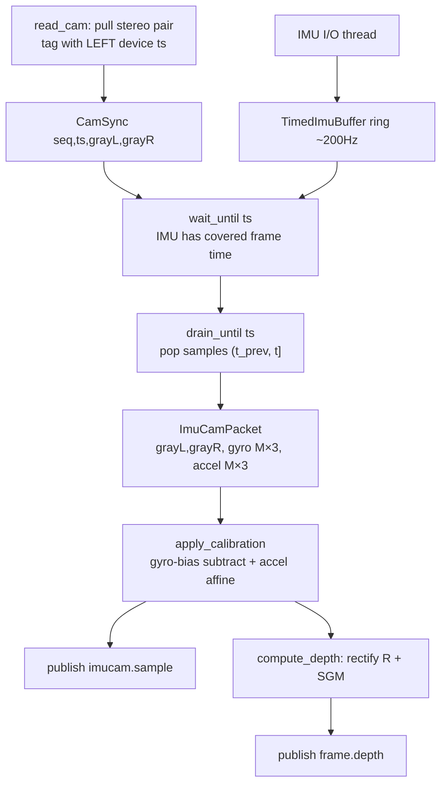
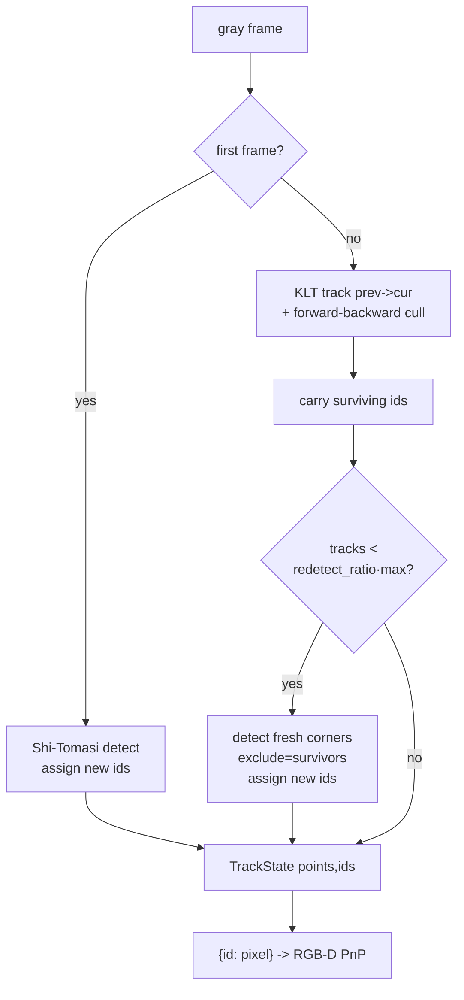
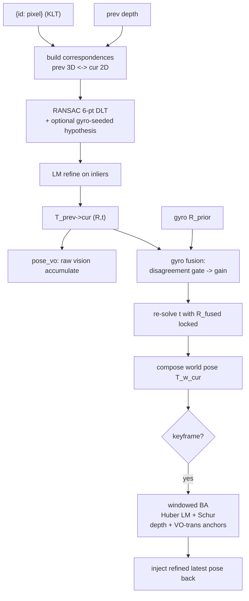
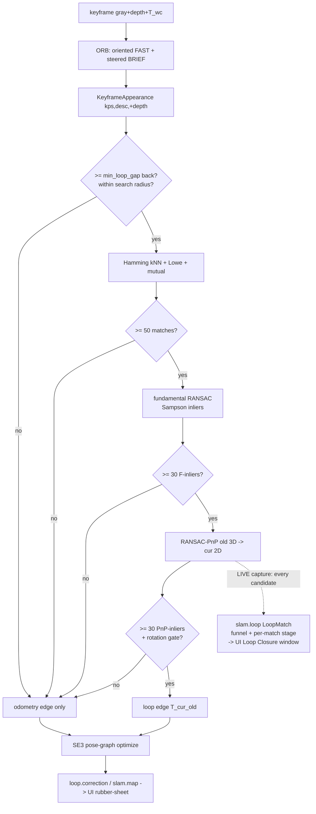
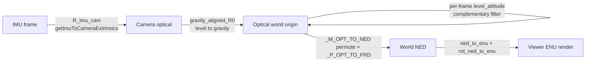

# ALGORITHMS — OAK-D VIO/SLAM pipeline, stage by stage

> **Who this is for.** You built this pipeline but are a bit vague on the algorithms
> underneath. This guide is meant to be read **top to bottom**. For each algorithm
> you get: a one-paragraph **intuition** (the "why"), the **key math/steps** (concise
> and correct), the **inputs/outputs**, the **code location** (`path:line`), and
> **"How to see it"** — the existing UI view that reveals it, or the proposed new one.
>
> The prioritized build plan for the *new* visualizations lives separately (returned by
> the workflow that generated this doc); this file is the conceptual reference.

---

## 0. The whole pipeline at a glance

Four cooperating processes, one shared OAK-D (or a recorded session). Data flows
left-to-right; each process owns one stage and publishes abstract IPC topics the next
stage (and the UI) consume. Nothing downstream knows it's an OAK-D — that's deliberate
(the UI is chip-agnostic, fed calibration over IPC, never a device handle).

```mermaid
flowchart LR
  subgraph IC["imu_camera/  (sensing)"]
    A1[read_cam<br/>stereo pull @ fps] --> A2[CamSync]
    A3[IMU I/O thread<br/>~200 Hz ring] --> A4[pack_synced<br/>drain IMU to frame time]
    A2 --> A4
    A4 --> A5[apply_calibration<br/>gyro bias + accel model]
    A5 --> A6[compute_depth<br/>SGM dense stereo]
  end
  subgraph DP["depth/  (deployment fork)"]
    D1[compute_depth<br/>identical SGM]
  end
  subgraph VIO["vio/  (motion)"]
    B1[KLT frontend<br/>corners + tracks] --> B2[RGB-D PnP<br/>frame-to-frame]
    B2 --> B3[gyro fusion<br/>rotation-locked t]
    B3 --> B4[windowed BA<br/>keyframes + landmarks]
  end
  subgraph SLAM["slam/  (global consistency)"]
    C1[ORB on keyframes] --> C2[loop detect + verify]
    C2 --> C3[SE3 pose-graph<br/>optimization]
  end
  subgraph UI["ui/  (proc4 GUI)"]
    U1[Viewer3D<br/>5 trajectory lines]
    U2[Triplet<br/>rect-L | depth | IMU]
    U3[Keypoint tracker]
    U4[Loop Closure<br/>2 keyframes + match funnel]
    U5[BA Window<br/>window poses + landmarks<br/>+ reprojection rays]
    U6[Pose Graph<br/>before/after nodes + edges<br/>+ correction arrows]
  end

  A5 -- imucam.sample --> B1
  A6 -- frame.depth --> B2
  A6 -- frame.depth --> U2
  B1 -- frame.tracks --> U3
  B2 -- pose.odom / pose.vo / frame.inliers --> U1
  B2 -- "pose.odom (raw = before)" --> U6
  B4 -- pose.refined --> U1
  B4 -- keyframe(gray+depth+pose) --> C1
  B4 -- keyframe(gray, buffered by seq) --> U4
  B4 -. "ba.window (solve snapshot, opt-in --ba-window)" .-> U5
  C3 -- slam.map / loop.correction --> U1
  C3 -- "slam.map (corrected = after)" --> U6
  C2 -- slam.loop (match funnel, LIVE) --> U4
  C2 -- "slam.loop (loop edges)" --> U6
```

**The single most important thing the UI already shows:** `Viewer3D` draws *five*
trajectory lines at once (VO grey → VIO green → VIO-BA blue → SLAM-corrected orange →
SLAM keyframe cyan). The visible drift ordering VO → VIO → BA → SLAM **is** the value
proposition of the whole stack — each stage tightens the line.

**Frames in play** (full treatment in §5): Camera-optical (OpenCV: x-right, y-down,
z-fwd) is the lingua franca of all VIO/SLAM math and the wire pose. The UI converts to
NED for state and ENU for rendering.

**An honesty note on where math lives vs. runs.** The loose IMU math library
(`sky/imu/imu.py`, `inertial_filter.py`) now lives in the shared `sky/` package,
but is **consumed downstream by `vio`** (the sensing stage `imu_camera` only emits
the data the math needs). The sensing stage's real output is the *calibrated
per-frame IMU segment* plus a *gravity-align seed*; the preintegration / fusion
that uses them runs in `vio`. Likewise `depth/` is a deployment **fork** of the
SGM step (byte-identical math, now `sky.depth.stereo`), not new algorithms. These
distinctions are flagged inline so you know what each process actually produces.

---

# STAGE 1 — Sensing + Depth (`imu_camera/`, `depth/`)

Two processes own this stage. `imu_camera/` reads stereo + IMU off one shared device,
time-syncs them, calibrates the IMU, and computes dense depth inline. `depth/` is a
thin standalone copy of just the SGM depth step so depth can run as its own process.

Data spine, one frame:
`read_cam` (schedule) → `CamSync` → `pack_synced` (drain IMU to frame time) →
`apply_calibration` → publish `imucam.sample` → `compute_depth` (SGM) → publish `frame.depth`.



## 1.1 Camera ↔ IMU time-sync (bucketing IMU per frame)

**Intuition.** Cameras and IMU run on different threads at different rates (stereo
~20 Hz on a schedule; IMU free-running ~200 Hz). The IMU has no frame serial — only a
device clock. So you bind them by *time*: for a frame captured at device-time `t`, the
inertial samples that "belong" to it are everything since the previous frame, the
interval `(t_prev, t]`. That block is exactly the motion that happened *during the step
into this frame* — the segment a VIO preintegrates.

**Steps.**
1. The IMU I/O thread pushes every sample into a thread-safe, time-indexed ring
   (`TimedImuBuffer.append`, `sky/imu/timed_buffer.py:59`). Capacity-bounded
   deque; evictions counted.
2. `read_cam` owns the schedule: one stereo pair per scheduler tick at `fps` Hz, paired
   by hardware `seq` (`read_cam.py:101`), tagged with the **left frame's device
   timestamp** (`read_cam.py:133`) — the same clock the IMU carries. Emits one `CamSync`
   (`read_cam.py:202`).
3. On each `CamSync`, `pack_synced` does the bucketing:
   - `buf.wait_until(ts, timeout)` — block (bounded) until the IMU stream has actually
     *covered* this frame's time, so a slow IMU thread can't short-change the interval
     (`timed_buffer.py:86`, called at `pack_synced.py:22`).
   - `buf.drain_until(ts)` — pop and return every sample with `sample_t <= ts`
     (`timed_buffer.py:107`). Because each drain *removes* what it returns, successive
     drains yield disjoint, contiguous intervals `(prev_cut, t]` — no sample dropped or
     double-counted. (Invariant proven end-to-end in `imucam_sync_selftest.py`.)
4. Offline replay (`io/synced.py:slice_imu`, line 93) reproduces the same slice from
   recorded streams, with optional `bracket=True` to include the one sample either side of
   the endpoints so the integrator can interpolate up to `t0`/`t1`.

**I/O.** In: `CamSync{seq, ts_ns, gray_left, gray_right}` + IMU buffer. Out:
`ImuCamPacket{seq, ts_ns, gray_left, gray_right, imu_ts(M,), gyro(M,3), accel(M,3)}`.

**Code.** `imu_camera/modules/pack_synced.py:18`; `sky/imu/timed_buffer.py:86,107`;
`modules/read_cam.py:101,133,202`; offline `io/synced.py:93`.

**How to see it.** *New view needed.* A **scrolling time-ruler**: horizontal axis =
device time; camera frame timestamps as vertical ticks; under each, the IMU samples that
drained into that frame as dots colored per-bucket; shade the `(t_prev, t]` interval.
Makes the contiguous-disjoint-tiling invariant visible and instantly exposes a starved
bucket (empty) or a straggler. Closest existing view is the `imucam.sample` triplet
(`ui/qt/synced_window.py`), which shows the data but not the bucketing in time.

## 1.2 Gyro bias — still-window calibration

**Intuition.** A gyro at rest should read 0 rad/s, but every MEMS gyro has a small
constant offset (bias). Un-subtracted, integrating angular velocity drifts the
orientation. Measure it once by holding the device dead still and averaging — but only
trust the average if the window was genuinely still and long enough.

**Math/steps.** `w_cal = w_raw − bias`, with `bias = mean(gyro)` over a verified still
window.
- **Live, first run / `--recalibrate-bias`** (`live_calib.py:99 _collect_startup`,
  gate=True): accept a sample only while `|gyro| < _STILL_GYRO (0.15)` **and** accel
  within `_STILL_ACCEL (0.6)` of the window mean; any motion clears and restarts the
  window. After ≥`window_s` and ≥10 samples, `bias = mean(gyro)`. Persisted per device
  via `save_gyro_bias` (`live_calib.py:196`); reused every later boot (a normal Start is a
  quick, non-gated gravity read since downstream re-leveling handles drift).
- **Wizard / offline gate** (`calib_collect.py`): `StaticCollector` (line 103) is the
  shared stillness primitive — running mean of a motionless streak, resets on motion,
  `ready` after `window_s`. `gyro_bias_verdict` (line 70) is the acceptance test: rejects
  if `n < 80` samples or per-axis gyro std `> 0.02` rad/s (a creeping/vibrating rest that
  passes the per-sample gate but poisons the mean).
- **Replay** (`pipeline.py:_replay_imu_startup`, line 144): `bias = mean(gyro over first
  ~1 s)`.

The bias is subtracted for every drained sample by `ImuCalibration.apply`
(`imu_calib.py:52`).

**I/O.** In: raw gyro stream + stillness thresholds. Out: `gyro_bias (3,)` rad/s
(persisted per device); a `CalibVerdict{ok, message, metric}` for the SAVE gate.

**Code.** `imu_camera/device/live_calib.py:99,196`; `sky/sensors/calib_collect.py:70,103`;
replay `modules/pipeline.py:144`.

**How to see it.** *Partially exists — extend.* `ui/viz/imucam_render.py:GyroChart`
(line 60) already scrolls 3-axis gyro deg/s. Add a `|gyro|` magnitude trace with the
acceptance bands (still threshold 0.15, std band 0.02) overlaid, plus a fill-up progress
bar to `window_s` that turns green only when `n≥80` **and** `std≤0.02`. Any wobble
visibly resets the bar — the operator sees *why* a noisy rest is rejected.

## 1.3 Accelerometer — gravity-align + six-face calibration

**Intuition.** Two different jobs.
- **Gravity-align (cheap, every boot).** At rest the accelerometer points "up" with
  magnitude g; `−accel` is the gravity ("down") direction. That single vector levels
  roll/pitch of the world frame (yaw is undefined — no magnetometer).
- **Six-face calibration (one-time, full model).** A real accelerometer has *bias*
  (nonzero at free-fall), *scale* (1 g reads 0.98/1.02), and *misalignment* (axes not
  orthogonal). A single "level the gravity vector" step can't separate these. The classic
  six-position (tumble) test does: hold each face up/down so true gravity points along
  ±x, ±y, ±z; the direction is known and the magnitude is exactly g everywhere, which
  fully constrains a 9-DOF affine model.

**Math.**
- **Gravity-align seed:** `accel_align = R_imu_cam @ mean(accel over startup)` in the
  camera frame (`live_calib.py:_collect_startup` `_level`, line 123; replay
  `pipeline.py:172`). This seed flows out in the calib bundle. The rotation it produces,
  `gravity_aligned_R0` (`sky/imu/imu.py:257`), builds a camera→world rotation:
  `down = −a/|a|` (world +y), forward = horizontalized optical +z, right = down×forward.
  Defined here, **consumed by the vio odometry** to seed initial attitude (verified <1°
  vs Basalt on near-static starts).
- **Six-face affine model:** `a_cal = T (a_raw − b)` (`sky/sensors/accel_calib.py:AccelCalibration`,
  line 64). Constraining only magnitude is under-determined (it only fixes the symmetric
  `TᵀT`). Using the *known direction* gives a well-posed linear system per pose:
  `T·a_k − c = g·dir_k` (with `c := T·b`) — 3 equations × N poses, 12 unknowns
  `[vec(T), c]`, one `lstsq`, then `b = T⁻¹c` (`solve_accel_calibration`, line 121;
  stacked system at lines 149–164). `residual_g = RMS(|a_cal| − g)` is the quality figure.
- **Capture state machine:** `SixFaceCollector` (`sky/sensors/calib_collect.py:217`) waits for a still
  window, identifies the up-face by *squareness* (dominant axis ≥ 0.95 of vector length,
  judged relative to the measured vector so a mis-scaled axis is still capturable —
  `_identify_face`, line 269), requires a move between captures, solves on the 6th, and
  `verdict()` (line 244) rejects if `residual_g > 0.5` m/s².

**I/O.** In: raw accel stream (+ `R_imu_cam` for align). Out: `accel_align (3,)`
cam-frame seed (in calib bundle); `AccelCalibration{T(3×3), bias(3,), residual_g}`
persisted per device; applied via `AccelCalibration.apply` → `a_cal = (a − b) @ Tᵀ`
(line 83).

**Code.** `sky/sensors/accel_calib.py:64,121`; `sky/sensors/calib_collect.py:217,269,244`;
gravity-align `sky/imu/imu.py:257` + seed `imu_camera/device/live_calib.py:123`,
`modules/pipeline.py:172`.

**How to see it (the most illuminating one for this stage).** *Built —
`imu_camera/tools/gravity_sphere.py`* (offline; `--render` PNG, matplotlib Agg, no
GUI). The **gravity sphere** 3D scatter: the translucent g-sphere (radius g), the 6
*raw* face means as RED dots forming a tilted, off-center *ellipsoid* (bias = center
offset, per-axis scale = half-axis lengths, misalignment = tilt), and the
calibrated vectors `T(a−b)` as GREEN dots snapping onto the g-sphere — grey
connectors draw each raw→calibrated "snap". `bias`, per-axis scale, max
off-diagonal misalignment and `residual_g` are annotated, so all three error
sources are literally visible and the residual shows as leftover scatter. HONEST
about the data: the calib store (`sky.sensors.calib_store`) persists only the
*solved* `AccelCalibration` (T, bias, residual_g), **not** the six raw face vectors
(`SixFaceCollector` solves and discards them) and no raw accel stream is recorded —
so the default loads the REAL stored calib and *reconstructs* the six raw faces by
inverting the stored model exactly (`a_raw_k = b + T⁻¹(g·dir_k)`), the genuine
"before" dots for that device's own calibration; `--demo` synthesizes from a known
injected model and shows `solve_accel_calibration` recovering it. The figure title
states the source. Run::

    .venv/bin/python -m imu_camera.tools.gravity_sphere --render /tmp/gravity_sphere.png

For the cheap gravity-align, the existing `ui/viz/imucam_render.py:render_accel3d`
(line 126) already draws the live accel vector against the optical axes — that's the
right *live* view; the sphere is the right *calibration* view.

## 1.4 The inertial (translation) filter

**Intuition.** A complementary filter that predicts translation with the IMU and
corrects it with vision — a lightweight stand-in for full sliding-window VIO. The key
state is a persistent **world velocity**: a fast push registers the same frame (no lag),
while a pure in-place yaw (which produces ~0 net acceleration) keeps velocity ~0 (no
phantom drift). The accelerometer is the honest discriminator between real translation
and rotation-induced phantom.

**Steps** (`inertial_filter.py:102 step`):
1. **Predict:** optional accel feed-forward `a_world = R_wc·accel_cam + g_world`, clipped,
   `v_pred = v + a_world·dt`. *Default OFF* (`use_accel_prediction=False`, line 79) — honest
   note in code: un-calibrated accel ~doubles jitter, so attitude leveling only; tight IMU
   translation belongs in the vio backend's preintegration where bias is estimated.
2. **Correct:** if vision gives a displacement,
   `v = (1−w)·v_pred + w·(dp_vis/dt)` with `vision_trust=0.8`; else dead-reckon
   `v = v_pred·vel_damp`.
3. Speed-fence `max_speed`, then `p += v·dt`.

**I/O.** In: `dt`, `R_wc`, `accel_cam`, vision displacement. Out: world position `p`.
**Produced here as library code; driven by the vio/odometry layer, not by acquisition.**

**Code.** `sky/imu/inertial_filter.py:102` (`InertialFilterConfig` at line 53).

**How to see it.** *New view needed.* Three stacked time-series — `|accel net|`,
`|velocity|`, and vision-vs-fused displacement — on a yaw/translation-labeled timeline,
with the four canonical regimes overlaid (still / fast push / in-place yaw / forward+yaw).
Shows why the velocity state fixes drift: in the yaw regime accel-net and velocity stay
flat while vision displacement spikes and gets down-weighted.

## 1.5 Stereo rectification (left/right rectifier warps)

**Intuition.** SGM block matching only works if a 3D point lands on the *same row* in
both images (search becomes 1-D along the row). Raw cameras don't satisfy this — lens
distortion + inter-camera rotation put corresponding points on different rows (measured:
~48% of corners off by ≥2 rows). Rectification is a per-pixel warp that re-projects both
images onto a common, distortion-free, row-aligned virtual stereo pair.

**Math.**
1. **Bouguet rectifying rotations** (`rectify_rotations`, `stereo.py:383`): split the
   inter-camera rotation in half, `r_l = exp(+ω/2)`, `r_r = exp(−ω/2)`; build the
   rectifying basis `e1 = −t/|t|` (baseline dir), `e2 ⟂ e1`, `e3 = e1×e2`; return
   `R1 = Rrect·r_l`, `R2 = Rrect·r_r`. Matches `cv2.stereoRectify` to ~1e-7. Crucially
   **keeps left raw intrinsic K_left as the common rectified intrinsic** (the OAK-D does
   this), so disparity gives metric `Z = fx_left·B/d` directly.
2. **Build the inverse map once per session** (`LeftRectifier`/`RightRectifier.__init__`,
   lines 507/456): for each rectified pixel → `K_left⁻¹` → ray → `R1ᵀ`/`R2ᵀ` back into
   the raw camera → apply the OpenCV rational+tangential+thin-prism forward distortion
   `_distort_normalized` (k1..k6, p1,p2, s1..s4; tilt terms omitted, line 401) → project
   with raw K → `(map_u, map_v)`.
3. **Apply** = bilinear remap `_remap_bilinear` (line 430, numba), `rectify()` per frame
   (lines 500/551).

Two configurations: replay feeds the chip's already-rectified left + raw `syncedRight`,
so only `RightRectifier` runs (`from_calib(..., rectify_left=False)`). The fully VPU-free
live path taps *both* raw cameras, so `rectify_left=True` runs both —
`dense_depth_rectified_left` (line 949) returns rectified left *and* depth on the same
grid (the tracking grid the frontend must use, or depth is sampled at the wrong pixel).

**I/O.** In: `StereoCalib` (both K, both dist, left→right `T`); per frame a raw image.
Out: precomputed `map_u, map_v (H,W) float32`; per frame a rectified `float32 (H,W)`.

**Code.** `sky/depth/stereo.py:383` (rotations), `:401` (distortion), `:430`
(remap), `:456` (RightRectifier), `:507` (LeftRectifier), `:949` (rectified-left+depth).

**How to see it.** *Built — `depth/tools/epipolar_explorer.py`* (offline; `--render`
PNG, no GUI). Overlaid **horizontal scanlines** on a left|right pair, before vs after:
the same ~13 scanlines are drawn across both images in a 2-row figure (top = BEFORE,
bottom = AFTER) — a handful of strong left corners are located in the right by a
same-row-band block search, and their **vertical row-mismatch** is annotated and
median-reported, collapsing from raw → rectified (e.g. `corridor_60s#80`: 2.0px →
0.5px). HONEST about the data: a gold session stores the chip's *already-rectified*
LEFT + a *raw* RIGHT, so the genuinely-raw image is the right one — the BEFORE row is
labelled "chip-rectified LEFT | RAW right" and the AFTER right is
`RightRectifier.rectify(raw_right)` (the left is kept as the common rectified grid, not
re-warped, exactly as the replay depth path does). Run::

    .venv/bin/python -m depth.tools.epipolar_explorer \
        --session sessions/gold/lab_loop_30s --frame 40 --render /tmp/epipolar.png

## 1.6 SGM dense stereo matcher (end-to-end)

**Intuition.** The sparse per-point block matcher (ZNCC along the row) fails in
low-parallax indoor scenes — the cost is flat/ambiguous over a few-pixel disparity range,
so the global NCC peak isn't at the true disparity. The fix is a **global smoothness
prior**: trust that neighboring pixels usually have similar disparity, so an ambiguous
pixel borrows confidence from its neighbors along many directions. This is Hirschmüller's
Semi-Global Matching, reimplemented from scratch (no DepthAI `StereoDepth`, library-free,
portable). Numba compiles our own explicit loops; a pure-NumPy fallback runs identical math.

**Pipeline** (`sgm_disparity`, `stereo.py:743`):
1. **Census transform** (`_census`, line 569): each pixel → a uint64 bit-signature
   comparing it to its `(2r+1)²−1` neighbors (bit = neighbor < center). Robust to
   gain/offset between the two physical cameras. r=3 → 7×7 → 48 bits (live preset r=2).
2. **Hamming cost volume** (`_cost_volume`, line 589):
   `C(v,u,d) = popcount(censusL[v,u] ⊕ censusR[v,u−d])` for `d ∈ [dmin, dmin+ndisp)`.
   `_popcount64` is SWAR constant-time (line 559). Out-of-range columns break early
   (line 600).
3. **N-path SGM aggregation** (`_aggregate_dir`, line 605, called per direction at 780):
   along each direction r,
   `L_r(p,d) = C(p,d) + min( L_r(p−r,d), L_r(p−r,d±1)+P1, min_k L_r(p−r,k)+P2 ) − min_k L_r(p−r,k)`
   and `S(p,d) = Σ_r L_r(p,d)`. **P1** (=7) penalizes ±1 disparity steps (slanted surfaces
   stay smooth); **P2** (=86) ≫ P1 penalizes big jumps but allows true depth
   discontinuities. The `−min_k L_r(p−r,k)` term keeps costs bounded. `num_paths` = 4
   (cardinal) or 8 (+ diagonals); `_SGM_DIRS` at line 326. Parallelization: each path is
   disjoint, so `_path_starts` (line 657) finds boundary start pixels and each path is
   walked race-free in its own thread.
4. **WTA + sub-pixel + uniqueness + L/R** (`_wta_lr`, line 673):
   - **WTA**: `d* = argmin_d S(v,u,d)`.
   - **Uniqueness** (line 714): reject if the best non-adjacent second cost
     `< best·(1+uniqueness)` (uniqueness=0.10) — repetitive texture.
   - **Sub-pixel parabola** (line 723): fit `S` at `d*±1`,
     `d* += 0.5(c⁻−c⁺)/(c⁻−2c⁰+c⁺)`.
   - **Left↔right consistency** (lines 686, 732): compute the right-image disparity from the
     same aggregated volume and reject if `|d − dispR[round(u−d)]| > lr_max_diff (1.5)`.
     False matches don't round-trip.
5. **Speckle filter** (`_speckle_filter`, line 794, optional): 4-connected flood fill (like
   `cv2.filterSpeckles`); invalidate connected disparity blobs ≤ `speckle_window` px.
6. **Disparity → metric depth** (`dense_depth`, line 939): `Z = fx·B/d`, clamped to
   `[min_depth, max_depth]`, 0 = invalid. `fx = K_left[0,0]`, `B = baseline_m`.

**The 'fast'/downscale preset** (`SGMConfig.live`, line 309; applied at
`sgm_disparity:746`): `downscale=2` → box-average both images to half-res
(`_box_downsample`, line 860), run SGM on ¼ the pixels with half the disparity range, then
nearest-neighbor upsample and **rescale the disparity by `n`** (disparity scales with
resolution — `_upsample_disp`, line 868). Also census r=2 and 4 paths instead of 8.
`sgm_config` (`resolution_build.py:18`) sets `num_disparities` from resolution and forces
`downscale=1` below 160 px width (where ¼-res starves PnP of valid-depth keypoints).
Validated against the chip's SGBM oracle in `stereo_sgm_selftest.py`.

**I/O.** In: rectified left + rectified right (`float`), `SGMConfig`, `K`, `baseline_m`.
Out: `dense_disparity (H,W)` float (NaN=invalid) → `dense_depth (H,W)` float32 m
(0=invalid). For VIO: `depth_at(pts)` / `sparse_depth_map(pts)` sample only tracked
pixels. The ToF-sim path (`tof_downsample.py:92`) computes full-res depth then
block-medians valid pixels to a 54×42 grid.

**Code.** `sky/depth/stereo.py:743` (orchestrator); census `:569`; cost volume
`:589`; aggregation `:605` + starts `:657`; WTA/subpixel/uniqueness/LR `:673`; speckle
`:794`; downscale `:746,860,868`; depth `:939`; `SGMConfig` `:288`, live preset `:309`;
`compute_depth.py:25`; `resolution_build.py:18`.

**How to see it (most illuminating internals view).** *Built — `depth/tools/sgm_cost_explorer.py`.*
A standalone, offline **disparity-space cost-curve explorer**: it loads ONE frame from a
gold session, re-rectifies the recorded raw right via `RightRectifier`, runs the SGM with
the **opt-in volume-capture hook** (`sgm_disparity_capture` /
`SGMStereoMatcher.dense_disparity_capture`, which run the SAME math but *keep* `C`/`S`
instead of discarding them — `sgm_disparity` stays bit-for-bit unchanged, verified), shows
the rectified-left + the depth heatmap (reusing `ui/viz/depth_render.colorize_depth`), and
on a pixel click plots `C(d)` (raw Hamming cost) and `S(d)` (aggregated cost) over
`d ∈ [dmin, dmin+ndisp)` — marking the WTA minimum, the parabola sub-pixel offset, and the
uniqueness second-best band. Two preset markers (a textured corner [T] vs a flat region
[F]) are auto-placed so the contrast is one click away. On a textured pixel the raw curve
already has a sharp single valley (`C` and `S` agree); on a textureless/repetitive pixel
the *raw* curve is flat/multi-valleyed (its argmin is basically noise) and only the
*aggregated* curve develops a clear single minimum — precisely the "global smoothness
disambiguates low-parallax" story made visible. A headless `--render PNG` mode writes the
textured-vs-textureless 2×2 curve figure (numpy → cv2, no GUI) for verification. Inherently
offline because the live UI publishes only left+depth, never the raw right the volume needs.
The full-frame depth *output* already exists and is well-handled: the triplet depth panel
(`ui/viz/depth_render.py:colorize_depth`, line 71 — fixed 0.3–8.0 m khaki ramp, black =
invalid).

**Cross-cutting.** the SGM matcher is now the single shared `sky/depth/stereo.py`
(imported by both `depth` and `imu_camera` — the old per-project copies + their
`diff -r` lock-step gate are retired); `depth/modules/compute_depth.py` +
`publish_depth.py` are the same two steps standalone. Honesty flags: accel prediction in the inertial filter is OFF on purpose
(un-calibrated accel adds drift); the gyro preintegration prior is currently a no-op seed
(vision PnP already converges) kept for degraded-vision robustness.

---

# STAGE 2 — VIO Frontend (`sky.front`)

The frontend maintains a set of point *tracks* across the grayscale stream: each track is
a real corner, followed frame-to-frame by optical flow, carrying a persistent integer id
so the odometry/backend can associate the same world point over time. Library-free pure
NumPy (optional Numba JIT for the KLT hot loop) — hand-rolled replacements for
`cv2.goodFeaturesToTrack` and `cv2.calcOpticalFlowPyrLK`.



## 2.1 Shi-Tomasi corner detection ("good features to track")

**Intuition.** A good feature can be *re-located unambiguously* next frame. A flat patch
is hopeless (looks the same shifted any direction); an edge is ambiguous *along* itself
(the aperture problem); only a **corner** is pinned in *both* directions. Shi-Tomasi
measures exactly that "pinned in both directions" property at every pixel and keeps the
strongest, well-spread ones.

**Math/steps.** For each pixel, build the windowed **structure tensor** of image
gradients over a `block_size` window:
```
M = Σ_window [[Ix²,    Ix·Iy],
              [Ix·Iy,  Iy²  ]]
```
The Shi-Tomasi response is the **smaller eigenvalue**:
```
λ_min = ½·( (Sxx+Syy) − √((Sxx−Syy)² + 4·Sxy²) )
```
Large `λ_min` ⇒ strong gradient in *both* directions ⇒ a true corner. (Differs from
Harris `det − k·tr²`; Shi-Tomasi takes `λ_min` directly, more stable for tracking.)
1. Gradients `Ix, Iy` via separable Sobel 3×3 (`_sobel`, corners.py:46).
2. Windowed sums `Sxx, Syy, Sxy` via an **integral image** (cost independent of window
   size, `_box_sum`, corners.py:53).
3. Response map, off-image border + optional `mask` zeroed (`_shi_tomasi_response`,
   corners.py:84).
4. **Quality threshold + NMS**: keep pixels above `quality_level·max(response)` that are
   also a 3×3 local max (`_dilate3`, corners.py:73; selection at corners.py:222-231).
5. **Min-distance spacing** via an occupancy grid: walk candidates strongest-first, reject
   any within `min_distance` of a kept corner. Cells are `min_distance` wide so only 3×3
   neighbouring cells need checking (corners.py:233-272). `exclude` (already-tracked
   points) is pre-seeded into the grid (corners.py:243-248) — replaces drawing a
   `cv2.circle` mask.

**Bucketed low-res variant** (`bucketed=True`, `_bucketed_candidates`,
corners.py:116-172): split the image into a `grid_rows × grid_cols` grid (default 5×6),
take the threshold **per cell** (`quality_level·cell_max`), emit at most `per_cell`
(default 2) per cell. Forces even spatial coverage so a single bright structure can't
starve whole regions (which would make PnP geometry degenerate). Enabled only when
`res.width ≤ 160`; 320/640 use the global path (byte-identical to the cv2 oracle,
`resolution_build.py:48-55`).

**I/O.** In: `gray (H×W)`, `max_corners`, `quality_level` (def 0.01), `min_distance` (def
12 px), `block_size` (7, or 3 at low res), optional `mask`, optional `exclude (M,2)`,
`bucketed`. Out: `(N,2) float32` (x,y), strongest-first, ≤ `max_corners`, spaced
≥ `min_distance`.

**Code.** `good_features_to_track` corners.py:175; response `:84`; bucketed `:116`; NMS
`:73`; occupancy-grid spacing `:233-272`.

**How to see it.** *New view needed.* Three-panel: (a) gray frame; (b) the `λ_min`
response as a log-scaled **heatmap** (the load-bearing intermediate nobody currently
sees); (c) the same frame with kept corners + faint `min_distance` exclusion circles, and
for the bucketed path the grid drawn so the per-cell quota is visible. The single most
illuminating element is the **heatmap + accepted corners side by side** — it makes "why
this pixel and not that bright edge" obvious (edges glow weakly, corners brightly, and you
watch spacing/grid thin the cluster). The Keypoint tracker shows only final dots, never
the response field.

## 2.2 Pyramidal Lucas-Kanade optical-flow tracking (KLT)

**Intuition.** You have a corner at pixel `p` in the previous frame — where did it go?
Assume its local window looks the same, just shifted by `d`. Find the `d` that best lines
up the two windows photometrically. Naively this only works for tiny motions (the
linearisation is local), so build an **image pyramid**: solve the displacement on a tiny
blurry version first (where a big motion is small), then refine level by level down to
full resolution. That coarse-to-fine trick lets it follow large motions.

**Math/steps.** Minimise `Σ_w (I(p+w) − J(p+d+w))²` (I=prev, J=cur). A Gauss-Newton step:
```
G·η = b
G = Σ_w [[Ix², Ix·Iy],[Ix·Iy, Iy²]]          (structure tensor of the PREV frame)
b = Σ_w [Ix; Iy]·( I(p+w) − J(p+d+w) )        (residual-weighted gradients)
d ← d + η
```
Because gradients come from the *previous* frame (forward-additive LK), `G` and `G⁻¹` are
**constant across inner iterations** — computed once per pyramid level (klt.py:161-171).
Iterate: resample current patch at `p+d`, form residual, accumulate `b`, solve
`η = G⁻¹b`, update `d`, stop on `|η|² < eps²` or after `iters` (klt.py:180-196).

Mechanics:
- **Pyramid:** separable 5-tap Gaussian `[1 4 6 4 1]/16` then decimate by 2, `max_level+1`
  levels (`build_pyramid`, klt.py:51; `_sep_conv5`, klt.py:40).
- **Coarse-to-fine:** loop levels high→low, scale start coords + flow guess by `1/2^lvl`,
  carry refined flow down (klt.py:146-198).
- **Sub-pixel sampling:** bilinear gather of every window patch at once (`_bilinear`,
  klt.py:72).
- **Reject degenerate points:** "bad" when `G`'s min eigenvalue < `min_eig` (flat/edge
  patch — the aperture problem made explicit) (klt.py:167-168).
- **Active-set:** the NumPy path iterates only over not-yet-converged points; the set
  shrinks fast (klt.py:178-196).
- **Numba path:** same Bouguet algorithm as scalar loops (`_track_level`,
  klt_numba.py:77) — the per-point Gauss-Newton is inherently sequential, so JIT removes
  interpreter overhead (~10× speedup); auto-selected when numba is installed
  (klt.py:120-122).
- **Forward-backward consistency (in the frontend, not klt):** track p→q, then q back;
  keep only points where `|p − back| < fb_threshold` (def 1.0 px) AND both passes succeed
  AND it lands in bounds (`KLTFrontend._track`, frontend.py:79-101). This is the main cull
  for bad/occluded tracks.

`win_size` (def 21, or 13 live-without-numba) sets the window; bigger = more robust but
slower and worse near motion boundaries. `max_level` (def 3, or 2 live) sets how large a
motion can be followed. The `live_own` preset (frontend.py:42) trims these to fit the
50 ms/frame budget when Numba is unavailable.

**I/O.** In: `prev_gray`, `cur_gray`, `prev_pts (N,2)`, `win_size`, `max_level`, `iters`
(30), `eps` (0.01), `min_eig` (1e-4). Out: `next_pts (N,2) float32`, `status (N,) uint8`
(1 tracked, 0 lost).

**Code.** `calc_optical_flow_pyr_lk` klt.py:96; per-level solve klt.py:146-198; Numba core
`_track_level` klt_numba.py:77; fb-check `KLTFrontend._track` frontend.py:79.

**How to see it.** *New view needed.* On the current frame, draw an arrow from each
`prev_pt` to its `next_pt`, colored green→red by `fb_err`, with culled (over
`fb_threshold`) points as red X's; inset the 3–4 pyramid levels so a fast pan visibly
shrinks to a small flow at the coarse level. The most illuminating element is the
**fb-error-colored flow field** — you watch tracks on a moving object / occlusion edge
light up red and get culled, the exact mechanism that keeps PnP clean. Today's view shows
trails (where a track *has been*), never the per-frame flow vector or the fb-error that
decides life/death.

## 2.3 Track lifecycle (persistent ids + re-detection cadence)

**Intuition.** A VIO needs *the same point* recognised over many frames to triangulate it
and constrain motion. So every corner gets a permanent id the day it's born and keeps it
until it dies (leaves frame, fails fb-check, or its structure tensor goes rank-deficient).
When enough have died that the set is sparse, top up with fresh corners that avoid the
survivors — never re-detecting on a healthy frame, so ids stay stable and long-lived.

**Steps** (`KLTFrontend.process`, frontend.py:118):
- **First frame:** detect only; assign ids `next_id … next_id+N` (frontend.py:125-131).
- **Subsequent frames:** KLT-track prev points forward with fb-check, drop failures,
  **carry surviving ids** — `tracked_ids = prev_ids[good]` (frontend.py:135-137).
- **Re-detection cadence:** only if `tracked_pts < redetect_ratio·max_corners` (def 0.6),
  detect `max_corners − survivors` fresh corners with `exclude=survivors`; assign
  brand-new ids and append (frontend.py:144-151, `_detect` frontend.py:103). New ids are
  monotonic — never reused.

So a corner born at frame 0 and tracked cleanly keeps id 0 for life; the `redetect_ratio`
gate makes re-detection *event-driven* (track attrition), not every-frame.

**I/O.** State: `TrackState{points (N,2), ids (N,)}` + `_prev_gray` + monotonic
`_next_id`. In: one `gray`. Out: updated `TrackState`; odometry exposes it as
`{int id: pixel}` (`track`, odometry.py:378). Published on `frame.tracks` via
`PublishTracks` (pipeline.py:132).

**Code.** `KLTFrontend.process` frontend.py:118; `_detect` `:103`;
`FrontendConfig.redetect_ratio` `:39`; `TrackState` `:58`.

**How to see it.** *Partially exists — extend.* The Keypoint tracker already draws per-id
**trails** (last 20 frames) and an **amber ring** for fresh tracks (age < 3) — id
persistence over a short window. Missing is the *lifecycle at a glance*: a strip-chart of
`n_tracks` over time with the `redetect_ratio·max_corners` threshold line drawn, so you
see the count **sawtooth** down and snap back up on each re-detection event; plus a per-id
age histogram. The most illuminating add is the **track-count sawtooth vs. the redetect
threshold line** — it makes the entire cadence policy visible in one plot.

## 2.4 Depth sampling at tracks (back-projection to 3D)

**Intuition.** KLT gives 2D pixel tracks; PnP needs 3D points. The depth map already
gives metres-per-pixel, so for each tracked corner read the depth under its
*previous-frame* pixel and shoot it out along the camera ray to a metric 3D point. Metric
depth ⇒ true trajectory scale (no monocular ambiguity).

**Math/steps.** For prev pixel `(u,v)` with depth `z`, pinhole back-projection:
```
X = (u−cx)·z/fx ;  Y = (v−cy)·z/fy ;  Z = z
```
Per frame in `RGBDVisualOdometry.estimate` (odometry.py:432-448): for every track seen in
both prev and cur, look up `z = prev_depth[round(v), round(u)]` (nearest-pixel), **gate**
`min_depth_m ≤ z ≤ max_depth_m` (def 0.2–8.0 m — far stereo is noisy), back-project the
*prev* pixel (`_backproject_px`, odometry.py:373), pair it with the *cur* pixel, feed the
`(3D_prev, 2D_cur)` pairs to `solve_pnp_ransac` for `T_prev→cur` (odometry.py:454-463).
Note the asymmetry: 3D from **previous** depth, 2D constraint from **current**
observation. (The UI samples depth separately for *coloring only* — `sample_depths`,
keypoint_overlay.py:69.)

**I/O.** In: live `{id: cur_pixel}`, `_prev_obs {id: prev_pixel}`, `_prev_depth (H×W)`,
`K`. Out: `obj_pts (M,3)` / `img_pts (M,2)` / `id_list` → PnP. Depth-invalid or
out-of-band tracks are dropped before PnP.

**Code.** `_backproject_px` odometry.py:373; correspondence build + depth gate
`:432-448`; PnP call `:454-463`.

**How to see it.** *Exists, with a gap.* This is exactly the **Keypoint depth tracker**:
each live track on rect-left, **dot color = metric depth** (0.3–8.0 m khaki + scale bar),
**hollow grey ring = no stereo return** (z=0, never faked), amber = fresh, **green ring =
PnP inlier**, + 20-frame trail (keypoint_overlay.py:142, keypoints_window.py:249).
Missing for this stage specifically: (1) no view of the back-projection itself — never the
*3D point cloud of back-projected tracks* where you'd see the geometry PnP solves on (a
near-planar / collinear spread = degenerate, the whole reason bucketed detection exists);
(2) no depth-validity *gating* shown — a valid-but-too-far 9 m point is still colored yet
silently excluded from PnP, so the "valid-z" count overstates what PnP uses; (3) the
prev-vs-cur pairing asymmetry is invisible. High-value add: a small **3D scatter of the
back-projected inlier points** next to the 2D overlay, flagged when near-degenerate.

---

# STAGE 3 — VIO Motion Estimation (`sky.front.odometry`, `sky.backend`)

Three nested layers: **(1) RGB-D PnP** estimates frame-to-frame motion; **(2) Gyro
fusion** corrects it with the IMU; **(3) Windowed BA** re-optimizes a sliding window of
keyframes to kill local drift. Layers 1+2 run every frame; layer 3 runs at keyframes.



## 3.1 RGB-D PnP (frame-to-frame motion)

**Intuition.** Same physical features tracked prev↔cur (persistent KLT ids). In the prev
frame you also know each feature's metric 3D position (prev depth). So the question is
purely geometric: *what camera move carries those known 3D points so they land exactly on
the pixels I now see?* That move is `T_prev→cur`. RANSAC handles liars (KLT slipped, depth
wrong): try many minimal hypotheses, keep the one most features agree with, polish on the
agreeing subset. Metric depth ⇒ translation in real meters.

**Math/steps.**
1. **Correspondences** — for every track in both frames, back-project the prev pixel with
   prev depth, gate `[0.2, 8.0] m`, pair `obj` (3D prev) ↔ `img` (2D cur). (odometry.py:432-449,
   back-proj `:373-376`).
2. **RANSAC over 6-point DLT** — sample 6, solve a Direct Linear Transform for the 3×4
   projection in normalized coords, SVD-project its left block onto `R ∈ SO(3)`, recover
   `t`, enforce cheirality (points in front), score by reprojection inliers
   `err < reproj_px (2.0 px)`. Keep highest-inlier hypothesis; adaptive stop at
   `conf=0.999`. (pnp.py:`_dlt`:49-88, `solve_pnp_ransac`:203-259).
3. **Prior-seeded hypothesis** — if a gyro `R_init` is supplied, add one extra hypothesis
   (prior + its linear-LS translation) BEFORE the random loop, so clean frames lock on
   instantly; RANSAC still runs so a bad prior can't trap it (pnp.py:237-241). A Huber-LM
   rescue of the prior runs only when plain RANSAC under-counts (pnp.py:270-279).
4. **LM refine on inliers** — Levenberg-Marquardt minimizing `r = [u−û, v−v̂]` over 6-DoF.
   Damped Gauss-Newton `(H + λ·diag(H))·δ = −g`, accept+shrink λ on cost drop else
   reject+grow; rotation update left-multiplied `R ← exp(δ_rot)·R`. Final polish is **plain
   least-squares** (`huber_px=inf`) on already-clean inliers — a Huber kernel there was
   measured to bias the fit. One re-selection + re-fit. (pnp.py:`_refine_lm`:137-200,
   `_build_jac`:91-134, driver `:284-311`).
5. **Compose world pose** — `T_pc` is `(R,t)` cur←prev; `T_w_cur = T_w_prev @ inv(T_pc)`
   (odometry.py:663-666). A separate pure-vision accumulator `pose_vo` advances identically
   from the RAW PnP before any fusion (odometry.py:513-516).

The **reproj gate** (`reproj_px=2.0`) is the single inlier/outlier discriminator (RANSAC
scoring AND final inlier re-selection). Inlier track ids are exported for the UI
(odometry.py:500-501).

**I/O.** In: `cur_obs {id: pixel}`, previous `{id:pixel}` + prev depth, `K`, optional gyro
`R_prior`. Out: `T_w_cur` (4×4), `last_info` (`n_tracks, n_pnp, n_inliers, inlier_ids, ok,
reason` + the additive reproj diagnostic `pnp_ids (M,), pnp_reproj (M,2), pnp_inlier (M,)`),
pure-vision `pose_vo`.

**Code.** `odometry.py:415` (`estimate`), correspondence `:432-449`, own-PnP call
`:454-463`, compose `:663-666`. `pnp.py:203` (`solve_pnp_ransac`), `:49` (`_dlt`), `:137`
(`_refine_lm`), `:91` (`_build_jac`), `:33` (`_reproj_err`).

**How to see it.** *Exists (built).* The overlay + inlier green rings exist
(`ui/viz/keypoint_overlay.py`, fed by `frame.inliers` → `ui/modules/render_inliers.py`,
`ui/qt/keypoints_window.py`), and the **reprojection-error stub line** is now drawn
on top of them. For every PnP correspondence the odometry reprojects its prev-frame
3D point through the SAME `(R, t)` the RANSAC produced (the pose that *defined* the
inliers, NOT the post-gyro-fusion translation) — `reproj_i = pinhole(K, R·obj_i + t)` —
and publishes, per point, `{ids, reproj, inlier}` on `frame.inliers`
(`odometry.py:estimate` ~line 503, `vio/modules/publish_inliers.py`). `draw_overlay`
joins those to the measured current pixel by id and draws a stub measured→reproj:
subtle GREEN for inliers (near-zero length), striking RED for outliers (long strays),
line width scaled to the frame like the markers. Measured on `lab_loop_30s`: inlier
stubs mean ≈ 0.06–0.14 px (max ≤ 1.8 px, inside the 2 px RANSAC gate), outlier strays
8–29 px — so "minimize reprojection error" is literally visible. The diagnostic is
purely additive (the 640-pose byte-parity oracle stays gap = 0). Convention matches
`pnp._reproj_err`: `X_cur = R·obj + t`, `u = fx·X/Z + cx`, `v = fy·Y/Z + cy`.

## 3.2 Gyro Fusion (loosely-coupled rotation + translation re-solve)

**Intuition.** Vision is great at translation but fragile at fast rotation: during a quick
yaw, KLT loses high-parallax edge features and keeps low-parallax central ones, so PnP
reports *many inliers yet under-rotates*. The gyro, over one ~50 ms frame, is essentially
ground-truth for rotation. So: **let the gyro own rotation, vision merely correct it** —
trust vision fully when healthy, hand rotation to the gyro exactly when vision disagrees.
Then, because a wrong rotation gets absorbed as phantom translation, **re-solve translation
with the trusted rotation locked**, so a pure in-place yaw produces ~0 translation.

**Math/steps.**
1. **Per-frame disagreement** — gyro prior is prev←cur; transpose to cur←prev `R_gyro`.
   Vision-relative-to-gyro `R_corr = R · R_gyroᵀ`; `disagree_deg = ‖so3_log(R_corr)‖`. Also
   `rot_deg = ‖so3_log(R_gyro)‖`. (odometry.py:549-558).
2. **Confidence-weighted blend** — base gain scales with inliers:
   `gain = gain_max · min(1, ninl/40)`. The **disagreement gate** overrides: if
   `disagree_deg > 1.5°`, ramp `gain` linearly to 0 over a `3°` span, so a vision rotation
   off by ≥4.5° is full gyro *regardless of inliers*. Fused rotation
   `R_fused = scale_rotation(R_corr, gain) · R_gyro` (apply only a `gain`-fraction of the
   vision correction on top of the gyro). At `gain=1` this equals pure vision; at `gain=0`
   pure gyro. (odometry.py:553-570, `_scale_rotation`:274-276).
3. **Translation re-solve, rotation locked** — with `R_fused` fixed, solve `t` linearly:
   each correspondence forces `R_fused·X + t` onto the cur pixel's viewing ray,
   `ray × (R·X + t) = 0`; stack 2 rows/point → `A t = b`, lstsq. Depth gives metric scale.
   (odometry.py:`_translation_given_rotation`:279-303, call sites `:580-597`).
4. **Translation trust / damping (legacy paths)** — when not re-solving, scale `t` by
   `t_trust = 1−(disagree−1.5)/3` on disagreement (`:615-622`); optional blend toward
   constant-velocity `_vel_t` on large yaw (`:639-648`); optional physical speed clamp
   `‖t‖ ≤ max_speed·dt` (`:655-661`).
5. **Vision-failure propagation** — if PnP fails, `_gyro_propagate` advances rotation by
   the gyro alone (translation 0, or coasted by decayed `_vel_t` on straight fast motion)
   (`:716-764`). A separate **freeze** path holds position when inliers are below
   `min_inliers_for_translation` and the IMU says "at rest" (white-wall guard, `:530-542`).

All gated behind config flags defaulting **OFF** (offline gold stays byte-identical); the
live source enables `gyro_fuse`, `lock_translation_to_rotation`, `predict_translation`,
etc. (`OdometryConfig:100-270`).

**I/O.** In: raw PnP `(R, t, inliers)`, gyro `R_prior`, `dt_s`, `imu_moving`. Out: fused
`(R_fused, t)` → world pose; diagnostics `rot_deg`, `gyro_corr_deg` (disagreement),
`t_trust`, `rot_t_trust`, `reason`.

**Code.** `odometry.py:543-648` (fusion), `:279-303` (rotation-locked translation),
`:716-764` (`_gyro_propagate`). Rationale: `OdometryConfig:108-262`.

**How to see it.** *Exists (built).* A **two-trace strip chart** — the "Gyro fusion"
Visualize-menu window (`ui/qt/gyrofuse_window.py`, renderer
`ui/viz/gyrofuse_render.py:GyroFuseChart`) — now draws, per frame over time:
vision rotation magnitude (grey, drifts) vs gyro rotation magnitude (cyan, trusted)
in deg/frame, the disagreement between them **shaded**, two horizontal reference
lines at the `gate_deg` (1.5°, "gyro starts taking over") and `gate_deg + span_deg`
(4.5°, "full gyro"), plus a second lane plotting the resulting `gain` (vision weight
1→0) and `t_trust` (0..1). It is the one view that explains why the fused trajectory
stays straight where pure-vision (`pose_vo`, the dim-grey line in
`ui/qt/viewer3d.py:148-164`) drifts during fast yaw. Data path mirrors viz #4: the
odometry records the per-frame fusion observation additively into `last_info`
(`odometry.py:estimate` ~line 624 — `vision_rot_deg` = RAW PnP rotation magnitude
*before* fusion, `gyro_rot_deg` = `rot_deg`, `disagree_deg` = `gyro_corr_deg`,
`gain` after the disagreement-gate damp, `t_trust`); a new `PublishGyroFuse` step
(`vio/modules/publish_gyrofuse.py`) emits a `FrameGyroFuse` on the new
`frame.gyrofuse` topic — but **only on gyro-fused frames** (it self-skips when gyro
is off / PnP failed, so the chart never gets a garbage record), bundling the config
`gate_deg`/`span_deg` so the UI draws matching reference lines; the UI subscribes it
via `IpcGyroFuseSource` (`ui/modules/ipc_sources.py`). The diagnostic is purely
additive — the 640-pose byte-parity oracle stays gap = 0 (proven in
`vio/tests/gyrofuse_selftest.py` + the end-to-end `oracle_replay_selftest`).
Convention: `vision_rot_deg = degrees(‖so3_log(R_pnp)‖)`,
`gyro_rot_deg = degrees(‖so3_log(R_gyro)‖)`,
`disagree_deg = degrees(‖so3_log(R_pnp · R_gyroᵀ)‖)`.

## 3.3 Windowed Bundle Adjustment (`sky.backend`)

**Intuition.** Frame-to-frame PnP is a relay race — each handoff adds error, and it
accumulates (drift). BA holds the last few keyframes and their shared 3D landmarks
together and asks: *find the poses AND landmark positions that make EVERY observation
reproject correctly across ALL keyframes at once.* A landmark seen in 5 keyframes ties
those 5 poses together, so an error PnP would smear forward gets averaged out. Catch: pure
reprojection BA is scale-blind along a straight push (no parallax), so it shrinks the
baseline — fixed by anchoring scale with the metric depth residual and, more strongly, a
**VO translation prior** (feeding the metric f2f PnP motion back as a soft constraint, the
role IMU preintegration plays in a tight-coupled VIO).

**Math/steps.**
1. **Sliding window** — a keyframe every `kf_every` frames; keep the last `window`
   (default 8 offline / 6 live). At each KF, initialize a world landmark for every new live
   track (back-project from KF depth, windowed.py:108-114) and record `{id:[u,v,z]}`
   observations. (`WindowedBAMap.add_keyframe`:116-153).
2. **Reprojection least-squares** — pose param is **left SE3** `T ← Exp(ξ)·T`, `ξ=[ρ;φ]`,
   point Jacobian `d(Xc)/dξ = [I | −skew(Xc)]` (bundle.py:482-492). Solver is
   **Levenberg-Marquardt with Schur complement**: landmark block is block-diagonal
   (3×3/point), so eliminate landmarks first, solve the small reduced camera system
   `S·δc = rhs`, back-substitute. (bundle.py:`optimize`:206, Schur `:634-652`, back-sub
   `:663-670`).
3. **Huber robustifier** — per-obs sqrt-weight `w = 1` if `e ≤ huber_px(2.0)` else
   `√(huber/e)`, applied to Jacobian rows AND residual so `(w·r)²` equals the Huber loss.
   (bundle.py:469-470, `_huber_weight`:199-203).
4. **Metric-scale anchors** —
   - *Depth residual:* `(Z_pred − z_meas)` per obs, weighted by stereo noise
     `σ_z = depth_sigma_coeff·z²` (coeff `0.05` ≈ 1px SGM disparity noise). (bundle.py:513-536).
   - *`vo_trans` prior:* for each consecutive KF pair, pull the optimized relative
     translation `t_rel = t_b − R_b R_aᵀ t_a` toward the metric f2f PnP value `vo_rel_t`,
     soft (σ=1cm, Huber 10cm), analytic 2-camera Jacobian. Stops baseline collapse on a
     forward push (scale 0.39→0.97 measured). (windowed.py:247-261, bundle.py:593-629).
5. **Marginalization vs plain-drop** — when a KF leaves the window:
   - *Plain drop (default):* discard it; lose a little info, inject no fake constraints.
     (windowed.py:`_marginalize`:155-193 with `use_marg=False`).
   - *Schur marginalization (opt-in):* Schur-complement the dropped pose + its hosted
     landmarks into a **linear-Gaussian pose prior over survivors** —
     `H_p = H_kk − H_km·inv(H_mm)·H_mk`, `b_p = b_k − H_km·inv(H_mm)·b_m` — carried with
     First-Estimate Jacobians (frozen linearization point) so gauge doesn't drift between
     windows; marginalized landmarks then deleted to avoid double-counting.
     (marginalize.py:`marginalize_keyframe`:78-302, prior injection bundle.py:572-592).
6. **Gauge + injection** — oldest KF held fixed (or the marg-prior anchors the window);
   BA's correction to the latest KF is written back into the tracker so subsequent f2f
   motion continues from the optimized pose. (windowed.py:`run_ba`:195-283, inject
   `:353-357`).

*(Sibling tight-coupled backend `sky/vio/window.py` swaps gyro-fusion + VO-prior for true
IMU preintegration factors solving pose+velocity+bias jointly — `optimize_vio`, IMU residual
`_imu_residual` — same windowed structure. Its `--tight` LM solve carries a four-link
optimisation chain — **landmark Schur complement** (`_schur_solve`, exact, ~1.4–1.8× on the
Pi), an **absolute-velocity gauge regulariser** (`vel_abs_prior` + `tau_nav`, the rank-3
null-space fix for the shake round-off chaos), a **divergence guard** (reproj/jump
detect → reject → IMU-or-frontend bounded fallback, always-on flight invariant), and an
**njit IMU-Jacobian kernel** (`imu_factor_numba.py`, default ON only with the guard) — all
documented in `docs/TIGHT_COUPLED_PLAN.md` §4(g–j), all tight-only so the loose oracle stays
`gap = 0`.)*

**I/O.** In: per-KF `T_cw` + track snapshot + depth + optional accel; the f2f VO relative
translations; carried marg prior. Out: refined KF poses + landmarks; `last_info`
(`ba_kfs, ba_lms, ba_obs, ba_reproj_px, ba_prior`); corrected latest `T_cw` injected back.

**Code.** windowed.py:87 (`WindowedBAMap`), `:195` (`run_ba`), `:247-261` (vo_trans prior).
bundle.py:206 (`optimize` — LM+Schur engine), `:113` (`BAConfig`). marginalize.py:78
(`marginalize_keyframe`), `:44` (`MargPrior`).

**How to see it — the BA Window (`Visualize ▸ BA Window`, opt-in `--ba-window`).**
*Built.* A dedicated window draws the **real windowed-BA solve** on actual data as a
2D top-down (world X–Z) scene: the `window` keyframe poses as heading triangles
(newest highlighted, oldest marked as the **BA gauge anchor**), the shared 3D
landmark cloud as scatter dots, and one **observation ray** per `{keyframe,landmark}`
pixel observation coloured by its **post-solve reprojection error** (green sub-px →
amber → red), so "minimise reprojection error" is literally visible — the rays BA
could not satisfy stay long/red. A **before/after toggle** swaps the post-solve
geometry for the pre-solve state (with the other ghosted behind), showing the
relay-race drift being pulled into agreement. The status line reads
`kf N · lm M · obs L · reproj X px · KF id range`. A **timeline slider** scrubs the
buffered snapshots: "Follow latest" ON rolls the head (LIVE), OFF holds an index so
a short replay segment can be inspected solve-by-solve.

*Data path (all REAL, no parallel pipeline).* The capture-aware engine
(`make_ba_engine(capture_window=True)`, opt-in) runs the **SAME frozen `run_ba`**
and, on the engine's overlay channel (`poll_overlay`), stashes a `BaWindowSnap` built
from the live map's public state (`keyframes` / `landmarks` / `last_info.ba_reproj_px`)
plus a pre-solve shallow copy for the toggle — the frozen solve is never edited, so
the byte-parity oracle is gap=0 and `pose.refined` is byte-identical to the
no-capture path. `ba.modules.publishers.publish_ba_window` republishes it as a
`BaWindow` on the pure-POD `ba.window` topic (no images, mirrors `slam.loop`),
bounded to `N ≤ 8`
keyframes (the window) and `M ≤ 100` landmarks (the most-observed; the cap lives
only in the capture function, never in the solve). The UI's `IpcBaWindowSource`
buffers the last `K` (≈240) snapshots in a lock-guarded deque for the slider;
`ui/viz/ba_render.py` renders the top-down image (cv2, PNG-verifiable offscreen).

**Code.** `ba/engine/ba_capture.py` (`ba_step_capture`, `_build_ba_window`,
`ba_window_overlay`, `BaWindowSnap`), `ba/modules/publishers.py`
(`publish_ba_window`), `comms/{messages,wire,converters,topics}.py` (`BaWindow` /
`WireBaWindow` / `ba.window`), `ui/modules/ipc_sources.py` (`IpcBaWindowSource`),
`ui/qt/ba_window.py`, `ui/viz/ba_render.py`. The BA-window solve + capture now run
in the [`ba`](../ba/README.md) process; VIO re-emits `ba.window` on its own endpoint
so the UI reads it unchanged.

---

# STAGE 4 — SLAM: Loop Closure + Pose-Graph Optimization (`sky.slam`)

SLAM sits *behind* VIO. VIO/windowed-BA gives accurate **relative** motion but drifts
**globally**; SLAM keeps every keyframe, recognizes revisited places, turns each revisit
into a hard relative-pose constraint, and redistributes accumulated error over the whole
graph. Orchestrator `SlamMap` (`slam.py:82`); driver `slam_step` (`engine/steps.py:36`)
calls `add_keyframe` then `optimize` per keyframe.



## 4.1 ORB feature extraction (oriented FAST + steered BRIEF)

**Intuition.** Each keyframe needs a compact, rotation-tolerant fingerprint so we can ask
"have I been here before?" without keeping the full image. ORB does it in two halves:
*find* repeatable corners (FAST), *describe* the pixel pattern around each so it survives
rotation (steered BRIEF). The descriptor is 256 yes/no questions ("is pixel A darker than
B?"), packed into 32 bytes — so comparing two features is one XOR + popcount (Hamming).

**Math/steps.**
1. **Oriented FAST** (`_fast_corners`, orb.py:108): on the radius-3 Bresenham circle of 16
   pixels, a pixel is a corner if a contiguous arc of ≥9 neighbors is all brighter than
   `I+t` or all darker than `I−t` (FAST-9; `t=20`). Vectorized: roll into a 16-deep neighbor
   stack (`:117-119`), wrap-extend + prefix-sum to test every arc at once (`_arc`,
   `:123-129`). Score = Σ|I_p − I_circle| over the deciding arc (`:139-140`), then 3×3 NMS
   (`:144-150`).
2. **Harris re-score + pyramid** (`_harris_score`, orb.py:155; loop `:234-256`): detect over
   `n_levels=4` pyramid levels (scale 1.2×), map coords back to level-0; keep the strongest
   `n_features=800` by Harris `det(M) − k·tr(M)²` (`:264-266`).
3. **Orientation** (`_orientation`, orb.py:171): intensity-centroid angle
   `θ = atan2(m01, m10)` over a radius-15 circular patch (Rosin moment).
4. **Steered BRIEF-256** (`_describe`, orb.py:188): a fixed Gaussian point-pair pattern
   (`_make_pattern`, seed `0x012B`, `:73`) is *rotated by θ* before sampling (`:202-205`),
   so the descriptor is rotation-invariant; the patch is box-blurred first (`_box_blur`,
   `:93`) for bit stability. Each of 256 comparisons `I[a] < I[b]` is one bit, packed into
   32 bytes.

Pure NumPy — no cv2 on the SLAM path. Descriptors are not OpenCV-bit-compatible (own
pattern), so ours-match-ours only, all loop closure needs.

**I/O.** In: one grayscale keyframe. Out: `pts (N,2) float32` + `desc (N,32) uint8`
(`detect_and_compute`, orb.py:221). In `KeyframeAppearance` (loopclosure.py:53) stored
*with* per-keypoint metric depth from the depth map (`:76-85`), gated `[0.2, 8.0] m`.

**Code.** orb.py:108 (FAST), `:155` (Harris), `:171` (orientation), `:188` (BRIEF), `:221`
(`detect_and_compute`); wrapped per keyframe in loopclosure.py:63.

**How to see it.** *Partially exists — extend.* Draw the oriented keypoints on the
keyframe: a dot at `(u,v)` plus a short line of length ∝ Harris score pointing along θ,
colored by pyramid level. Optionally render the 32-byte descriptor as a 16×16 bit-grid
beside a clicked keypoint so the "256 binary questions" is tangible. The existing keypoint
overlay (`ui/qt/keypoints_window.py`) draws *VO tracks*, not ORB-on-keyframe with
orientation; the orientation arm + per-level coloring would be new (small extension fed by
`KeyframeAppearance`).

## 4.2 Loop-closure detection + geometric verification + gating

**Intuition.** Two stages, cheap-to-expensive. First a quick **appearance** test: do the
two keyframes share enough matching descriptors to be worth checking? If yes, **prove it
geometrically**: matches must obey one consistent camera geometry, and a real rigid
transform must reproject the old 3D points onto the new image. Then **sanity gates** kill
the classic failure mode — perceptual aliasing, where a different place merely looks the
same (two identical corridors).

**Math/steps.** Driven by `LoopDetector.verify(cur, old)` (loopclosure.py:110):
1. **Appearance gate** (`_good_matches` → `match_ratio_mutual`, orb.py:334): brute-force
   Hamming kNN (`hamming_knn`, orb.py:315; XOR + popcount LUT, `:302`), Lowe ratio
   (`dist[0] < 0.75·dist[1]`) **and** mutual cross-check. Reject unless ≥ `min_matches=50`
   (loopclosure.py:118). **No BoW / no vocabulary** — exhaustive matching against each older
   KF (`SlamMap.add_keyframe` loops over older KFs, slam.py:192).
2. **Epipolar pre-filter** (`find_fundamental_ransac`, orb.py:407): normalized 8-point
   fundamental-matrix RANSAC with Hartley normalization (`_normalize_pts`, `:360`),
   Sampson-distance inliers (`_sampson`, `:393`), adaptive iteration count. A true revisit
   obeys a single F; aliasing matches don't. Reject unless ≥ `min_fmat_inliers=30`
   (loopclosure.py:134).
3. **Metric PnP verification** (loopclosure.py:138-165): back-project the *old* KF's matched
   keypoints to 3D using its stored depth, then RANSAC-PnP onto the *current* KF's matched
   pixels (`solve_pnp_ransac`, sky/front/pnp.py). Reject unless
   ≥ `min_inliers=30`. **Output: `T_cur_old`** (4×4, OLD-cam → CUR-cam) + counts. A confirmed
   loop is a real geometric fact, not just appearance.

**Gating** (`SlamMap.add_keyframe`, slam.py:159):
- **`min_loop_gap=25`** (`:187-188`): only consider KFs ≥25 back (don't "close a loop" with
  immediate neighbors).
- **`loop_search_radius_m`** (`:194-197`): spatial gate — skip ORB+PnP for candidates farther
  than this radius; caps per-keyframe cost (`0` = check all, offline).
- **`loop_max_odom_rot_deg`** (`:205-212`): rotation-consistency gate — compare the loop's
  relative rotation against odometry's; if they differ beyond the band, reject. VO drifts
  translation fast but rotation slowly, so a true revisit agrees on rotation; an aliasing
  false loop usually claims a wildly different orientation → rejected. **Main guard against
  "teleport across untravelled space."**
- **`kf_min_trans_m` / `kf_min_rot_deg`** (`_needs_keyframe`, slam.py:116): motion-gated
  *insertion* — skip a keyframe unless the camera moved ≥ tmin OR rotated ≥ rmin. Map grows
  with *trajectory length*, not run *time* (bounds memory + O(N³) PGO cost).
- **`max_loops_per_kf=3`** (`:214-215`): keep only the strongest loops; **`max_keyframes`**:
  hard ceiling, drop oldest (`_drop_oldest`, slam.py:133).

**I/O.** In: current `KeyframeAppearance` + older ones, `K`, odometry poses (rotation gate).
Out: loop **events** `{cur, old, inliers, matches, cur_seq, old_seq}` and, per confirmed
loop, a **loop edge** `(old→cur, Z=inv(T_cur_old), Ω∝inliers, loop=True)` (slam.py:218-224).

**Code.** loopclosure.py:110 (`verify`); matcher orb.py:334; fundamental RANSAC orb.py:407;
gating + edge creation slam.py:159-233.

**How to see it (the highest-value gap in the whole UI).** *Built — the "Loop Closure"
Visualize window.* The **match-and-verify panel**: two keyframe GRAY images side by side
(CURRENT | MATCHED-OLD), one line per matched ORB keypoint **colour-coded by the
verification stage it survived** — GREY = appearance match dropped at/before the epipolar
gate, YELLOW = fundamental(epipolar)-RANSAC inlier but rejected by PnP, GREEN = PnP inlier
(survived everything). It overlays the funnel counts (`appearance 201 → epipolar 195 →
PnP 124`), the rotation-gate verdict (`rot 13.28 deg <= gate 30 deg`), and a big
ACCEPTED / REJECTED banner. The LAST event is kept on screen (loops are sporadic); an
evicted keyframe gray renders as a placeholder pane (the counts/verdict still show).

The funnel is REAL: an OPT-IN capture (`LoopDetector.verify_capture`, loopclosure.py —
sibling to the byte-frozen `verify`, so the offline/oracle path is bit-unchanged) labels
each match (`STAGE_APPEARANCE/EPIPOLAR/PNP`) and returns the pixel pairs + counts +
rotation verdict. The SLAM engine captures it LIVE-only (`SlamMap(capture_loops=True)`,
mirroring `publish_map`) for EVERY verified candidate — confirmed OR rejected — and the
`publish_loops` step publishes a `LoopMatch` on the new additive `slam.loop` topic
(no keyframe images on the wire — SLAM keeps only descriptors). The UI's
`IpcLoopMatchSource` subscribes `slam.loop` AND buffers the `keyframe` grays by seq, joins
them, and `ui/viz/loop_render.render_loop` draws the 2D image (no GL → light + PNG-verifiable).
Because the topic is additive + LIVE-only, the 640-pose byte-parity oracle stays gap = 0.
**Code.** capture loopclosure.py (`verify_capture` / `LoopMatchCapture`); engine channel
`SlamMap.drain_loop_captures` → `Engine.poll_loops` (base/inprocess/subprocess) →
`slam/modules/publish_loops.py`; topic+message `comms.topics.SLAM_LOOP` /
`comms.messages.LoopMatch` / `comms.wire.WireLoopMatch`; UI `ui/qt/loop_window.py` +
`ui/viz/loop_render.py` + `ui/modules/ipc_sources.IpcLoopMatchSource`. Verified end-to-end
on `lab_loop_30s` (`ui/tests/_loop_window_png.py` renders the real event to PNG;
`slam/tests/loop_capture_selftest.py` proves the stage labelling).

## 4.3 SE(3) pose-graph optimization (Gauss-Newton on the manifold)

**Intuition.** Now we have a graph: nodes = keyframe poses, edges = "I measured the
relative transform between these two." Odometry edges chain consecutive keyframes; a loop
edge says "keyframe 117 is right back at keyframe 3." Those two statements contradict each
other by exactly the accumulated drift. PGO finds the global poses that best satisfy *all*
edges simultaneously, spreading the loop's correction smoothly back along the whole
trajectory instead of dumping it at one spot. Because poses live on SE(3) (rotations don't
add linearly), we optimize with small **right perturbations** `X ← X·Exp(δ)` and iterate.

**Math/steps** (`PoseGraph.optimize`, posegraph.py:290):
- **Nodes** `X_i = T_wc`. **Edges** carry measured relative `Z_ij = T_ci_cj` + 6×6
  information `Ω` (`Edge`, posegraph.py:233).
- **Residual** per edge `e_ij = Log( Z_ij⁻¹ · (X_i⁻¹ X_j) )`, a 6-vector `[ρ; φ]`
  (translation-first; `se3_log`, posegraph.py:72; batched `_se3_log_batch`, `:168`). Zero
  when the current relative pose matches the measurement.
- **Cost** `Σ eᵀ Ω e`, minimized by Gauss-Newton with `∂e/∂δ_i = −Ad(X_j⁻¹X_i)`,
  `∂e/∂δ_j = +I` (`se3_adjoint`, posegraph.py:89). Build `H δ = −b` by scattering the four
  6×6 blocks `Hii=AdᵀΩAd, Hjj=Ω, Hij=−AdᵀΩ, Hji=−ΩAd` (`assemble`, posegraph.py:323-355).
  The assembly is **vectorized over edges** (batched SE(3) + `np.add.at` scatter) so it
  releases the GIL on the SLAM thread and doesn't stall the live read loop (`:109-118`).
- **Gauge fix** — pin the anchor node (id 0) with a strong prior `H[a,a] += 1e12·I`
  (posegraph.py:366-367), else the whole graph floats.
- **Robustness** — a **Huber** kernel down-weights *loop edges only* (odometry edges
  trusted): a loop whose residual `χ` exceeds `huber_delta=0.5` is scaled by `δ/χ`
  (posegraph.py:332-336). Loop information is also scaled by inlier count at edge creation
  (`w = loop_omega·inliers/min_inliers`, slam.py:219).
- **Step + LM damping** — solve `Hδ=−b` (`:373`), apply `X ← X·Exp(δ)` (`_se3_exp_batch`,
  `:198`), accept if cost dropped (shrink λ) else reject (grow λ). Up to `pgo_iters=40`,
  early-out on `rel_tol`.

**Producing the correction stream / `slam.map`.** After optimize, `SlamMap.optimize`
(slam.py:239) copies solved nodes back into `kf_pose`. Two outputs:
- **`loop.correction`** — per-keyframe world-frame correction `T_corr · inv(T_orig)`
  (`correction`, slam.py:255), emitted on a confirmed loop; the UI rubber-sheets the dense
  VIO trail by it (collected at `ui/modules/collect_correction.py`, topic `slam/comms` →
  `LOOP_CORRECTION`).
- **`slam.map`** — a *continuous* keyframe overlay published every keyframe when live
  (`publish_map=True`), carrying `(kf_seq, kf_pos, n_loops, match_pos)` from `slam_overlay`
  (steps.py:77-103). Offline keeps `publish_map=False` so deterministic `loop.correction`
  scoring stays clean (`ui/comms/topics.py:36-40`).

**I/O.** In: nodes (odometry `T_wc` per KF) + odometry edges + loop edges. Out: rewritten
globally-consistent `kf_pose`, plus `correction(idx)` and `slam.map`/`loop.correction`.
`optimize` returns `{iters, cost0, cost1, nodes, edges}` (posegraph.py:398).

**Code.** posegraph.py:290 (`optimize`), `:323` (`assemble`), `:72`/`:168` (SE(3) log),
`:89`/`:186` (adjoint), `:198` (batched exp); orchestration slam.py:239 + `:255`; driver
steps.py:36.

**How to see it — the Pose Graph window (`Visualize ▸ Pose Graph (before/after)`).**
*Built.* A dedicated 2D top-down (world X-Z) window (mirrors the BA-window / loop-window
precedents — light, offscreen-PNG-testable, NOT the always-on Viewer3D) that makes
"error distributed over the whole graph" visceral with an **explicit before/after pair**:

* **nodes** = keyframe poses (dots), **odometry edges** chain consecutive keyframes (grey
  lines), the confirmed **loop edge(s)** connect the two revisited keyframes (a magenta
  chord — "keyframe `cur` is back at keyframe `old`");
* a **BEFORE/AFTER toggle** swaps the node + trajectory positions: BEFORE = the raw/drifted
  VIO estimate — the loop is **OPEN** (the two revisit keyframes sit apart, so the chord is
  *long*); AFTER = the pose-graph-optimised estimate — the loop **CLOSES** (the chord
  collapses) and the drift correction redistributes smoothly along the whole path. The
  other state is ghosted behind so the shift reads;
* **per-keyframe correction-delta arrows** (amber, AFTER view) from each node's before to
  its after position — they taper from ~0 at the gauge/anchor to large near the loop, so
  "spread along the whole trajectory instead of dumped at one spot" is *literal*;
* a **timeline slider** scrubs the loop-closure events (one snapshot per close), with a
  Follow-latest toggle (live head vs replay scrub), exactly like the BA window.

**Pure UI consumer — NO new IPC topic / data-path change (gap=0 trivially).** The source
(`IpcPoseGraphSource`) joins data that already exists: VIO's raw `pose.odom` (the BEFORE
nodes + dense drifted trail), SLAM's `slam.map` corrected `kf_positions` (the AFTER nodes,
the pose-graph rewrite — see "Producing the correction stream" above) and SLAM's
`slam.loop` `(cur_seq, old_seq)` (the loop edges). The per-node delta is `after − before`;
the dense AFTER trail is the BEFORE trail rubber-sheeted by that delta (the SAME piecewise-
linear-by-seq deform `ui.main.corrected_vio_snapshot` applies to the corrected-VIO line),
so the path also visibly spreads the correction. Both positions are camera-optical world
X-Z (the frame `slam.map`/`pose.odom` publish), top-down, no NED conversion. **Honest:** on
the gold loop replays the spread is clearly visible — `lab_loop_30s` shows ~0.47 m max node
correction, `loop_closure_45s` ~2.24 m, with the arrows growing smoothly toward the loop. A
limitation vs the §4.3 ideal: there is no per-iteration cost-curve animation (the optimize
`cost0→cost1` is not on `slam.map`), so the view shows the converged before/after pair, not
the iteration sweep — adding the cost trace would need an additive `slam.loop`-field, out of
scope for the gap=0 UI-only build.

**Code.** `ui/modules/ipc_sources.py` (`IpcPoseGraphSource`, `ipc_pose_graph_factory`),
`ui/qt/posegraph_window.py` (`PoseGraphWindow`), `ui/viz/posegraph_render.py`
(`render_pose_graph`, `PoseGraphSnapshot`); offscreen PNG proof
`ui/tests/_posegraph_window_png.py` (boots the real imu_camera+vio+slam stack on
`lab_loop_30s`/`loop_closure_45s`, drives the real source, asserts a real closure +
before/after pixel diff + the loop chord + correction arrows). No `comms/`, `sky/`,
live-path or oracle change — `verification/oracle_replay_selftest` stays gap=0.

---

# STAGE 5 — Coordinate Frames + Transforms

Four frames are in play. The wire pose is **camera-optical**; the UI converts to NED for
state and ENU for rendering.

| Frame | Axes | Where it lives |
|---|---|---|
| **Camera optical (OpenCV)** | x-right, y-down, z-fwd | All VIO/SLAM math; `T_world_cam` on the wire |
| **Body FRD** | x-fwd, y-right, z-down | Drone body; on this mount `R_body_cam = I` |
| **World NED** | x-North, y-East, z-Down | Stored UI state; origin = first pose |
| **Viewer ENU** | x-East, y-North, z-Up | GL render only |



**The chain, step by step:**
1. **IMU → camera optical** — `R_imu_cam` (3×3) from the device extrinsic
   `getImuToCameraExtrinsics(left)` (`imu_camera/device/live_calib.py:92`); replay
   reads `calib.T_imu_left` (`imu_camera/main.py:66`). Raw accel rotated into optical with
   `R_imu_cam @ a` (`live_calib.py:126`). Gyro rotation is **conjugated**:
   `R_cam = R_imu_cam @ R_imu @ R_imu_camᵀ` (`sky/imu/imu.py:195, :219`). *Why:* the
   IMU and camera are physically rotated; gyro/accel must speak the camera's optical axes
   before seeding PnP or leveling attitude. The cm-scale lever arm is treated as noise
   (`sky/vio/window.py:16`).
2. **Optical world origin leveled to gravity** — `gravity_aligned_R0(accel_cam)`
   (`sky/imu/imu.py:257`) builds the initial `R_cam←world` so optical +y (down)
   aligns with measured gravity; yaw stays at the camera's start heading (no magnetometer).
   *Why:* makes "down" real instead of the arbitrary start tilt; ATE is Umeyama-aligned so
   it doesn't change the score, but it displays upright.
3. **Per-frame attitude leveling** — `level_attitude()` / `correct_tilt()`
   (`sky/front/odometry.py:36`): a complementary filter nudging the implied
   gravity (`R @ down_cam`) onto the measured accel target `[0,1,0]` (optical down),
   correcting only roll/pitch (axis horizontal), adaptive gain + `|a|≈1g` gate. *Why:*
   vision slowly tilt-drifts; the accelerometer is an absolute roll/pitch reference.
4. **Optical → NED** — `_M_OPT_TO_NED` permutes positions `(x,y,z)_opt → (z,x,y)=(N,E,D)`
   and `_P_OPT_TO_FRD` reorders attitude columns (`ui/main.py:95-100`, applied at
   `:113-114`). Same matrix for SLAM keyframes (`ui/main.py:337`) and the map window
   (`ui/qt/map_window.py:23`).
5. **NED → ENU (render only)** — `ned_to_enu()` `(N,E,D)→(E,N,−D)`
   (`ui/comms/lib/misc/frames.py:22`); attitude via `rot_ned_to_enu()` left-multiply by
   `C=[[0,1,0],[1,0,0],[0,0,−1]]` (`frames.py:107`). Applied every refresh in
   `Viewer3D._refresh*` (e.g. viewer3d.py:416, 456, 524). *Why:* pilots read East-right /
   Up-up; only the *world* frame is re-expressed, body axes unchanged.

**How to see it.** *New view needed.* A small static **frame-ladder diagram** — four
labeled triads (IMU, optical, FRD, NED→ENU) with the exact matrix on each arrow, drawn
from one captured static accel sample so the gravity-down arrow is real. Today the only
frame cue is the origin triad + drone triad in `Viewer3D`.

---

## Appendix A — Existing visualization inventory (active proc4 UI)

> Active UI is `ui/main.py` (the 4-process single-view GUI). The windows it opens are
> `Viewer3D`, `SyncedViewWindow` (triplet), `KeypointTrackWindow`, `GyroFuseWindow`,
> `MapWindow` (SLAM Map 3D room — voxel occupancy), and the two calib dialogs.
> `mainwindow.py`, `imucam_window.py`, and `viz/imucam_render.py` are legacy / not
> reachable from `ui/main.py`.

| View (file) | What it draws | Stage it reveals |
|---|---|---|
| **Viewer3D** `ui/qt/viewer3d.py` | Grid + origin ENU triad; 5 polylines: VO (grey), VIO `pose.odom` (green) + drone triad, VIO-BA `pose.refined` (blue), SLAM-corrected-VIO (orange, teleport red), SLAM keyframe line (cyan) + amber kf dots + revisit flash | **End-to-end pose outputs** of every stage at once. The drift ordering VO→VIO→BA→SLAM is the value proposition. |
| **TelemetryPanel** `ui/qt/panels.py` | Position NED, velocity, attitude RPY incl. accel-only roll/pitch, path length, fps | Output state + gravity-leveling cross-check |
| **SyncedViewWindow (triplet)** `ui/qt/synced_window.py` + `viz/depth_render.py` + `imu_panels.py` | rect-left \| dense SGM depth (khaki ramp + scale bar, % valid) \| scrolling gyro chart + interactive 3D accel vector | SGM dense-stereo output quality + the IMU stream |
| **KeypointTrackWindow** `ui/qt/keypoints_window.py` + `viz/keypoint_overlay.py` | rect-left with every KLT track: dot colour = depth, hollow grey = no stereo, amber = fresh, green ring = PnP inlier, 20-frame trail; stats | KLT frontend + RGB-D PnP together. The best existing frontend window. |
| **MapWindow (SLAM Map 3D room — voxel occupancy)** `ui/qt/map_window.py`, fed by `IpcSlamMapSource` (`ui/modules/ipc_sources.py`) | Grid + ENU triad; a **ModalAI/VOXL-style VOXEL OCCUPANCY map** — the room as clean green voxel cubes (floor grid + walls + furniture as blocky voxels) + amber keyframe-camera dots, in the SAME ENU frame as `Viewer3D`. Built as a **probabilistic LOG-ODDS occupancy grid with free-space RAY CARVING** (OctoMap/Voxblox-style — how VOXL cleans a map from *noisy stereo*): a **persistent** per-voxel `{(ix,iy,iz)→log_odds}` grid that accumulates across keyframes (`_fuse_keyframe_locked`). Per keyframe its denoised depth is back-projected by its OWN VIO pose `[R \| t]` (strided + depth-gated + edge-rejected) to world **hit points** `P`, with the camera origin `C`=the keyframe translation. Every ray `C→P` does **two** updates: the **hit voxel** gets `+L_OCC` and every voxel the ray **passes through** gets `+L_FREE`, via a **vectorised amanatides-woo DDA** (`_carve_free_cells`; lockstep over all rays, active set compacted per step, carve range capped at `MAX_DEPTH_M`); the result is clamped to `[L_MIN, L_MAX]`. One update per `(keyframe, cell)` on a packed-int64 key (fast `np.unique`); never rebuilt — only not-yet-fused keyframes folded forward (`_fused_seqs`). A cell is **internally OCCUPIED** when `log_odds ≥ L_OCC_THRESH`. The carving is the **self-cleaning** mechanism: a stereo-noise voxel (e.g. a textureless-ceiling cone) in **reachable** free space that the camera later sees *through* accumulates free evidence and drops below threshold — so it is **removed** (the "remove already-added invalid points" requirement), unlike the old add-only `hit_count ≥ OCC_HITS` gate. For the noise carving **can't** reach — the spray *behind a wall* (rays stop at the wall surface, nothing crosses the space behind it) — a **separate, higher RENDER confidence gate** does the job: the UPDATE math is untouched (the grid keeps every cell's low evidence so carving keeps working), but the VIEW renders **only `log_odds ≥ L_DISPLAY`** (a new tunable set higher, default **+2.0** vs `L_OCC_THRESH`=+0.5). A wall is re-hit by many rays → log_odds saturates near `L_MAX` → it clears `L_DISPLAY` and renders crisply; the behind-wall spray is hit only once or twice → stays below `L_DISPLAY` → filtered out of the view. The gate was picked from a PNG sweep on `corridor_60s` (top-down + side views; voxel count 190k→77k→52k→46k at `L_DISPLAY` ∈ {+0.5,+1.5,+2.0,+2.5}): +2.0 drops the behind-wall tail while keeping the wall solid (`ui/tests/_map_display_sweep.py`). `L_FREE` was strengthened (−0.40→−0.50) and `L_MAX` raised (3.5→5.0) to widen the confidence gap the display gate separates on. **After the `L_DISPLAY` gate a SPATIAL OUTLIER REMOVAL (SOR) clears the remaining ISOLATED spray OUTSIDE the walls** (the standard point-cloud radius-outlier filter, `_spatial_outlier_filter`): a real wall is a **DENSE** surface (each occupied voxel has ~10–26 occupied neighbours in a 3×3×3 box), an isolated stereo speck has few — so a displayed voxel is KEPT only if it has `≥ MIN_NEIGHBORS` OTHER displayed voxels in the `(2·NEIGHBOR_RADIUS+1)³` box, dropping lone specks **without eroding the walls**. Vectorised with NO scipy/skimage (pack `(ix,iy,iz)`→int64, sort once, then per neighbour offset binary-search `cell+offset` via `np.searchsorted`) — ~92 ms over a 52k-voxel set, off the GUI thread inside the 4 Hz budget. Picked from a PNG sweep on `corridor_60s` (top-down + side; `MIN_NEIGHBORS` ∈ {0,3,6,10} at `r=1`; displayed count 52.1k→47.6k→43.0k→35.9k): **+6** removes the outside-wall spray while keeping the walls solid + connected (+3 leaves specks, +10 erodes the walls; `ui/tests/_map_sor_sweep.py`). On the gold `corridor_60s` (whole replay) carving removes **~40 %** of the occupied voxels vs no-carving (332k → 199k, cleaner); per-keyframe fuse **~38 ms mean / ~56 ms max** off the GUI thread. **Render is LIGHT** (every prior 3D GL map lagged): a single `GLScatterPlotItem` of large **square world-unit points** (`pxMode=False`, `size`=voxel edge) — far cheaper than an N-cube `GLMeshItem` — coloured **green-by-height**, **capped** at the high `MAX_VOXELS`=150k runaway guard (fair uniform-random subsample when over, never top-N), re-emitted only when the displayed set materially changed. Tunables `VOXEL_M`/`STRIDE`/depth gate/`L_OCC`/`L_FREE`/`L_MIN`/`L_MAX`/`L_OCC_THRESH`/`L_DISPLAY`/`NEIGHBOR_RADIUS`/`MIN_NEIGHBORS`/`MAX_VOXELS` exposed + commented. | **Occupancy room map** of the keyframe/SLAM stage — clean blocky voxels, NOT a noisy point cloud; SELF-CLEANS as the camera moves. Consumes vio `keyframe` (denoised depth via VIO's kf rings) + slam `slam.map` (corrected poses) — pure consumer, no data-path change. Unit-tested headless (`ui/tests/occupancy_selftest.py`); carving-vs-no-carving + per-keyframe fuse probed on the gold replays (`ui/tests/_map_persist_functional.py`). |
| **PoseGraphWindow (Pose Graph — before/after)** `ui/qt/posegraph_window.py` + `viz/posegraph_render.py`, fed by `IpcPoseGraphSource` (`ui/modules/ipc_sources.py`) | 2D top-down X-Z: keyframe **nodes** + **odometry edges** (grey) + **loop edge(s)** (magenta chord); a **before/after toggle** swaps raw-drifted ↔ pose-graph-corrected node/trail positions (the other ghosted) so the loop visibly **opens→closes**; **per-node correction arrows** (amber) that spread from ~0 at the anchor to large near the loop; a **timeline slider** scrubbing the loop-closure events (Follow-latest = live head). | **SE(3) pose-graph optimization (§4.3)** made visible — the loop closing + the drift correction redistributed smoothly along the whole path. **Pure consumer** of vio `pose.odom` (before) + slam `slam.map` (after) + slam `slam.loop` (edges) — NO new IPC topic, no data-path change. Offscreen-PNG proven (`ui/tests/_posegraph_window_png.py` on `lab_loop_30s`/`loop_closure_45s`). |
| **GyroCalibDialog / AccelCalibDialog** `ui/qt/calib_dialogs.py` | Stillness progress + bias readout; 6-face capture grid + residual | Gyro bias + 6-position accel calibration |

**Legacy / not wired:** `imucam_window.py` / `viz/imucam_render.py` (legacy cv2 triplet)
— superseded by `SyncedViewWindow`.

**Standalone learning tools (offline, not wired into the live proc4 UI):**
`depth/tools/sgm_cost_explorer.py` — the SGM cost-volume explorer (§1.6 "How to see it"):
click a pixel → plot its raw `C(d)` + aggregated `S(d)` matching-cost curves; loads one
gold frame and runs the SGM with the opt-in volume-capture hook (production path unchanged).
`depth/tools/epipolar_explorer.py` — the stereo-rectification epipolar explorer (§1.5
"How to see it"): scanlines over a left|right pair, before vs after rectify, with the
corner row-mismatch collapsing toward 0 (`--render` PNG; imports only the `RightRectifier`).

**Algorithms with NO visualization at all:** ORB loop-closure matches + epipolar geometry;
the inertial filter; the camera↔IMU time-sync bucketing; the frame ladder. (The
pose-graph nodes/edges + correction spread are now the **Pose Graph** window §4.3; the
windowed-BA reprojection residuals + landmarks are the **BA Window** §3.3; the gravity
sphere + epipolar/SGM explorers are the offline tools above.)
