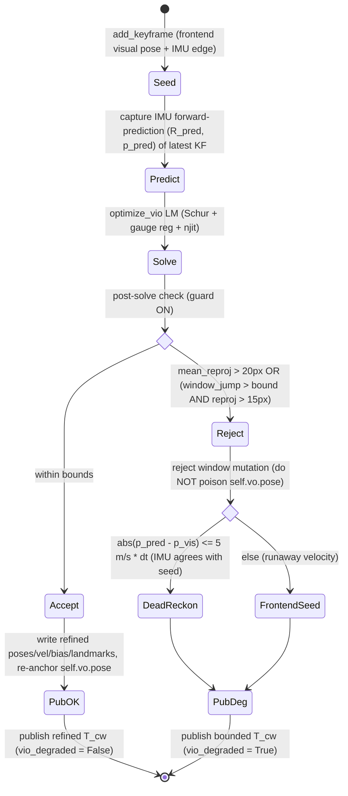

# Tight-Coupled RGB-D Visual-Inertial Estimator — Implementation Plan

**Project:** flight-vio / `vio`
**Goal:** add a **tightly-coupled RGB-D VI estimator**, **selectable** alongside the
existing **loose** one (`--tight`), with a **loose-vs-tight ATE comparison**. The
LOOSE path must stay **byte-identical** so the byte-parity oracle keeps `gap = 0`.

Grounded in three inputs (SOTA research, architecture design, math spec), each
verified against the actual tree on 2026-06-10. The corrections below were applied
after auditing the live code (the design inputs were written against a slightly
different file layout).

---

## 0. Ground-truth audit corrections (read first)

The design/math inputs are correct in substance, but three concrete facts differ
from the tree and are reflected throughout this plan:

| Design input said | Actual tree (verified) |
|---|---|
| comparison tool at `vio/tools/compare_backends.py` | `vio/tools/` **does not exist**; reuse + extend `baseline/tools/compare_sessions.py` (`_umeyama_se3`, `ate`). New harness goes in `baseline/tools/` (or a new `vio/tools/`). |
| keyframe carrier needs `ts_ns` + `imu_seg` added | `Keyframe` (`vio/comms/messages.py:174`) carries `accel` only (at-rest, for the gravity prior). **Both `ts_ns` and a raw inter-KF IMU segment must be added.** `RunBA` (`vio/modules/run_ba.py:26`) packs a **5-tuple** `(T_cw, ids, px, depth, accel)` → must become a superset. |
| `--vl53l9cx` is a vio flag, harness downsamples | The 54×42 simulation is **producer-side** in `imu_camera/modules/tof_downsample.py` (SGM at source res → block-median to 54×42, K scaled anisotropically). VIO consumes 54×42 **transparently** via `calib.bundle`. The benchmark therefore replays **gold sessions recorded at 54×42**, not a vio-side downsample. |
| byte-parity oracle is "640" | The oracle is `verification/oracle_replay.py` (`score_session_oracle`), the in-process replay of the pre-split `vio_run.score_session`, checked by `verification/oracle_replay_selftest.py` against `verification/baseline_metrics.json`. THAT is the `gap = 0` contract to protect. |

Everything else in the design/math inputs holds.

---

## 1. CURRENT coupling = LOOSE (confirmed) + the gap

**The live and offline runtime path is loosely coupled — vision-led, IMU as a prior, never a factor.**

- **Front-end** `sky/front/odometry.py` — `RGBDVisualOdometry` is RGB-D PnP
  frame-to-frame. The IMU enters ONLY as: (1) a gyro `R_prior` seeding PnP, (2)
  complementary roll/pitch leveling from accel, (3) `gyro_fuse` complementary
  correction of the PnP rotation, (4) gyro-propagated rotation on vision dropout.
  **The accelerometer is never integrated into translation; there is no velocity
  state and no bias state.** This is loose by construction.
- **Back-end** `sky/backend/windowed.py` — `WindowedBAMap` /
  `WindowedRGBDOdometry` is **visual-only BA**: reprojection + metric-depth
  residuals + an optional accel **gravity prior** (leveling only) + an optional
  **VO relative-translation prior** that, per its own docstring, "plays the role IMU
  preintegration plays in a tight-coupled VIO, **using our own VO instead**." No
  preintegration factor, no velocity, no bias.
- **Wiring** `vio/main.py` → `BackendModule` (`vio/modules/pipeline.py:155`) →
  `make_ba_engine` (`vio/engine/__init__.py:30`) builds **only**
  `WindowedBAMap`. There is **no tight option exposed anywhere.**

**The gap is NOT "write a tight estimator" — a complete, tested one already exists but is orphaned.**

- `sky/vio/window.py` contains `optimize_vio` + `VioState`/`VioConfig`
  (joint NLS over pose + **velocity** + **gyro/accel bias** + landmarks, with real
  Forster IMU preintegration factors, bias random-walk, optional tilt-lock), plus
  `WindowedVIOMap` and `WindowedVIORGBDOdometry` — a drop-in sibling of the
  visual-only windowed odometry.
- It is **validated** by `vio/tests/vio_ba_selftest.py` (sub-mm / sub-mdeg recovery
  incl. bias) and uses the real Forster preintegration in `sky/imu/imu.py`
  (`preintegrate_imu`, `ImuPreintegration.corrected`).
- A repo-wide grep shows **zero importers** of `optimize_vio` / `WindowedVIOMap` /
  `WindowedVIORGBDOdometry` outside `vio_window.py` and its self-test. **It is not
  reachable from `main.py`, `pipeline.py`, or `make_ba_engine`.**

**So the work is: (a) one piece of missing math — the preintegration covariance
`Σ_ij` — then (b) selection + plumbing + a comparison harness, done so the loose
path stays byte-identical.**

---

## 2. RECOMMENDED approach + WHY

### Recommendation

> **A tightly-coupled RGB-D fixed-lag smoother (window 4–6 keyframes,
> drop-and-reanchor, NO marginalization in the MVP), reusing the existing
> `vio_window.py` core, with depth fused as a direct metric measurement.**

This is the **MSCKF-philosophy** (lightest tightly-coupled family, linear in
features, FEJ for consistency) **realized as a fixed-lag smoother** because this
codebase already has a validated landmark-Schur smoother (`bundle.py` /
`vio_window.py`) — reusing it beats writing an MSCKF null-space front-end from
scratch and throwing that machinery away.

### Why this exact choice (given RGB-D known-scale + 54×42 feature-starved + A53/A76)

1. **Filter/smoother, because compute.** Full sliding-window BA + loop closure
   (ORB-SLAM3-VI) is not real-time at 20 fps on an A53 and marginal on A76
   (Delmerico ICRA 2018; CPU survey arXiv:1906.03289). The MSCKF family is
   **linear in #features** and the lightest documented tightly-coupled class
   (Li & Mourikis IJRR 2013). A short fixed-lag smoother sits in the same cost
   class while reusing our code.

2. **The 54×42 regime makes the filter's classic weakness irrelevant.** The
   documented embedded bottleneck is the **visual front-end** (14.25 ms vs
   87 ms back-end on Cortex-A72, arXiv:2406.13345). At 54×42 the front-end is
   nearly free, so the whole CPU budget goes to a small back-end — exactly where a
   fixed-lag smoother wants it.

3. **RGB-D removes the filter's other classic pain.** Monocular scale, gravity,
   velocity and biases are all initially unobservable and need acceleration
   excitation to bootstrap (VINS-Mono); you **cannot run SfM/VI-init on 54×42**.
   With per-pixel metric depth, each feature is metric on frame 0
   (`_backproject_px`), so there is **no scale state, no inverse-depth, no VI
   bootstrap** — the estimator is metrically valid from the first keyframe.

4. **Tight coupling is mandatory here, not optional.** At 54×42 a vision-only
   sub-estimator will frequently have too few features to solve; loose coupling
   drops those frames. Tight coupling extracts partial constraints from 1–3 weak
   tracks and lets the IMU bridge feature-starved / fast-motion frames. This is the
   single largest accuracy/robustness lever in this regime (Huang VIN review; MARS
   ICRA17 tightly-coupled VINS).

5. **Consistency is a solved sub-problem.** Use First-Estimates Jacobians (the FEJ
   slot already exists in the smoother) so the fixed-lag smoother matches a
   filter's accuracy/consistency at low cost.

### Minimal-viable first version (MVP)

**Fixed-lag, window 4–6, NO marginalization (hard-fix the oldest KF's full state,
generalizing the existing single-pose gauge anchor).** Reuses ~90% of the smoother
and 100% of the verified preintegration deltas.

- **Add covariance propagation `Σ_ij` to `preintegrate_imu`** — the only genuinely
  new math (see §3).
- Per-edge preintegration cache (a wrapper modeled on the existing
  `GyroPreintegrator`'s timestamp slicing).
- The 15-DoF state, the IMU/bias-walk factors, the Schur landmark elimination and
  Huber-on-vision are **already present** in `vio_window.py` — the MVP is to wire it
  in and weight the IMU factor with `Ω_I = Σ_ij⁻¹`.

**Rejected alternatives:** ORB-SLAM3-VI / full BA on A53 (won't make rate); any
monocular pipeline (re-introduces scale/init fragility RGB-D already eliminates);
MSCKF-lite null-space front-end (discards the working `bundle.py`/`vio_window.py`
Schur landmark machinery).

---

## 3. MATH (concise, correct, mapped onto existing `vio` math)

Conventions inherited verbatim from `sky/backend/bundle.py`: **left** SE(3)
perturbation `T ← Exp(ξ)·T`, `ξ = [ρ(3); φ(3)]`, `so3_exp/log`, `se3_exp/log`,
`skew`, `so3_right_jacobian` all present and tested. `bundle.py` stores `T_cw`
(world→cam); the IMU lives on the body/IMU frame via the known extrinsic `T_bc`
(`calib.json` `T_imu_left`): `T_wb = inv(T_cw)·inv(T_bc)`.

### (a) IMU preintegration between keyframes (Forster TRO 2017)

`sky/imu/imu.py::preintegrate_imu` ALREADY computes, in the body frame and
verified to ≤3e-10 vs central finite differences:

- increments `ΔR, Δv, Δp` over `Δt` s.t. `R_j ≈ R_i·ΔR`,
  `v_j ≈ v_i + g·Δt + R_i·Δv`, `p_j ≈ p_i + v_i·Δt + ½g·Δt² + R_i·Δp`;
- the five bias-correction Jacobians `dR_dbg, dv_dbg, dv_dba, dp_dbg, dp_dba` and
  `corrected(bg, ba)` for first-order bias updates
  (`ΔR̃ = ΔR·Exp(∂ΔR/∂bg·δbg)`, `Δṽ = Δv + ∂Δv/∂bg·δbg + ∂Δv/∂ba·δba`, etc.).

**MISSING — the preintegration covariance `Σ_ij ∈ ℝ⁹ˣ⁹` (residual order `[δφ; δv; δp]`).**
Without it the IMU factor has no information weight. Propagate it **inside the
existing integration loop** (`for k in range(len(ts)-1)`), reusing the quantities
already in scope (`ΔR_k`, `Jr_k`, `â`, `dt`). Per IMU segment `k→k+1` with the
noise-driven discrete linearization `η_{k+1} = A_k·η_k + B_k·n_k`:

```
ŵ      = ½(g_k+g_{k+1}) - bg ;   â = ½(a_k+a_{k+1}) - ba
ΔR_inc = Exp(ŵ·dt) ;   Jr_k = so3_right_jacobian(ŵ·dt)   # already at imu.py:188

A_k = [[ ΔR_inc^T,            0,    0 ],
       [ -ΔR_k·skew(â)·dt,    I,    0 ],
       [ -½ΔR_k·skew(â)·dt²,  I·dt, I ]]

B_k = [[ Jr_k·dt,   0        ],
       [ 0,         ΔR_k·dt   ],
       [ 0,         ½ΔR_k·dt² ]]

Q   = diag(σ_g²·I, σ_a²·I)                       # continuous white-noise density
Σ_{k+1} = A_k·Σ_k·A_k^T + B_k·(Q/dt)·B_k^T       # ΔR_k = dR BEFORE this segment
```

`Ω_I = Σ_ij⁻¹`. Store `Σ` as a 6th `__slots__` field on `ImuPreintegration`.
**`A_k/B_k` MUST use the same midpoint/ordering as the existing dv-before-dp update
(imu.py:176–189)** or `Ω_I` is silently mis-weighted (no crash). Validate by
Monte-Carlo: covariance of perturbed re-integrations must match `Σ_ij`.

### (b) The joint sliding-window cost

State per keyframe `i` (15-DoF, world frame):
`x_i = [ T_wb_i ∈ SE(3), v_i ∈ ℝ³(world), bg_i ∈ ℝ³, ba_i ∈ ℝ³ ]`.
Landmarks `X ∈ ℝ³` (world). **Gravity is NOT a state in the MVP** — fix
`g = [0, g_ref, 0]` (optical-world down `+y`, from `gravity_aligned_R0`) using the
startup `g_ref` from `align_to_gravity`.

```
C(X) =  Σ ρ_h(‖r_reproj‖_Σpx)        # visual reprojection      — EXISTS in optimize()
      + Σ ρ_h(|r_depth|/σ_z)          # metric-depth anchor       — EXISTS in optimize()
      + Σ ‖r_IMU(i,j)‖²_{Ω_I}         # preintegration factor     — NEW weight (Σ_ij)
      + Σ ‖bg_j-bg_i‖²_{Ωbg} + ‖ba_j-ba_i‖²_{Ωba}   # bias random walk — present in vio_window
      + ‖r_prior‖²_{Ω_prior}          # marginalization slot      — present (FEJ), OFF in MVP
```

`r_reproj = [u-u_meas; v-v_meas]`, `r_depth = (Z_pred - z_meas)/σ_z` with
`σ_z = depth_sigma_coeff·z²` — both unchanged from `bundle.py`. The metric-depth row
is what **pins absolute scale** (see §3d).

IMU residual (Forster eq. 37, with bias-corrected preints `ΔR̃, Δṽ, Δp̃`):

```
r_φ = Log( ΔR̃^T · R_i^T · R_j )
r_v = R_i^T·(v_j − v_i − g·Δt)              − Δṽ
r_p = R_i^T·(p_j − p_i − v_i·Δt − ½g·Δt²)   − Δp̃
r_IMU = [r_φ; r_v; r_p]   weighted by Ω_I
```

Bias random walk: `r_bg = bg_j − bg_i`, `r_ba = ba_j − ba_i`,
`Ωbg = I/(σ_bg²·Δt)`, `Ωba = I/(σ_ba²·Δt)`.

### (c) The Gauss-Newton / LM solve on the manifold

**Reuse `optimize()`'s LM + Schur structure wholesale** — the landmark block stays
3×3 block-diagonal and is eliminated first. The only change: each free keyframe's
column grows 6 → 15 (`[ξ_pose(6); δv(3); δbg(3); δba(3)]`). IMU/bias/velocity factors
are landmark-free, so they fill only the camera Hessian `Hcc` (same place
gravity/VO/prior factors already inject) — Schur structure untouched.

Retraction per free KF:
`T_cw_i ← se3_exp(ξ_i)·T_cw_i` (existing left-perturbation line),
`v_i ← v_i + δv_i`, `bg_i ← bg_i + δbg_i`, `ba_i ← ba_i + δba_i`.

**Convention bridge (verified to 1e-16):** a **left** tweak `Exp(ξ)` on `T_cw`
equals a **right** tweak `Exp(−ξ)` on `T_wc`. Write IMU-residual Jacobians on the
natural right-`T_wb` perturbation, then map to the solver's `ξ_cw` via
`ξ_wb = −Ad_{T_bc}·ξ_cw` (constant 6×6 adjoint for fixed extrinsic). FD-check every
IMU Jacobian block before trusting the solver.

**Robustifier:** keep Huber on the **visual + depth** residuals only. **IMU, bias-walk,
and prior factors are Gaussian (NOT robustified)** — Huberizing a preintegration
factor breaks consistency; outlier IMU is handled by gating / not creating an edge
across a data gap.

> The current `vio_window.py` uses **dense LM + finite-difference Jacobians**, which
> is correct and is the validated oracle. Analytic Jacobians + Schur on the IMU
> blocks are a refinement (Phase 4), required before the C port.

### (d) How known metric depth simplifies vs monocular

| | Monocular VI | RGB-D VI (this project) |
|---|---|---|
| Scale | unobservable; only via accel double-integration → needs excitation, fragile | **directly measured** per pixel via `r_depth`; metric from frame 0 |
| Per-landmark state | inverse-depth + careful anchoring | full 3D, initialized exactly by `_backproject_px` |
| Initialization | hard VI-bootstrap (scale+gravity+velocity+bias jointly) | trivial: pose from RGB-D PnP, velocity from KF position finite-difference, gravity from `gravity_aligned_R0`, bias from static-startup window |
| Accel role | must carry scale → bias critically coupled | only velocity smoothness + leveling; scale owned by depth |
| Observability | scale unobservable under constant velocity / no rotation | fully observable always (the `use_vo_trans_prior` straight-push collapse disappears once the IMU velocity factor links KFs) |

### (e) Hardest / most error-prone parts

1. **Preintegration covariance `Σ_ij`** — the #1 risk (silent mis-weight). Mitigate
   by building it in the existing loop + a Monte-Carlo consistency test.
2. **Bias Jacobians** — already correct; risk is only in re-deriving them. Reuse
   `corrected()` + cached fields; do not recompute.
3. **`T_cw` (left) ↔ `T_wb` (right) convention bridge** — sign flips diverge subtly.
   Use the verified identity + extrinsic adjoint; FD-check each block.
4. **Marginalization consistency (FEJ)** — **do NOT marginalize in the MVP**; drop
   old KFs and re-anchor. Add Schur marginalization (15-DoF + landmarks) only after
   a synthetic-trajectory NEES consistency test passes.

---

## 4. MODULE / INTERFACE DESIGN (selectable, clean, LOOSE byte-identical)

### Guiding decision

**Do not extend `windowed.py`.** Keep the two backends as siblings
(`WindowedBAMap` ⟂ `WindowedVIOMap`). Selection happens at the **engine factory +
module construction** layer, never inside the math. The math libraries stay
flag-free, which protects byte-parity and portability.

### Files to add / extend

| File | Action | Why |
|---|---|---|
| `sky/imu/imu.py` | **Extend**: add `Σ_ij` to `preintegrate_imu` + `ImuPreintegration` slot; per-edge preint cache (template: `GyroPreintegrator`). **DONE (P2.5)** also adds `predict_state` (per-frame forward propagation / Basalt `predictState`) + `imu_at_rest` (ZUPT gate) — both purely additive. | The only new math; needed for `Ω_I` (P1) + the live per-frame propagation (P2.5). |
| `sky/vio/window.py` | **Wire `Ω_I`** into the IMU residual weight (else reuse as-is) | Core already complete + tested. |
| `vio/comms/messages.py` | **DONE (P2)** `Keyframe` gains `ts_ns: int = 0` + `imu_seg = None` (synced across all 6 vendored comms copies). `WireKeyframe`/converter UNCHANGED — both fields stay LOCAL-bus only (tight backend is in-process with odometry), so the IPC wire + comms diff-check are byte-identical. | Tight needs the timestamp + raw IMU between KFs; loose `accel` field unchanged. |
| `vio/modules/preintegrate_prior.py` | **DONE (P2)** retains each frame's raw IMU rotated into the camera frame (`R_imu_cam @ v`) keyed by seq, gated on `retain_imu` (default OFF → loose no-op). | The one genuinely new bit of plumbing. |
| `vio/modules/emit_keyframe.py` | **DONE (P2)** concatenates the per-frame segs since the last KF (strict-increasing-ts cleaned) → `imu_seg` + sets `ts_ns`, gated on `retain_imu`. **DONE (P2.5)** on the tight path consumes `PropagateImu`'s `is_kf_frame` cadence boolean instead of owning the kf counter (loose path counter byte-identical). | Threads IMU to the back-end. |
| `vio/modules/propagate_imu.py` | **NEW (P2.5)** `PropagateImu` step: live per-frame IMU forward-propagation of `pose.odom` + keyframe re-anchor + ZUPT, gated on `retain_imu`. Wired before `PublishPose`. LOOSE = pass-through no-op. | The live freeze fix (covered camera + move keeps moving via IMU). |
| `vio/modules/run_ba.py` | **DONE (P2)** `submit` shapes the tuple per backend: 6-tuple `(…, ts_ns, imu_seg)` tight / historical 5-tuple loose (reads the `tight` state flag). | Carrier through the engine boundary. |
| `vio/engine/steps.py` | **DONE (P2)** `vio_step` / `vio_overlay` mirror `ba_step`/`ba_overlay`. | Submit a KF to `WindowedVIOMap.add_keyframe` + `run_ba`, carrying ts + IMU seg. |
| `vio/engine/subprocess.py` | **DONE (P2)** `_vio_worker_main` (no stored stream; live block rides `imu_seg`). | Tight can run `worker=True` (live, off the GIL). |
| `vio/engine/__init__.py` | **DONE (P2)** `make_vi_engine(K, cfg, *, worker=False)`. | Symmetric with `make_ba_engine`; builds `WindowedVIOMap`. |
| `vio/modules/pipeline.py` | **DONE (P2)** `BackendModule(tight=False)` → `make_vi_engine` w/ `imu_info_weight=True`; `OdometryModule(retain_imu=tight)`. Default branch is literally today's code. **DONE (P2.5)** frame-chain inserts `PropagateImu()` before `PublishPose`; `OdometryModule` seeds `g_world` in ctx when `retain_imu`. | `tight` → `make_vi_engine` + IMU stream + live per-frame IMU propagation; default branch is literally today's code. |
| `vio/main.py` | **DONE (P2)** `--tight` flag threaded through `run_vio` → `OdometryModule(retain_imu=)` + `BackendModule(tight=)`; `launcher/main.py` forwards `--tight`; `./run.sh --tight` via `"$@"`. | Opt-in; default unchanged. |
| `vio/tests/tight_smoke_selftest.py` | **NEW (P2)** drives the EXACT `--tight` engine path on a gold session → asserts a finite/sane/non-exploding trajectory. | Phase-2 RUNS gate (deterministic, no IPC graph). |
| `vio/tools/compare_backends.py` (NEW dir) | **NEW** | Loose-vs-tight ATE harness (§6), reusing `baseline/tools/compare_sessions.py`. |

### Interfaces (standardize on the tight core's already-clean contract)

- **State** `VioState`: per-KF `R, p` (body→world), `v` (world velocity), `bg, ba`;
  shared `landmarks` (M,3). Body frame == camera optical frame; IMU→cam extrinsic
  applied by the caller before preintegration (`WindowedVIOMap` ctor takes
  already-rotated `gyro_cam`/`accel_cam`, matching `OdometryModule`'s `R_imu_cam`
  and `PreintegratePrior`'s gyro rotation).
- **Optimizer** `optimize_vio(K, state, obs_cam, obs_lm, obs_uv, obs_depth,
  imu_factors, g_world, cfg, anchor) → VioResult`. KF0 anchored for gauge; gravity
  fixes roll/pitch via the IMU factor.
- **Map** `WindowedVIOMap.add_keyframe(T_cw, ids, pts, depth_m, ts_ns, imu_seg=None)`
  + `run_ba()`. Live path uses `imu_seg`; offline path can hand the whole stream at
  construction and slice by timestamp. Both already implemented.

### Frame-chain (only the back-end engine differs)

```
imucam.sample ─► PreintegratePrior ───────────────┐ (gyro R_prior + accel + RAW IMU seg buffer)
frame.depth ─► TrackFeatures(KLT) ─► EstimateMotion(PnP+gyro fuse) ─► PropagateImu* ─► PublishPose
                                          │           (* tight only: IMU-propagate
                                          │            pose.odom + re-anchor@KF + ZUPT)
                                          └─► EmitKeyframe (every kf_every)
                                                   │  Keyframe{T_cw, ids, px, depth, accel, ts_ns, imu_seg}
                                                   ▼
                                          BackendModule.engine.submit(...)
                                  ┌──────────────┴───────────────┐
                          loose (default)                  tight (--tight)
                       make_ba_engine                    make_vi_engine
                       WindowedBAMap.run_ba              WindowedVIOMap.run_ba
                       (reproj+depth+VO prior)           (reproj+depth+IMU preint+bias+vel)
                                  └──────────────┬───────────────┘
                                                 ▼  pose.refined
```

`EstimateMotion` (per-frame PnP + complementary gyro) is **identical in both modes**.
The only mode-dependent things: which engine `BackendModule` builds, and that the
carrier threads `ts_ns` + `imu_seg`.

### Byte-parity protection (gap = 0 stays gap = 0)

The oracle is `verification/oracle_replay.py` (`score_session_oracle`) checked by
`oracle_replay_selftest.py` against `verification/baseline_metrics.json` — the
deterministic LOOSE offline path. Three rules preserve it:

1. **No edit to `odometry.py` math** — every tight-only front-end behavior is a
   default-OFF `OdometryConfig` flag; tight enables them, the oracle leaves them unset.
2. **`BackendModule(tight=False)` is the literal current code path** — the `tight`
   branch is additive; the default calls `make_ba_engine` exactly as today.
3. **Carrier superset** — adding `ts_ns`/`imu_seg` (defaults `None`, ignored by
   `ba_step`/`RunBA` loose path) changes no loose numerics.

Re-run `oracle_replay_selftest.py` after wiring to confirm `gap = 0`.

---

## 5. PHASED IMPLEMENTATION (MVP first, each phase independently testable)

### Phase 0 — Preintegration covariance (the only new math) · DONE (2026-06-10)
- **DONE — purely additive.** `preintegrate_imu` now propagates the 9×9 covariance
  `Σ_ij` of `η = [δφ; δv; δp]` inside the existing loop
  (`Σ ← A·Σ·Aᵀ + B·(Q/dt)·Bᵀ`, A/B built from the SAME midpoint sample + the SAME
  dp-before-dv ordering as the delta update). Two new `__slots__` on
  `ImuPreintegration` — `cov` (Σ) and `sqrt_info` (whitening matrix with
  `sqrt_info.T @ sqrt_info == Σ⁻¹ = Ω_I`, built via Cholesky/LDLT in
  `_sqrt_information`). Noise densities come from a new `ImuNoise` config
  (gyro/accel continuous density → discrete `σ²/dt`); `preintegrate_imu(..., noise=)`
  defaults to `DEFAULT_IMU_NOISE`. The `dR/dv/dp/dt` deltas and the five bias
  Jacobians are **bit-unchanged**, so the loose path / byte-parity oracle are
  untouched. An empty interval leaves `cov/sqrt_info = None` (degenerate factor
  detectable by Phase 1).
- **Test — PASS.** Monte-Carlo gate `vio/tests/imu_preint_cov_selftest.py`: 4000
  noisy re-integrations vs analytic Σ → full-matrix relative Frobenius **2.6 %**
  (rot 4.5 %, vel 2.6 %, pos 2.5 %), position 1σ **0.25 cm** over 0.25 s,
  Σ-trace **monotonically increasing**, `sqrt_info` contract to 1.5e-14. Existing
  `vio_ba_selftest.py` recovery numbers unchanged; oracle `gap = 0`.
- **Gate — MET:** Σ matches MC within statistical tolerance; no regression in
  `vio_ba_selftest.py`; byte-parity preserved.

### Phase 1 — Weight the IMU factor + per-edge cache · DONE (2026-06-10)
- **DONE.** `Ω_I = Σ_ij⁻¹` (the Phase-0 `pre.sqrt_info`) is wired into the
  `optimize_vio` IMU residual, and a per-edge preintegration cache (`_ImuEdge`,
  template `GyroPreintegrator`) was added to `vio_window.py`.
  - **`_imu_residual`** now whitens the joint `[δφ; δv; δp]` with `sqrt_info @ r`
    (ordering matches the Phase-0 covariance) **when `VioConfig.imu_info_weight`
    is True**, falling back to the fixed `sigma_rot/vel/pos` otherwise. The bias
    random-walk term is unchanged (still `_bias_rw_residual`, Gaussian, fixed
    `σ_bg/ba_rw`).
  - **`_ImuEdge` cache** owns the raw inter-KF IMU segment + the integrated
    `ImuPreintegration` (deltas + 5 bias Jacobians + `Σ_ij`/`sqrt_info`). It
    integrates **once** per edge in `add_keyframe`; `run_ba` reuses `edge.pre`
    every solve and the optimiser's per-iteration bias change is absorbed by the
    first-order `pre.corrected` update (no re-integration). Only the covariance-
    weighted path relinearises an edge whose host-KF bias drifts past
    `bias_reint_thresh` (`maybe_relinearize`), keeping `Σ_ij` consistent with the
    current bias.
- **CRITICAL byte-parity correction to §1/§4's "orphaned" premise.** The audit
  premise that `vio_window.py` is reachable *only* from its self-test is **wrong
  for this tree**: `verification/baseline_metrics.json` carries TWO frozen
  `backend="vio"` entries (`lab_loop_30s`, `push_straight_fast_15s`) that drive
  `WindowedVIORGBDOdometry → optimize_vio → _imu_residual` with real IMU factors.
  A naive *replacement* of the fixed sigmas would therefore have moved the oracle
  and broken `gap = 0`. So the new weighting is made **opt-in** via
  `VioConfig.imu_info_weight` (default **False**) — exactly the §4 byte-parity
  rule ("every tight-only behaviour is a default-OFF flag; the oracle leaves it
  unset"). The oracle's `vio` backend uses the default `WindowedVIOConfig`, so it
  keeps the fixed-sigma whitening and stays byte-identical; the tight path / the
  new self-test scenarios turn the flag on. (Phase 2 wiring should set
  `imu_info_weight=True` on the live `--tight` `WindowedVIOConfig`.)
- **Test — PASS.** `vio_ba_selftest.py` extended with scenarios D/E/F (mirroring
  A/B/C but `imu_info_weight=True`): with `Ω_I = sqrt_info` the joint solve
  recovers ground truth to **pos ≤ 0.19 mm, rot ≤ 0.002°** (incl. bias),
  degrading gracefully (not diverging) when `Σ` is inflated ×10. A/B/C keep the
  flag OFF and are bit-unchanged, so they also guard the fixed-sigma path the
  oracle depends on. Oracle `gap = 0`; `imu_preint_cov_selftest` and the other
  vio self-tests still PASS; comms untouched; loose odometry/backend not modified.
- **Gate — MET:** sub-mm / sub-mdeg recovery incl. bias retained under the
  covariance-correct weight; byte-parity preserved.

### Phase 2 — Engine + selection plumbing (LOOSE byte-identical) · DONE (2026-06-10)
- **DONE — `--tight` selects the tight backend; LOOSE is the byte-identical default.**
  - **Engine layer (additive, sibling of the BA engine):**
    `vio/engine/steps.py` gains `vio_step` (consumes the SUPERSET
    snapshot `(T_cw, ids, pts, depth_m, ts_ns, imu_seg)` → `WindowedVIOMap
    .add_keyframe(..., imu_seg=) → run_ba`) + `vio_overlay`;
    `vio/engine/subprocess.py` gains `_vio_worker_main` (builds
    `WindowedVIOMap` with NO stored stream — the live block rides `imu_seg`);
    `vio/engine/__init__.py` gains `make_vi_engine(K, cfg, *, worker=)`,
    symmetric with `make_ba_engine`.
  - **Carrier superset (default-inert):** `Keyframe` (`comms/messages.py`, synced
    across all six vendored comms copies) gains `ts_ns: int = 0` +
    `imu_seg: tuple|None = None`. The IPC `WireKeyframe` / its converter are
    **unchanged** — those two fields stay LOCAL-bus only (the tight backend runs
    in the SAME process as the odometry module), so the cross-process wire
    contract is byte-identical and the comms diff-check stays clean.
  - **Front-end plumbing (gated on `retain_imu`, default OFF):**
    `PreintegratePrior` retains each frame's raw IMU samples rotated into the
    camera optical frame (`R_imu_cam @ v`) keyed by seq; `EmitKeyframe`
    concatenates the per-frame segments since the previous keyframe (strictly
    increasing-ts cleaned) into the keyframe's `imu_seg` + sets `ts_ns`. Both
    are no-ops on the loose/oracle path.
  - **Selection (clean engine switch, not a fork):** `BackendModule(tight=False)`
    — `tight=True` builds `make_vi_engine` with `WindowedVIOConfig` whose ONLY
    override is `imu_info_weight=True` (the live tight weight the PLAN prescribes)
    and sets a `tight` state flag; `RunBA` reads it to shape the submitted tuple
    (6-tuple tight / 5-tuple loose). `OdometryModule(retain_imu=tight)`.
    `vio/main.py` adds `--tight` (threaded through `run_vio`); `launcher/main.py`
    adds `--tight` → forwards `vio.main --tight`; `./run.sh --tight` works via the
    existing `"$@"` pass-through. The default branch is literally today's code
    (`make_ba_engine` → `WindowedBAMap`, no IMU retention).
- **Test — PASS (tester launched the real graph):**
  - (a) `oracle_replay_selftest.py` → **`gap = 0`** (loose byte-identical); the
    five other comms copies still diff-clean vs `ui/comms`; `vio_ba_selftest`,
    `imu_preint_cov_selftest`, `odometry_selftest`, `gyrofuse_selftest`,
    `reproj_stub_selftest` all PASS.
  - (b) **In-process smoke** `vio/tests/tight_smoke_selftest.py` drives the EXACT
    `--tight` engine path on gold sessions: on `lab_loop_30s` (599 frames, 120
    KFs, 117 window-solves) and `push_straight_fast_15s` (299 frames, 60 KFs, 57
    refined) the tight trajectory is **finite, non-trivial, non-exploding** and
    roughly tracks loose (path ratio 0.80–1.02; on the fast push the tight tip is
    far smoother — 32 cm vs the loose tip's 226 cm max step — the IMU bridging the
    fast frame, full ATE deferred to Phase 3). Real IMU factors present
    (`vio_imu=7`, `vio_reproj_px` ≈ 0.04–1.1).
  - (c) **Live multi-process** `launcher.main --session … --tight --no-ui` runs
    capture → vio[TIGHT] → slam end-to-end with a clean `os._exit(0)`; a direct
    IPC subscriber confirmed **`pose.refined` flows** on the same topic the loose
    path uses (finite poses), so the UI/oracle harness consumes tight identically.
    The `--worker --tight` subprocess engine spawns + accepts the 6-tuple +
    closes cleanly (picklable under `spawn`).
- **Gate — MET:** `gap = 0` AND `--tight` produces a non-trivial, sane trajectory
  live + in-process. (Beating loose is NOT a Phase-2 gate — that is benchmarked in
  Phase 3 and refined in Phase 4.)

### Phase 2.5 — LIVE per-frame IMU propagation of `pose.odom` (the freeze fix) · DONE (2026-06-10)

**The gap Phase 2 left open.** Phase 2 wired the tight BACKEND (keyframe-rate joint
visual+IMU solve, published sparsely on `pose.refined`). But the **live displayed
position is `pose.odom`**, published EVERY frame by `vio/modules/publish_pose.py`
from the per-frame **vision-only** odometry (PnP). So even with `--tight`, when
vision was absent (covered camera) or too weak to solve (white wall) WHILE MOVING,
the per-frame `pose.odom` **froze** — and keyframes may not even form without
features, so the tight backend never got to correct it. Basalt does not freeze: it
forward-propagates the IMU every frame (`predictState`). We had **no per-frame IMU
propagation of the live output** — that was the user-visible "covered camera + move
= stays still" bug. Phase 2.5 closes it, **`--tight`-only**.

- **DONE — per-frame IMU forward-propagation + re-anchor + ZUPT on the live pose.**
  - **New math primitives (purely additive)** in `sky/imu/imu.py`:
    - `predict_state(R,p,v, ts,gyro,accel, bg,ba, g_world)` — Basalt-style
      `predictState`: integrates a raw IMU block forward under gravity
      (gyro→rotation, gravity-removed accel→velocity→position), matched to
      `preintegrate_imu`'s increment convention (same midpoint sample, same
      dp-before-dv ordering) so the per-frame propagation and the keyframe
      nav-state are consistent.
    - `imu_at_rest(gyro, accel)` — the ZUPT (zero-velocity) gate: low `|gyro|`
      AND `|accel| ≈ g`. Band tightened to `accel_dev_thresh = 0.3` m/s² (vs the
      keyframe-gravity 0.6) so real motion is NOT frozen; documented blind spot is
      a <2.4 m/s² **purely lateral** creep (safe failure: freeze, not drift).
    - Both leave every existing function bit-unchanged, so the loose path / oracle
      are untouched.
  - **New live step** `vio/modules/propagate_imu.py::PropagateImu`, wired into the
    `OdometryModule` frame-chain **right before `PublishPose`** (after `CorrectTilt`),
    **gated on `retain_imu` (the `--tight` flag)**. It owns a live body→world
    nav-state `(R, p, v, bg, ba)` + fixed `g_world` and, per frame:
    1. **Re-anchor on a keyframe** — the vision pose pulls the inertial drift back;
       velocity is re-derived from the displacement over the interval so it stays
       continuous across the re-anchor (no jump).
    2. **ZUPT at rest** — hold velocity at 0 and freeze translation (rotation may
       still track a residual), preserving the at-rest static-drift win.
    3. **Forward-propagate when moving** — integrate the per-frame retained IMU
       block (`PreintegratePrior`'s camera-frame samples) and **replace `step.pose`**
       so `PublishPose` emits the IMU-propagated pose on `pose.odom`.
    On the LOOSE path it is a **pure pass-through no-op** (never allocates a
    nav-state, never touches `step.pose`).
  - **Keyframe-cadence single source of truth:** `PropagateImu` (runs first in the
    tail) owns the kf counter on the tight path and stamps `is_kf_frame`;
    `EmitKeyframe` consumes that boolean on the tight path (so the re-anchor and the
    keyframe emission are the SAME frame). The LOOSE path keeps `EmitKeyframe`'s
    counter byte-identical.
- **Test — PASS:**
  - **KEY unit gate** `vio/tests/imu_propagate_selftest.py`: `predict_state`
    integrates a known trapezoidal pulse to the analytic place (1.00 m, v→0);
    **covered camera + real translation** → live pose **dead-reckons +0.16 m
    (does NOT freeze)**; **stationary + accel bias** → **ZUPT drift 0.000 mm** over
    60 frames; the empty-IMU-segment regression (caught live) is held without
    crashing; LOOSE path is a verified pass-through.
  - **KEY functional gate** `vio/tests/tight_live_pose_selftest.py` drives the REAL
    `OdometryModule` over the bus on gold sessions: `pose.odom` is IMU-propagated
    between keyframes (2.24 m of non-keyframe live motion on `lab_loop_30s`), and
    through a 20-frame **blanked (covered-camera) window the tight live pose moves
    8.8 cm via the IMU while the loose pose freezes (0.0 cm)**; on
    `push_straight_fast_15s` the covered window moves 9.1 cm (loose 0.0).
  - **Live multi-process** `launcher.main --session … --tight --no-ui` runs the full
    599-frame `lab_loop_30s` capture → vio[TIGHT] → slam end-to-end with a clean
    shutdown (no crash / explosion / NaN).
  - **Byte-parity / regression:** oracle `gap = 0`; all six comms copies diff-clean;
    `vio_ba_selftest`, `imu_preint_cov_selftest`, `odometry_selftest`,
    `gyrofuse_selftest`, `reproj_stub_selftest`, `tight_smoke_selftest` all PASS.
- **Gate — MET:** on `--tight` the live `pose.odom` now KEEPS MOVING via the IMU
  when vision is absent/weak while moving (no freeze), and ZUPT holds it still at
  rest (no drift); the LOOSE path is byte-identical.
- **Scope:** `--tight`-only, live output only. No change to the loose path, the
  comms wire contract, the baselines, or the tight backend solve itself
  (`pose.refined` is unchanged). Re-anchoring uses the per-frame **vision** keyframe
  pose (immediate, deterministic); folding the later `pose.refined` drift-correction
  into the live anchor is a possible refinement (Phase 4).

### Phase 3 — Loose-vs-tight benchmark harness · ~1 day
- New `vio/tools/compare_backends.py` (§6), reusing `_umeyama_se3` + `ate` from
  `baseline/tools/compare_sessions.py`.
- **Test:** run on all 10 gold sessions; produce the ATE table; assert acceptance
  gates (§6).
- **Gate:** tight ≥ loose on looping/straight sessions; tight beats loose on
  `push_fwdback_20s`, `push_straight_fast_15s`, and the in-place-yaw / shake
  sessions; tight converges on the 54×42 (ToF) replays.

### Phase 4 — Refinement (only after MVP passes) · ~2–4 days, optional
- (a) Analytic IMU Jacobians + Schur on the 15-DoF blocks (replace FD) — **required
  before the C port**; (b) gravity promoted to `S²` (2-DoF) state; (c) proper Schur
  marginalization with FEJ (replace drop-and-reanchor), gated on a NEES test;
  (d) low-res profile tuning (`min_ba_views`, window, landmark cap) for 54×42;
  (e) **velocity-divergence stabilisation at 54×42 — DONE (2026-06-11).**
  (f) **dense-ICP relative-pose factor at 54×42 — BUILT + FALSIFIED, kept OPT-IN/
  EXPERIMENTAL (2026-06-12): not a clear win, do NOT enable by default.**
- **Gate per item:** no ATE regression vs MVP on gold; NEES within χ² bounds for (c).

#### Phase 4(e) — velocity-divergence stabilisation (DONE 2026-06-11)
**Problem.** The lone IMU factor is rank-6-deficient in velocity: it ties only the
*differences* (`v_j−v_i`, `Δp−v_i·dt`) and carries **zero absolute-velocity**
information. At 54×42 the feature-starved vision cannot pin `p_j`, so the position
residual `r_p` cannot transfer weight onto `v_i`; only the difference-tie `r_v`
survives, faithfully copying a drifting velocity seed forward and compounding it
(the documented 0.175 → 4.96 m/s `push_shake_20s` runaway).

**Fix (two opt-in terms in `VioConfig`, ALL default OFF → oracle byte-safe).**
- **(A) Constant-velocity smoothness prior** (`vel_cv_prior`, `sigma_vel_cv=0.15`):
  per IMU edge `i→j`, residual `r_cv = (v_j−v_i)/σ_cv` (world frame, isotropic).
  It is **appended as 3 extra rows to the stacked `_imu_eval` residual** — *not*
  folded into `_imu_residual` (that would desync the 9×9 `sqrt_info` whitening).
  The existing per-edge FD-Jacobian loop already perturbs the `vel_col[i]/[j]`
  blocks, so it fills the `r_cv` columns automatically (no new Jacobian code).
- **(B) Excitation-gated ZUPT** (`vel_zupt`, `sigma_vel_zupt=0.5`): per in-window
  KF whose inbound edge is low-excitation, an analytic velocity-only prior
  `r_zupt = v_i/σ_z` (`H[v_i,v_i] += I/σ_z²`, `b[v_i] += v_i/σ_z²`). The gate is
  **gravity-aware**: `pre.dv` is preintegrated *specific force* (still contains
  gravity), so at true rest `‖pre.dv‖/dt ≈ |g|`, not 0. Excitation is the
  *deviation* `a_exc = |‖pre.dv‖/dt − |g||` (plus gyro rate `w_exc =
  ‖log(pre.dR)‖/dt`); both below threshold ⇒ rest ⇒ ZUPT on. Shake → high
  excitation → ZUPT off, the CV prior carries the window.
- One `WindowedVIOConfig.stabilize_velocity` knob flips both flags on in `run_ba`
  via `dataclasses.replace` (the clean single live `--tight` switch).

**Verification.** Oracle `gap=0` with flags OFF (incl. the `backend="vio"` entry).
FD/analytic unit checks in `vio/tests/phase4_velprior_selftest.py`. A/B over gold
(`verification/phase4_bench_velprior.py`, flags flipped via `replace`, harness
unmodified): **all 54×42 cases improve, full-res does NOT regress (±1 %)** —
shake 1554→832 cm (−46 %), push-fast 249→104 cm (−58 %), straight 38.9→33.0 cm
(−15 %), lab-loop 73→63 cm (−14 %). ZUPT adds drift-anchoring on rest sessions
(still-tof54 3.66→3.36 cm, static-tof54 maxstep 9.2→3.8 cm) without crushing
forward speed on the dynamic straights (gate keeps it off there). HONEST LIMIT:
the shake runaway is *halved*, not fully flattened — the IMU dead-reckoning **seed**
itself ramps (`R@dv ≈ 2 m/s` per shake edge), and the CV prior caps the optimiser's
peak but cannot undo the inflated seed. Scale stays <1 at 54×42 (still
feature/depth-starved), so this is a real partial win, not a full fix.

#### Phase 4(f) — dense-ICP relative-pose factor (BUILT, OPT-IN/EXPERIMENTAL, 2026-06-12)
**Idea.** At 54×42 the sparse KLT frontend starves (5–10 % of frames < 6 tracks),
so the inter-keyframe *translation* `Δp` goes unobservable. A **dense point-to-plane
ICP** between two keyframes' depth clouds never fails (it always yields a translation
constraint), so an ICP **relative-pose factor** between adjacent window keyframes
should give `Δp` a real anchor, composing with the velocity prior (4e).

**What was built (faithful to the math-reviewer spec, all OPT-IN, default OFF).**
- **Leaf module `sky/depth/icp.py`** (`sky.*`-clean, numpy-only): `icp_p2plane_blend`
  — IMU-seeded point-to-plane + small point-to-point blend, salient subset,
  t-dist robust IRLS; returns `(T_icp_ij, Λ, n_corr, converged)` with `Λ` = the
  point-to-plane normal-equation Hessian (the measurement information, `[trans;rot]`
  order). Drops the factor when not-converged / under-determined.
- **Factor in `vio_window.py`** (`VioConfig.icp_factor`, `IcpFactor`, `_icp_omega`,
  `_icp_residual`): residual `r = Ω_icp · se3_log_robust(T_icp⁻¹ T_i⁻¹ T_j)`
  (`[ρ;φ]`); the whitening `Ω_icp` eigendecomposes `Λ`, **projects out** eigen-
  directions below `max(κ·λ_max, floor)` (the degeneracy remap), **overwrites the
  rotation block** with a loose fixed `1/σ_rot_icp²` (gyro owns rotation) and **zeroes
  the trans–rot cross-blocks**, computed once per factor. Jacobian via FD through the
  same `_pose_perturb` as the IMU edge (tilt-lock handled automatically); the factor
  touches ONLY the two pose blocks (no landmark-Schur coupling), ADDED to the sparse
  reproj so it self-balances by information.
- **Plumbing:** `WindowedVIOConfig.depth_icp` (sibling of `stabilize_velocity`);
  `run_ba` caches each KF's cam-frame cloud + builds per-adjacent-pair factors +
  `replace(vio_cfg, icp_factor=True)` only when on. Live flag `--depth-icp` threaded
  launcher → vio.main → pipeline (tight-only, mirrors `--stabilize-velocity`).

**Verification (all green).** Oracle `gap=0` byte-for-byte with flags OFF (incl.
`backend="vio"`). Unit gates: ICP geometry + `Λ` info + single-plane null space
(`icp_p2plane_selftest`); the **FD-Jacobian ordering/adjoint gate** matching analytic
`Ω·Jr⁻¹(r)` to 1e-9 — and confirming the spec's `Ω·Ad(T_err)` oracle is the *r=0*
form (`icp_factor_fd_selftest`); gap=0 dead-branch + pose-only assembly
(`icp_factor_gap0_selftest`); the **flat-wall degeneracy SIL** — ICP-ON tracks the
OFF baseline (1.01×, bounded, finite) on a single-plane lateral sweep, proving the
eigenvalue remap (`icp_flatwall_degeneracy_selftest`). Launcher flag forwarding
(`depth_icp_forward_selftest`). pyflakes 0; `sky.*` leaf.

**HONEST falsification result (`verification/icp_factor_bench.py`, full gold clips).**
ICP `Λ` is correct and the factor *does* carry translation info (trans-block info
~40–75), but **it is NOT a clear win** and must stay opt-in:

| clip (res)            | OFF ATE | vel ATE | icp ATE | icp+vel ATE | note |
|-----------------------|--------:|--------:|--------:|------------:|------|
| push_straight_fast (tof54) | 248.8 | 103.3 | **242.4** | 109.7 | icp alone ≈ OFF; +vel: phantom 19.1→6.6 cm, maxstep 152→135, scale 0.163→0.197, ATE slightly worse |
| push_shake (tof54)    | 1554.2 | 832.9 | **1679.3** | 838.9 | icp alone WORSE than OFF; +vel ≈ vel |
| lab_straight (tof54)  | 38.9 | 32.0 | 37.1 | **30.7** | the one positive: icp+vel beats vel (−21 % vs OFF), icp alone −4 % |
| push_straight_fast (full) | 11.70 | 11.30 | 11.71 | 11.31 | inert (<0.1 %) — designed self-balancing |
| push_shake (full)     | 842.8 | 813.7 | 838.0 | 809.6 | inert / marginally + |
| lab_straight (full)   | 16.11 | 16.04 | 16.07 | 16.05 | inert (<0.5 %) |

**Verdict.** ICP-*alone* does not improve the 54×42 cases beyond the velocity prior
(≈ OFF on straight-fast, *worse* on shake); the only genuine gain is **icp+vel on the
translation-dominant `lab_straight`** (best ATE of all configs) plus reduced phantom/
maxstep on `push_straight_fast`. Full-res shows **NO regression** (ICP inert when
vision is rich) and the flat-wall degeneracy stays **bounded** — so it is *safe* but
not *worth* enabling. **Recommendation: keep `--depth-icp` OPT-IN / experimental, OFF
by default; do NOT merge into the live default path.** Root cause of the weak 54×42
gain: OAK-D *passive-stereo* depth at 54×42 is itself noisy/textureless, so the ICP
constraint is barely more reliable than the sparse one it replaces — the real payoff
needs the accurate per-pixel **VL53 ToF** depth (see `oakd-vl53-tof-pivot`), where the
dense clouds are trustworthy. The module + factor are kept, gap=0-safe, ready to
re-evaluate on real ToF.

#### Phase 4(g–j) — tight-solve optimisation chain (DONE 2026-06-16)

A four-link chain on the `--tight` LM solve: **Schur complement** (speed),
**gauge regularisation** (the real fix for the long-standing "tight explodes on
shake"), **divergence guard** (a bounded-output safety net), and the **njit IMU
Jacobian kernel** (speed, coupled to the guard). All four live on the tight path
only; the loose / oracle build never assembles them, so byte-parity stays
`gap = 0` (the two `backend="vio"` oracle entries were re-baselined against the
new exact/intended tight solve). Within `--tight` all four are **ON by default**.

The `run_ba` solve→detect→accept/reject flow:



##### 4(g) — Schur complement on the tight LM dense solve

**Before.** `optimize_vio` solved the FULL damped normal equations with a dense
`np.linalg.solve` (`ndim ≈ 993` at a typical window: nav block + `3·M`
landmarks), scaling `O(ndim³)`. The module docstring (`sky/vio/window.py` ~29–31)
had flagged Schur as the planned optimisation; this delivers it.

**Now.** The state is laid out **nav-first / landmark-last** (`optimize_vio`
column layout, `nav_dim` contiguous then `3·M`), and the landmark Hessian block
`All` is **block-diagonal** (3×3 per landmark — each landmark only sees its own
reprojection/depth rows). Marginalising it gives the algebraically EXACT same
`δ` from a reduced **nav-only** solve (`~114`):

```
[[App, Apl],[Apl.T, All]] [dp; dl] = -[gp; gl]
  S  = App − Apl All⁻¹ Apl.T        (Schur reduced, ~nav_dim)
  rp = gp  − Apl All⁻¹ gl
  dp = solve(S, -rp)                 (small system)
  dl = All⁻¹ (-gl − Apl.T dp)        (back-substitution)
```

`All⁻¹` is a batched `(M,3,3)` host-LAPACK inverse — never a dense `3M×3M`
inverse. The reduced coupling `Apl All⁻¹ Apl.T` is formed by a **per-landmark
scatter** (`_schur_solve`): each landmark `l` couples only to its observers' pose
columns `k_l` (captured once at build time in `lm_nav_cols`), so its contribution
is a tiny `(k_l × k_l)` outer product scattered into `S` — `O(Σ_l k_l²)` instead
of `O(nav_dim² · M)`. 100% NumPy/LAPACK (scipy-free). The dense-einsum form
`_schur_reduce_dense` is kept as the algebraic reference.

**Gating.** Schur is taken only when IMU factors are present AND `M > 0`
(`use_schur` in `optimize_vio`) — i.e. the tight VIO solve. The loose / oracle BA
path uses `sky.backend.windowed` and never calls `optimize_vio`.

**Code.** `sky/vio/window.py` `_schur_partition`, `_schur_reduce_dense`,
`_schur_solve`; `use_schur` gate in `optimize_vio`'s LM loop.

**Verification.** `vio/tests/schur_equiv_selftest.py` — the scatter reduction is
compared against BOTH the dense Schur reference and the full
`np.linalg.solve(A, -b)` on EVERY inner LM damping-retry solve, across 4 tight
configs (loose-sigma / tilt-lock / covariance-weighted / tilt+infowt+ZUPT+CV).
**PASS:** worst gap `max|δ_scatter − δ_dense| ≈ 1.7e-14` (observed up to
`2.4e-14` over 35 inner solves) — algebraically exact to round-off, far below the
`1e-9` gate. Measured ~1.4–1.8× on the Pi.

##### 4(h) — Absolute-velocity gauge regularisation (the rank fix)

**Root cause (the long-standing "tight explodes on shake").** The lone IMU
velocity residual `r_v = R_iᵀ(v_j − v_i − g·dt) − dv` is a pure **difference
operator**: `∂r_v/∂v_i = −R_iᵀ`, `∂r_v/∂v_j = +R_iᵀ`, so the IMU factor carries
**zero absolute-velocity information** — the NAV information matrix has a **rank-3
null space** in absolute velocity (eigenvalues ~3e-17). The LM **relative**
damping `lam·diag(H)` floors that null direction only by a machine-eps-scale
value, so a ~1e-11 round-off perturbation of `H/b` divides by `~(lam·diag) ~ 1e-6`
and is amplified ~1.9e6× → the converged basin flips (round-off **chaos**; this is
why njit-vs-pure used to diverge ~603 mm on shake). It is a **gauge** defect, not
a physics one.

**Fix (two paired terms, tight-only, default ON).**
- **(A) Absolute-velocity prior** (`VioConfig.vel_abs_prior=True`, `sigma_vabs=
  1.0` m/s): a weak absolute prior on EVERY keyframe, toward the IMU
  forward-prediction (NOT zero, so it never suppresses a real manoeuvre):
  `r_vabs = (v_i − v_pred_i)/σ_vabs` (3 rows/KF). `v_pred_i = v_{i−1} + g·dt +
  R_{i−1}·dv_pre` is the inbound-edge forward-prediction, treated as a CONSTANT
  pseudo-measurement recomputed each iteration, so the Jacobian is the simple
  absolute self-term `∂r_vabs/∂v_i = I/σ_vabs`. The anchor keyframe (no inbound
  edge) is pinned toward its own current velocity (a prior at the linearisation
  point). UNLIKE the excitation-gated ZUPT this is **un-gated** — it must stay ON
  during shake (exactly when ZUPT turns off). This is the standard VINS/Basalt
  velocity **gauge anchor**.
- **(B) Absolute Tikhonov floor on the nav block** (`tau_nav=1e-3`): `A = H +
  lam·diag(H) + τ_nav·I_nav` — identity on the first `nav_dim` (pose+vel+bg+ba)
  columns, ZERO on landmark columns (so the block-diagonal landmark Schur
  structure is untouched; it is added to the full damped `A` BEFORE Schur
  partitioning, so the exact Schur path consumes it unchanged). It caps the
  round-off amplification at `~b/τ_nav` regardless of `lam`.
- The LM damping floor was raised `min_lambda` 1e-9 → **1e-6** as the third half
  of the same regulariser: at 1e-9 the relative damping on the pinned
  low-curvature nav directions decayed to a machine-eps floor; 1e-6·diag(H) keeps
  the step bounded near convergence without biasing the well-conditioned solution.

**Why it invents no information (math-reviewer APPROVED).** The prior pulls toward
the IMU prediction, not zero, and `σ_vabs = 1.0` is ~400× weaker than the IMU
velocity tie, so it drags a real manoeuvre only ~2 mm/s — it pins the genuinely
free gauge without fighting the IMU/vision solution.

**Code.** `sky/vio/window.py`: `VioConfig.vel_abs_prior` / `sigma_vabs` /
`tau_nav` / `min_lambda`; `_v_pred_inbound`; the `vabs_on` pre-pass + the
analytic `I/σ_vabs²` block in `build_system`; `use_tau_nav` in the LM loop.

**Verification.** Nav block `lam_min` restored **−6.45e-9 (rank-3 null) →
+7.59e-3 (full rank)**. Fixed the `lab_straight` / `quick_motion` round-off chaos
with **no accuracy regression** on the well-conditioned sessions (re-baselined
tight ATE unchanged to fp noise).

##### 4(i) — Divergence guard (SAFETY, default ON)

**Problem.** The LM window solve accepts ANY step that lowers the cost — no
step-magnitude bound, no reprojection ceiling, no output sanity check. On a
bad/blurred frame it can converge into a DIVERGENT basin — a one-window pose jump
of metres (observed 4.5 m on `push_shake` ~seq95, mean reproj 71–91 px) — and
`run_ba` would return that pose uncaught, poisoning BOTH the published pose AND
the live VO frontend (`self.vo.pose`).

**Detect (`WindowedVIOConfig`, two trip signals — EITHER rejects the window).**
- **(a) PRIMARY: post-solve mean reprojection > `max_reproj_px=20`.** Reproj
  directly measures whether the visual solve FIT its own measurements, and it
  cleanly separates divergence (40+ px) from every healthy gold session (≤9.4 px)
  → a single ceiling catches shake with ZERO false positives.
- **(b) SECONDARY: refined latest-KF position vs the IMU forward-prediction jumps
  by more than `max_window_jump_m=1.0` + `jump_margin_frac·|IMU displacement|`,
  AND the solve is also visually questionable (reproj > `jump_reproj_floor_px=
  15`).** The reproj gate on (b) is essential: when the velocity/bias estimate
  drifts, the IMU PREDICTION itself drifts away from a perfectly good visual solve
  (e.g. `push_fwdback` fires a 1.8→10.5 m predicted-vs-refined gap while reproj
  stays 1–9 px); rejecting that would swap a good pose for a worse dead-reckon. A
  genuine divergence trips BOTH together (shake).

**Reject + bounded fallback.** On divergence the guard does NOT write the solver
output back to the live keyframes/landmarks (the window stays at its pre-solve
seed, so the NEXT solve starts clean). The latest keyframe falls back to the IMU
dead-reckon ONLY when it AGREES with the bounded frontend visual seed to within
`max_deadreckon_speed_mps=5 · dt` (vision-degraded-but-IMU-trustworthy →
publish the dead-reckon); a runaway velocity → the dead-reckon disagrees → keep
the frontend seed, so the published trajectory stays FINITE. The frontend pose
(`self.vo.pose`) is NOT re-anchored on a rejected solve, so a transient blur
cannot persistently poison tracking.

**Health flag.** A rejected window raises `vio_degraded=True` on
`WindowedVIOMap.last_info` (with the `vio_reproj_px` / `vio_window_jump_m`
diagnostics). See §"Health signal" and the SAFETY note below.

**Code.** `sky/vio/window.py`: `WindowedVIOConfig.divergence_guard` (+ the five
threshold fields), `_imu_predict_pose`, the detect/reject/fallback block in
`WindowedVIOMap.run_ba`, and the writeback gate in
`WindowedVIORGBDOdometry.process`.

**Verification.** `vio/tests/divergence_guard_selftest.py` PASS — rejects + flags
a diverged keyframe WITHOUT poisoning the frontend, and is a bit-for-bit no-op on
a healthy solve (published-vs-refined and frontend-vs-refined = 0.0 mm).
Measured: shake bounded **836 → 83 cm** (no runaway), ZERO false positives on
well-conditioned sessions.

##### 4(j) — njit IMU-factor Jacobian kernel (default ON, coupled to the guard)

**What.** The per-edge IMU-factor finite-difference Jacobian is ~67–72% of the
tight solve. `sky/vio/imu_factor_numba.py` reimplements ONLY that hot loop as an
explicit-array `@njit(cache=True, fastmath=False)` kernel — the SAME FD math
(same `eps`, same so3 `exp`/`log`, same residual order, same 9×9 `sqrt_info`
whitening), so `H/b` match the pure-Python build to the fp round-off floor
(relative ~7e-11). `fastmath=False` is deliberate: the LM loop branches discretely
on cost, so reassociated float ops would flip an accept/reject. `HAVE_NUMBA=False`
falls back to pure-Python.

**Default ON, but SAFETY-COUPLED to the guard.** njit-vs-pure was round-off
divergent (~600 mm on shake) ONLY because the LM accepted a divergent window. With
the divergence guard (4i) rejecting that window deterministically (regardless of
njit-vs-pure round-off), the chaos source is gone: the full-session ATE is now
**EQUAL (0.0 mm) on ALL 12 gold sessions including shake**. So njit-default-ON is
validated ONLY with the guard ON. The gate (`njit_guard_ok` in `optimize_vio`):
- `SKY_VIO_IMU_NJIT=0` → force OFF (explicit kill switch, always honoured);
- guard OFF (`cfg.njit_guard_ok` False, set by `run_ba` from `divergence_guard`)
  → FORCE-DISABLE the kernel and log why (safety wins even over an explicit `=1`);
- otherwise DEFAULT ON.

**Code.** `sky/vio/imu_factor_numba.py` (`imu_factor_jacobian` + so3 primitives);
the `use_imu_njit` gate in `sky/vio/window.py` `optimize_vio`; the `njit_guard_ok`
threading from `WindowedVIOConfig.divergence_guard` in `run_ba`.

**Verification.** `verification/imu_factor_njit_ate.py` — njit-vs-pure
full-session ATE **0.0 mm** on every gold session incl. shake (the guard makes
shake deterministic). `verification/imu_factor_njit_equiv.py` — H/b relative
~7e-11. Measured ~2–5× on the FD-Jacobian slice.

> **DRIFT:** the `sky/vio/imu_factor_numba.py` module docstring still carries the
> superseded **"SHIPPED DISABLED" / default-OFF / `SKY_VIO_IMU_NJIT=1`-to-enable**
> status block (it predates the divergence guard). The runtime in
> `sky/vio/window.py` is now default-ON gated by the guard with `=0` as the kill
> switch. Fixed in the same change as this doc (see §"Drift found").

##### Health signal — `vio_degraded` threaded end-to-end

The divergence-guard verdict is now carried all the way to the published pose:
- `vio/engine/steps.py::vio_step` returns `(T_cw, health)` (was bare `T_cw`),
  where `health` = `_vio_health(vio_map)` = the picklable scalars
  `{vio_degraded, vio_reproj_px, vio_window_jump_m}` from `last_info`. Both the
  in-process and subprocess (`--worker`) engines run the same `vio_step`, so the
  health crosses the pickle boundary as plain scalars.
- `vio/modules/backend.py::run_ba` merges `health` into the published
  `pose.refined` `PoseMsg.info` — alongside the existing `refined` flag and the
  `pos_sigma_m` position-noise field the FC ESKF already reads.
- The **loose** path (`ba_step`) returns the bare `T_cw`, so its `info` stays
  `{"refined": True}` — the `vio_degraded` key is simply absent (loose info
  unchanged).

**PENDING (known gap).** The FC consumer of
`pose.refined.info['vio_degraded']` (hook `launcher/main.py::_start_pose_logger
._on_pose`) is NOT wired — the FC link itself is a separate, unbuilt item. Until
it exists, a sustained `vio_degraded` should drive **`pos_sigma_m` inflation /
loiter-RTH** on the FC. See the SAFETY note in `docs/PROC4_ARCHITECTURE.md` §9.

---

**Critical path to a usable `--tight`: Phases 0 → 1 → 2 → 2.5 → 3** (~3.5–4.5 days).
**Status:** Phases 0, 1, 2, 2.5 DONE (2026-06-10) — `--tight` is wired + runs
end-to-end on gold sessions (loose stays byte-identical), AND the live `pose.odom`
now forward-propagates the IMU every frame + ZUPTs at rest (the covered-camera
freeze fix). Phase 4(g–j) tight-solve optimisation chain DONE (2026-06-16):
Schur + gauge regularisation + divergence guard + njit kernel + `vio_degraded`
health signal, all validated, oracle re-baselined. Phase 3 (loose-vs-tight ATE
benchmark) is next.

---

## 6. LOOSE-vs-TIGHT BENCHMARK METHODOLOGY

**Field standard: Absolute Trajectory Error (ATE, RMSE of position after SE(3)
Umeyama alignment), plus RPE/drift, on identical trajectories** (Delmerico ICRA 2018;
ORB-SLAM3). Reuse the existing machinery — `_umeyama_se3`, `ate`, `rpe` in
`baseline/tools/compare_sessions.py` — do not re-implement Umeyama.

### Harness (`vio/tools/compare_backends.py`)

```
for session in sessions/gold/*:
    load frames(gray, depth), imu(ts, gyro, accel), calib(K, R_imu_cam), basalt ref
    loose = WindowedRGBDOdometry(K, WindowedConfig(...), odom_cfg=loose_cfg)
    tight = WindowedVIORGBDOdometry(K, ts, gyro_cam, accel_cam,
                                    cfg=WindowedVIOConfig(...), odom_cfg=tight_cfg)
    for each frame:
        pose_loose = loose.process(...)
        pose_tight = tight.process(..., ts_ns)
    resample both to basalt ref timestamps
    ATE_loose = ate(ref_pos, loose_pos);  ATE_tight = ate(ref_pos, tight_pos)
    print: session | ATE_loose cm | ATE_tight cm | Δ | Sim3-scale (forward-push sanity)
```

### Two resolutions, SAME trajectories

1. **Full-res gold** — the 10 sessions in `sessions/gold/` (corridor_60s,
   lab_loop_30s, lab_static_10s, lab_straight_20s, loop_closure_45s,
   push_fwdback_20s, push_shake_20s, push_straight_fast_15s, quick_motion_15s,
   still_15s), scored against `basalt/` reference poses.
2. **54×42 (ToF) gold** — the SAME trajectories recorded/replayed through the
   producer-side VL53L9CX simulation (`imu_camera/modules/tof_downsample.py`: SGM at
   source res → block-median to 54×42 → K scaled anisotropically). VIO consumes the
   54×42 `calib.bundle` transparently — the harness does NOT downsample; it replays
   the ToF-recorded sessions and reruns both backends.

### Acceptance gates

1. **No regression:** tight ATE ≤ loose on looping/straight gold sessions.
2. **Tight wins where loose is documented weak:** the phantom-translation /
   scale-collapse cases — in-place-yaw (`push_shake_20s`, quick_motion), and
   fast-forward-push (`push_fwdback_20s`, `push_straight_fast_15s`) — tight ATE must
   beat loose.
3. **54×42 convergence:** at ToF resolution tight `run_ba` returns non-None on ≥ the
   same fraction of keyframes as loose (may require lowering `WindowedVIOConfig.min_ba_views`).

Report ATE/RPE alongside resource axes (per-frame ms, peak window solve ms) so the
accuracy/compute trade is explicit (Delmerico protocol).

---

## 7. COMPUTE / EMBEDDED FEASIBILITY + TOP RISKS

### Feasibility (A53 @1.8GHz / A76 @2.4GHz, no GPU, ~20 fps)

- Full BA + loop closure (ORB-SLAM3-VI): **not realistic** at 20 fps on A53.
- Sliding-window optimization (VINS/OKVIS): ~6–7 fps native on A72-class — too slow
  at full res.
- **Fixed-lag smoother / filter (this plan): feasible.** At 54×42 the front-end (the
  documented bottleneck, ~14 ms vs ~87 ms on A72) is nearly free, leaving the CPU
  budget for a small back-end at rate.

### Top risks (in priority order)

1. **Compute — dense LM, no Schur on IMU blocks, FD Jacobians.** `optimize_vio`
   builds a ~252²-ish dense Hessian by finite differences (window 8 + ~60
   landmarks). ~100 ms/solve on x86; **likely blows the keyframe budget on embedded
   ARM (no BLAS-tuned NumPy).** Mitigate in order: (a) `worker=True` (off the camera
   GIL — supported via `_vio_worker_main`); (b) shrink window/landmark count;
   (c) **Schur complement + analytic Jacobians** (Phase 4) — highest-value perf item
   before any real ARM deployment.
2. **Marginalization.** `WindowedVIOMap._marginalize` is a **plain drop** (no Schur
   prior carried forward), unlike `windowed.py`'s optional `MargPrior`. For tight
   VIO this loses velocity/bias info at the window boundary and can let scale/yaw
   drift over long sessions. Bounded (no fake constraints) but the correct long-term
   fix is a proper VI marginalization prior — **do NOT naively reuse the vision-only
   `marginalize.py`** (it doesn't know nav/bias states).
3. **Preintegration covariance `Σ_ij`.** Wrong `A_k/B_k` ordering silently
   mis-weights the filter (no crash). Mitigate via the Monte-Carlo test (Phase 0).
4. **Convention bridge `T_cw`/`T_wb`.** Sign errors diverge subtly. Use the verified
   identity + extrinsic adjoint; FD-check every IMU Jacobian block.
5. **Added observability surface.** Velocity + 6 bias DoF the loose path never had;
   bad accel-bias or wrong `g_world` sign silently corrupts translation. Gate on
   `vio_ba_selftest`; surface `vio_reproj_px` + bias magnitude in live diagnostics
   (`last_info` already exposes them).
6. **54×42 feature starvation.** `min_ba_views ≥ 2` and `len(ba_tids) < 6 → None`
   guards in `run_ba` may abort often. Tight coupling is exactly the lever that helps
   (lean on accurate per-pixel depth + IMU), but the harness gate (3) must measure
   abort rate and `min_ba_views` may need lowering for the low-res profile.
7. **Portability (C port).** Consistent with the C-port goal **only if** the
   FD-Jacobian/dense-solve is replaced first (Phase 4). Keep Python FD as the
   reference oracle; plan analytic Jacobians + sparse/Schur for the C port. The IMU
   residual formulas (`_imu_residual`) are the validated, portable contract.

---

## Key files (all absolute)

- **Loose path:** `/Users/bao/skydev/flight-vio/sky/front/odometry.py`,
  `/Users/bao/skydev/flight-vio/sky/backend/windowed.py`,
  `/Users/bao/skydev/flight-vio/vio/modules/pipeline.py`,
  `/Users/bao/skydev/flight-vio/vio/main.py`
- **Tight core (exists, tested, ORPHANED):**
  `/Users/bao/skydev/flight-vio/sky/vio/window.py`, validated by
  `/Users/bao/skydev/flight-vio/vio/tests/vio_ba_selftest.py`
- **IMU preintegration (`Σ_ij`) + per-frame propagation (`predict_state`) + ZUPT
  gate (`imu_at_rest`):** `/Users/bao/skydev/flight-vio/sky/imu/imu.py`
- **Live per-frame IMU propagation step (P2.5, the freeze fix):**
  `/Users/bao/skydev/flight-vio/vio/modules/propagate_imu.py`, validated by
  `/Users/bao/skydev/flight-vio/vio/tests/imu_propagate_selftest.py` (KEY unit gate) +
  `/Users/bao/skydev/flight-vio/vio/tests/tight_live_pose_selftest.py` (KEY functional gate)
- **Engine selection layer to extend:**
  `/Users/bao/skydev/flight-vio/vio/engine/__init__.py`,
  `/Users/bao/skydev/flight-vio/vio/engine/steps.py`,
  `/Users/bao/skydev/flight-vio/vio/engine/subprocess.py`
- **Carrier + front-end plumbing:** `/Users/bao/skydev/flight-vio/vio/comms/messages.py`,
  `/Users/bao/skydev/flight-vio/vio/modules/preintegrate_prior.py`,
  `/Users/bao/skydev/flight-vio/vio/modules/emit_keyframe.py`,
  `/Users/bao/skydev/flight-vio/vio/modules/run_ba.py`
- **ATE machinery to reuse:** `/Users/bao/skydev/flight-vio/baseline/tools/compare_sessions.py`
  (`_umeyama_se3`, `ate`, `rpe`)
- **Byte-parity oracle (must stay gap=0):**
  `/Users/bao/skydev/flight-vio/verification/oracle_replay.py`,
  `/Users/bao/skydev/flight-vio/verification/oracle_replay_selftest.py`,
  `/Users/bao/skydev/flight-vio/verification/baseline_metrics.json`
- **54×42 simulation (benchmark resolution 2):**
  `/Users/bao/skydev/flight-vio/imu_camera/modules/tof_downsample.py`
- **Gold sessions:** `/Users/bao/skydev/flight-vio/sessions/gold/` (10 sessions)
