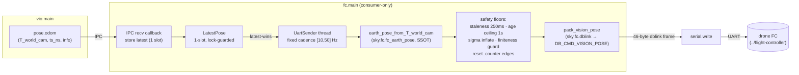

# `fc/` — UART output to the drone flight controller (dblink)

A consumer-only sibling project (`imu_camera`, `depth`, `vio`, `ba`, `slam`, `ui`,
`netbridge`, `fc`), built by replicating the **proven `imu_camera` / `vio` / `slam`
template**. `fc` subscribes to the VIO process over IPC, converts each pose to the
flight controller's **NED earth frame** via the shared SSOT, and streams it to the
in-house drone FC (sibling repo `../flight-controller`) over its UART using the FC's
own **dblink** wire protocol — **not MAVLink**.

```
imu_camera.main ─(oak.capture)─▶ vio.main ─(oak.vio)─▶ fc.main ──(UART /dev/ttyAMA0)──▶ drone FC
   capture proc      IPC          VIO proc     IPC      FC sender      dblink
```

It is the **flight-safety output seam**, so the safety floors below are
non-negotiable. `fc` is a pure **sink**: it opens **no IPC server**, allocates no
rings, and **publishes nothing** — it is the 8th vendored-comms copy purely so it
can be an IPC *client* of the VIO endpoint. Default **OFF**: with no `--fc` flag the
process is never spawned (`gap = 0`, the rest of the stack unchanged).

## Layers

| File | Role |
|------|------|
| `fc/comms/` | the **FROZEN** vendored comms contract (8th copy, byte-identical to `imu_camera/comms`) — used only as an IPC *client* |
| `fc/main.py` | the FC process: latest-wins UART sender thread off the IPC callback, the safety floors, `reset_counter`, the device→host clock-offset estimator behind `age_us`, and `run_fc` |
| `sky/fc/dblink.py` | the pure, leaf dblink packer (`build_db_frame`, `pack_vision_pose`); stdlib `struct` only |
| `sky/fc/fc_earth_pose.py` | the pure, stateless **SSOT** pose→NED+quaternion conversion, **shared with the UI** (`ui/main.py`) so they can never drift |

The conversion math (`sky/fc/fc_earth_pose.py`) and the wire packer
(`sky/fc/dblink.py`) are both `sky.*` **leaves** (numpy / stdlib `struct` only, no
time / I/O / counters / comms) — trivially testable and on the `libsky*` port
boundary. All the *stateful* concerns (serial I/O, staleness, `reset_counter`,
clock-offset, `age_us`) live in `fc/main.py`, the consumer.

## Wire contract — dblink `DB_CMD_VISION_POSE`

Carried **verbatim** from the FC's own `build_db_frame`
(`../flight-controller/tools/dblink_test.py`). Every dblink frame is:

```
'd' 'b' | CMD(1B) | CLASS(1B, =0x00) | LEN(2B LE) | payload | checksum(2B LE)
```

| Field | Bytes | Value |
|-------|-------|-------|
| magic | 2 | `'d' 'b'` (`DB_MAGIC`) |
| CMD | 1 | `DB_CMD_VISION_POSE = 0x0C` — the FC routes purely on this byte (`data[0]`) |
| CLASS | 1 | `0x00` (`DB_CLASS`, fixed for host→FC commands) |
| LEN | 2 (LE) | payload byte count = **38** |
| payload | 38 | the vision pose (below) |
| checksum | 2 (LE) | `(cmd + class + len_lo + len_hi + sum(payload)) & 0xFFFF` |

Full vision-pose frame on the wire = **46 bytes** (6 header + 38 payload + 2
checksum).

> **The FC does NOT verify the dblink checksum for vision frames** — it routes on
> the CMD byte and parses the payload (it CRC-checks only UBX). We still emit the
> correct checksum so the link is byte-clean and a future FC-side validator (or the
> `parse_db_stream` test) accepts it. **Only well-formedness matters on the wire.**

### Vision-pose payload (38 bytes, little-endian `struct '<8fIBB'`)

| off | field | type | meaning / units |
|-----|-------|------|-----------------|
| 0 | `pos_n` | f32 | NED **North** position, metres |
| 4 | `pos_e` | f32 | NED **East** position, metres |
| 8 | `pos_d` | f32 | NED **Down** position, metres |
| 12 | `q_w` | f32 | attitude quaternion (body→NED), Hamilton, **w-first**, unit-norm |
| 16 | `q_x` | f32 | |
| 20 | `q_y` | f32 | |
| 24 | `q_z` | f32 | |
| 28 | `pos_sigma_m` | f32 | 1-σ position noise, metres — the FC uses it as **√R** |
| 32 | `age_us` | u32 | measurement age, microseconds (capture → send elapsed) |
| 36 | `reset_counter` | u8 | bumped on a pose discontinuity (re-lock / jump) — wraps mod-256 |
| 37 | `flags` | u8 | bit0 `pos_valid`, bit1 `att_valid`, bit2 `degraded` |

The pose carries the **full attitude quaternion**, not a heading scalar: the FC
extracts heading (and roll/pitch) from it itself, which is **gimbal-lock-free** (a
scalar yaw is undefined near pitch = ±90°). Heading is still **RELATIVE** — there is
no magnetometer, so the optical world's gravity-aligned X axis defines "North" (the
heading at VIO init). That is the quaternion's reference frame, not a property of the
encoding.

`sky/fc/dblink.py` is **authoritative about wire well-formedness** and is a *total*
function — it can never raise and can never put a poisoned value on the wire,
regardless of the caller:

- **Floats** pass through `_safe_f32`: a non-finite (NaN/±inf) field becomes a finite
  sentinel (pos/quat → 0.0; `pos_sigma_m` → a large `_SIGMA_UNKNOWN = 1e4` so the FC
  down-weights to ~zero gain), and a magnitude beyond the f32 range (the codebase's
  known exploding poses at ~1e300) saturates to ±`_F32_MAX` so `struct '<f'` can never
  `OverflowError`. This leaf-level NaN/inf scrub is a **last-resort backstop**; the
  caller (`fc.main`) is expected to detect a non-finite pose *first* and advertise the
  frame INVALID (see below).
- **`age_us`** saturates (clamps) to `[0, 2³²−1]`.
- **`reset_counter` / `flags`** are masked to `[0, 255]` (`& 0xFF`) — by design a
  **wrap**, not a clamp (a free-running counter and a bitfield).

## The "Level 1 / age" time model

The wire carries `age_us` (a **duration** — capture→send elapsed), **not** an
absolute timestamp. Because it is a duration, the FC anchors it to its **own** clock
and the module's absolute clock never has to be synchronised with the FC's:

```
validity_at_fc = fc_rx_time − age − C
```

The capture instant is `pose.ts_ns` (the **device** / camera clock). `fc.main`
recovers the device→host offset `O` on the UART thread as a running **minimum** of
`(recv_host_s − ts_device_s)`, with a slow upward relaxation
(`_OFFSET_RELAX_PER_S ≈ 1e-4`/s so a drifting device clock can't pin the estimate
low forever) and an outlier reject (a candidate > 0.5 s below the running-min is a
corrupt / future `ts_ns` and is excluded so one bad sample can't latch `O_est` low).
It then reports `age = send_host_s − (ts_device_s + O_est)`, floored at 0.

**Honest property (read before tuning `C` on the FC):** because the running-min
`O_est = O + min(capture→fc pipeline latency)`, the reported `age` is biased
**YOUNGER** than the true capture→send age by ≈ that minimum pipeline-latency floor.
That floor is **not** sub-millisecond — it includes the VIO compute floor (tens of
ms), the IPC hop, and the sender's queue wait. So `age` conveys only the **variable**
latency *above* the floor; the only hard guarantees are `age ≥ 0` and this constant
under-report. **The FC's constant `C` must therefore absorb the floor:**

```
C = UART_transport + pipeline_latency_floor      (NOT just the ~4 ms UART transport)
```

With `C` calibrated that way, `fc_rx_time − age − C` lands on the true capture
instant. (Fallback: if `ts_ns` is unset (0; the loose path shouldn't hit this live)
the age falls back to the queue age `send − recv` only. A future "Level 2" — once
`imu_camera` stamps a host capture time — makes `age` the full absolute capture→send
age and reduces `C` to UART transport only.)

## Safety floors (from the very first send)

All of these live in `fc/main.py` and are active from send #1:

- **Latest-wins, UART OFF the IPC callback.** The IPC recv callback does ONE thing —
  store `(wire_pose, recv_monotonic)` in a 1-slot lock-guarded holder (`LatestPose`),
  then return. It NEVER touches the serial port. A dedicated daemon thread
  (`UartSender`) loops at a fixed cadence and does the convert+pack+write on the
  freshest stored pose. So a slow / blocked UART can **never back-pressure the flight
  pipeline** and a write error / stale pose never crashes the run.
- **Queue staleness** — a stored pose older than `_STALE_S` (**250 ms**) is treated
  as stale and **not sent** (never fuse a stale fix as fresh; matches the
  `propagate_imu` sensor-gap guard).
- **Capture-age ceiling** — a frame whose measured capture age exceeds `_AGE_CEIL_US`
  (**1 s**) is dropped. Defence-in-depth *distinct* from the 250 ms queue-staleness
  gate (which bounds queue wait — a different quantity).
- **Non-fatal on serial error** — a `serial.Serial` open failure makes `fc` log +
  exit non-zero (the launcher treats that as non-fatal, like a failed `--forward`);
  any pack/write error inside the loop is logged + swallowed and the UART thread
  NEVER terminates on an exception.
- **Non-finite / degraded pose → advertised INVALID.** This stack genuinely produces
  exploding / NaN poses (`--tight` on shake, `--direct` divergence). A non-finite
  position/quaternion goes out as an explicitly INVALID, degraded frame: the broken
  field is zeroed / identity-ed, the validity bit (`pos_valid` / `att_valid`) is
  **cleared**, `degraded` is **set**, and the sigma is forced to `_SIGMA_DEGRADED =
  100 m` (FC gain → 0) — **never NaN/inf on the wire**. The dblink leaf is the second
  line of defence, but the **flags** are what tell the FC not to fuse it, so they are
  set in `fc.main`.
- **`reset_counter`** (owned in `fc/`, a plain int on the UART thread) bumps on **two
  re-anchor signals**, each debounced to one bump per event:
  1. the **rising edge of a sensor-gap re-lock** (`sensor_gap_s` present this frame
     but not last — a camera/IMU dropout just ended), and
  2. an **fc-local position JUMP** — a single-frame NED position delta exceeding
     `max(_JUMP_SIGMA_K · pos_sigma_m, _JUMP_FLOOR_M)` (`_JUMP_SIGMA_K = 5`,
     `_JUMP_FLOOR_M = 0.5 m`), suppressed when a gap edge already fired this frame.

  It is **NOT** keyed off `loop.correction` — that is tight-only and blended, invisible
  on the loose / `--direct` default path. A bump tells the FC ESKF to **reset its
  origin** instead of fusing the discontinuity.
- **`flags`** — bit0 `pos_valid` (the solve's `info["ok"]`), bit1 `att_valid` (the
  quaternion is valid once tracking), bit2 `degraded` (`vio_degraded` /
  `sensor_gap_s` / `inertial_dr`). The FC gates fusion on these.

### `pos_sigma_m` is `--direct`-only — usable FC position needs `--direct`

`fc.main` (`_sigma_for`) sends the real `info["pos_sigma_m"]` **only on a clean frame
that carries it**; otherwise (`info` missing, `pos_sigma_m` absent, `vio_degraded`,
or a `sensor_gap_s` re-lock marker) it **inflates** the sigma to `_SIGMA_DEGRADED =
100 m` so the FC down-weights the fix to ~zero gain — and **never** hands the FC an
over-confident sigma.

> **IMPORTANT.** `pos_sigma_m` is populated **only on the `--direct` path**
> (`wm.info["pos_sigma_m"]`, σ ∝ Z/√N). On the **loose default** path the field is
> **absent**, so `fc` sends the inflated 100 m sigma every frame and the FC
> effectively **ignores VIO position**. A usable FC *position* fix requires the
> `--direct` recipe. (The attitude quaternion is sent regardless.)

> **SAFETY ASSUMPTION (cross-checked with the FC EKF).** The down-weighting defence
> assumes the FC consumes `pos_sigma_m` as √R with **no internal floor that
> re-trusts a large sigma** — a bigger sigma must monotonically *reduce* the Kalman
> gain toward zero. If the FC ever floored R, this defence is void.

## Data flow



The SSOT (`earth_pose_from_T_world_cam`) maps the gravity-aligned **optical** world
`T_world_cam` (camera OpenCV axes: X=right, Y=down, Z=forward) to NED
(X=North, Y=East, Z=Down) and the FRD-body attitude quaternion. The optional
`R_body_cam` mount extrinsic (`--fc-mount`) is the **extra physical mount tilt**
relative to the nominal forward-facing mount; it defaults to identity (a
forward-facing camera needs no config). **The same SSOT drives the UI viewer**, so
the two paths can never disagree.

## Run

Default OFF. Add `--fc PORT[:BAUD]` to the launcher (the optional `:BAUD` suffix is
recognised only when the text after the last colon is all digits; default baud
**115200**):

```bash
# Full FC recipe on the Pi: ToF + direct VO (for usable pos_sigma_m) + FC UART out.
./run.sh --vl53l9cx --direct --fc /dev/ttyAMA0

# explicit baud + non-default cadence + a pitched-down mount extrinsic:
./run.sh --vl53l9cx --direct --fc /dev/ttyUSB0:921600 --fc-rate 50 \
         --fc-mount 1,0,0,0,0.94,-0.34,0,0.34,0.94
```

| Launcher flag | Effect |
|---|---|
| `--fc PORT[:BAUD]` | spawn `fc.main` on the serial PORT writing dblink `DB_CMD_VISION_POSE` frames. Additive + **non-fatal**: a bad / missing port makes `fc` log + exit without taking the stack down. Spawned **after** `slam`. |
| `--fc-rate HZ` | UART send cadence, Hz — **clamped `[10, 50]`** by `fc.main` (`0` = the default 30 Hz). Below 10 the FC fusion starves; above 50 a 115200-baud link (~one 46-byte frame per ~4 ms) can't keep up. |
| `--fc-mount R11,..,R33` | the `R_body_cam` mount extrinsic: 9 comma-separated row-major values (OpenCV-camera body → FRD airframe body, relative to the nominal forward mount). Default = identity. |

`fc.main` can also run standalone for SIL / bench:

```bash
python -m fc.main --vio-endpoint oak.vio --port /dev/ttyAMA0
python -m fc.main --port /dev/ttyUSB0 --baud 921600 --rate 50
```

It barriers on VIO's retained `calib.bundle` (proves VIO is up — `fc` doesn't need
the intrinsics themselves, it only sends pose), then subscribes `pose.odom`. Same
SIGTERM / SIGINT / `os._exit` lifecycle as the template.

## Open items

- **The FC-side receiver + EKF fusion does NOT exist yet.** A matching dblink vision
  receiver and the EKF wiring are separate work in `../flight-controller` (the FC
  owns that). Today this link only *transmits*; nothing fuses it.
- **Finalize `DB_CMD_VISION_POSE`.** `0x0C` is proposed here — the FC header owns the
  final value; keep `sky/fc/dblink.py:DB_CMD_VISION_POSE` in sync with it.
- **HIL on the Pi is pending.** Bench/SIL-verified; not yet flown on real hardware.
