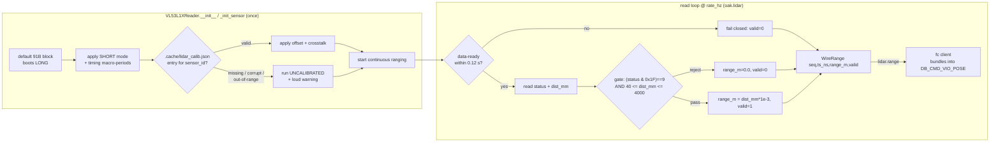

# `lidar/` — downward rangefinder (VL53L1X over I2C → `lidar.range`)

A standalone, independently-runnable sibling project (`imu_camera`, `depth`, `vio`,
`ba`, `slam`, `ui`, `netbridge`, `fc`, `lidar`). It reads a **downward-facing
VL53L1X** time-of-flight rangefinder (a **bare VL53L1X breakout**) over **I2C** via a
**pure-`smbus2` register-level driver** and publishes each gated reading on the
`lidar.range` IPC topic, served on its own `oak.lidar` endpoint.

The range is **not** a separate flight-controller channel: the [`fc`](../fc/) UART
sender opens a read-only client on `oak.lidar`, keeps the freshest reading, and
**bundles** `range_m` (+ its validity) into the dblink VIO-pose frame (`sky.fc.dblink
pack_vio_pose`: the trailing `range_m` @ offset 38 + the `VIO_FLAG_RANGE_VALID` =
`0x08` flag bit). See [`fc/README.md` → Bundled downward range](../fc/README.md#bundled-downward-range-vl53l1x).



`lidar` is a **pure producer**: unlike `depth` / `vio` / `slam` it subscribes to
**nothing** — no capture dependency, no calib barrier, no shared-memory rings. It just
opens the sensor and publishes. So a missing / down / `--no-lidar` lidar process simply
means `fc` never sees a range (it sends `range_valid=0`); the VIO send is unaffected.

## Layers

| File | Role |
|------|------|
| `lidar/comms/` | the **FROZEN** vendored comms contract (byte-identical to the other copies); `lidar` consumes only its server API |
| `lidar/io/vl53l1x_reader.py` | the swappable I2C reader: `VL53L1XReader` (a bare VL53L1X driven register-level with `smbus2` only) + `MockRangeReader` (hardware-free, for host tests); the pure `gate_reading` validity rule |
| `lidar/main.py` | the standalone process: read loop → publish `WireRange` on `lidar.range` (a non-blocking `IPCPubSub` server) |
| `lidar/tools/characterize.py` | I2C bench tool: stream dist + `range_status` + signal and, on the ground, print the recommended FC `disarm_range` |
| `lidar/tests/lidar_mock_selftest.py` | mock-sensor read → gate → publish selftest (no I2C) |

`cv2-free`: the only third-party dep is `smbus2` (pure-Python, installs cleanly on the
Pi5 aarch64/py3.13 with no build) — it **is** the whole VL53L1X driver, talking the
chip's register map directly. Nothing here imports OpenCV, so the lean Pi flight image
(`requirements-flight.txt`) stays clean.

## Hardware / wiring

| Item | Value |
|------|-------|
| Sensor | bare VL53L1X breakout, downward-facing, AGL rangefinder |
| Driver | pure-`smbus2` register-level (`VL53L1XReader`): writes the 91-byte ST/Adafruit default config block at init (which boots LONG), applies SHORT mode + timing, applies the stored calibration (if any), then reads `RESULT__RANGE_STATUS` + distance directly. Verified on-device (model id `EA CC 10`, status `0x09`, live distance) |
| Bus | **I2C** — Pi `/dev/i2c-1` (the 40-pin header bus; `DEFAULT_I2C_BUS = 1`) |
| Address | **`0x29`** (the VL53L1X default 7-bit address; `DEFAULT_I2C_ADDRESS = 0x29`) |
| Pi pins | **pin 3 (SDA1 / GPIO2)** → sensor SDA, **pin 5 (SCL1 / GPIO3)** → sensor SCL, **3V3** (pin 1) → VIN, **GND** (pin 6/9) → GND |
| Distance mode | **SHORT** (`DIST_MODE_SHORT = 1`, the `VL53L1XReader` default; `main.py` + `characterize.py` both construct with it). Range up to ~1.3 m — correct for a 0–1.3 m downward sensor; best ambient-light immunity + tightest near-floor accuracy. The 91-byte default block boots LONG, so `_apply_mode_timing` writes the SHORT vcsel/phase block (`_SHORT_MODE_WRITES`, incl. **`0x004B = 0x14`** = `PHASECAL_CONFIG__TIMEOUT_MACROP`) **then** the SHORT timing macro-period pair (mandatory — the LONG defaults are invalid in SHORT). |
| Timing budget | 50 ms inter-measurement (`DEFAULT_TIMING_BUDGET_US = 50_000`) → continuous ranging at ~20 Hz. Selects the SHORT macro-period pair `_MACROP[(SHORT, 50_000)] = (0x01AE, 0x01E8)` (33 ms = `(0x00D6, 0x006E)` is also supported). **The SHORT timing constants are MEDIUM-confidence → bench-verified** (cadence read-back, [`BENCH_CALIBRATION.md`](BENCH_CALIBRATION.md) §2). |
| Calibration | per-sensor **offset + crosstalk**, persisted by `lidar_calib_store` in `.cache/lidar_calib.json`, keyed by `--sensor-id`, applied at init. See [Calibration](#calibration-offset--crosstalk) + [`BENCH_CALIBRATION.md`](BENCH_CALIBRATION.md). |

> ℹ️ **Wiring is overridable.** The bare VL53L1X answers at its factory address `0x29`
> (verified on-device); the reader is behind a tiny `RangeReader` interface, so override
> the bus/address with `--i2c-address` / `--i2c-bus` (or the launcher's
> `--lidar-i2c-address` / `--lidar-i2c-bus`) if you re-strap it. Enable the Pi's I2C bus
> first (`raspi-config` → Interface → I2C) and confirm the device responds:
> `i2cdetect -y 1` should show `0x29`.

## The validity gate (`range_status` + distance band)

`gate_reading(dist_mm, range_status)` is a pure function (unit-testable in isolation):

```
valid = ((range_status & 0x1F) == 0x09) AND (LIDAR_MIN_MM <= dist_mm <= LIDAR_MAX_MM)
        # RANGE_STATUS_MASK = 0x1F,  RANGE_STATUS_OK = 0x09  (device code 9)
        # LIDAR_MIN_MM = 40,  LIDAR_MAX_MM = 4000  (millimetres)
```

**Mask first, then accept ONLY device code 9.** `RESULT__RANGE_STATUS` (reg `0x0089`)
carries the device range-status code in **bits 4..0**; **bits 7..5 are unrelated flags**
the ST ULD strips with `& 0x1F` before comparing. The prior gate compared the **raw**
byte (`== 0x09`), so whenever a high bit happened to be set a perfectly valid frame was
rejected nondeterministically — this dropped the bulk of the readings (the user's
**~38% valid** baseline). Masking recovers them (**> 90%** on a real matte surface;
proven on hardware in [`BENCH_CALIBRATION.md`](BENCH_CALIBRATION.md) §3).

Only the masked code **9** (a completed range) passes. **Code 8 (`MIN_RANGE_CLIPPED`) is
rejected** — a near-floor clipped reading must **not** pass as a valid height. Any other
masked code (sigma fail, signal fail, wrap-around, …) also rejects. The distance band
additionally rejects below the floor / above trusted range **even when** the masked
status is 9. The chip reports **millimetres**; the published / wire value is **metres**
(`range_m`). On any reject, `range_m` is forced to `0.0`.

### `LIDAR_MIN_MM = 40` — the 4 cm hardware floor

`LIDAR_MIN_MM = 40` is the VL53L1X **minimum ranging distance (4 cm, ST datasheet)**.
**Ranges below 4 cm read invalid by sensor physics** — below the optical floor the chip
still detects but is inaccurate and admits crosstalk garbage, so the gate drops it. This
is **not** a bug: the operating standoff must be **≥ 40 mm**. Mount the sensor so that,
with the gear on the ground, the cover-glass-to-ground distance is ≥ 40 mm (≥ 50 mm for
margin); a 3 cm standoff reads `valid=0` at rest, by physics. The previous floor (30 mm)
admitted sub-floor crosstalk garbage. The FC owns the flight-relevant ground/disarm
thresholds; this is only the sensor sanity band.

> ℹ️ **The status gate reads the raw register; the mask is in the gate.**
> `VL53L1XReader.read()` reads `RESULT__RANGE_STATUS` (reg `0x0089`) directly over
> `smbus2` and passes the **raw** byte to `gate_reading`, which applies `& 0x1F` then
> compares to `RANGE_STATUS_OK = 0x09`. There is no driver-accessor dependency, and the
> status gate always applies (it never degrades to distance-band-only). The register map
> is confirmed present on-device (model id `EA CC 10`).

`WireRange` (the `lidar.range` POD) carries `{ seq, ts_ns, range_m, valid }` — `seq`
is a monotone reading counter (drop detection), `ts_ns` is the host `monotonic_ns`
capture instant the `fc` side uses for its freshness gate, `range_m` is metres,
`valid` is `0/1` (kept an int so it maps 1:1 onto the FC's `range_valid` flag).

## Calibration (offset + crosstalk)

Each physical sensor has its own **part-to-part range offset** (near-range bias) and
**crosstalk** (the reflection off the cover glass / window in front of it). These are
solved on the bench and persisted, so the live reader auto-applies them at init.

- **Persistence** — `lidar/io/lidar_calib_store.py` writes `.cache/lidar_calib.json`
  (gitignored, repo root), **keyed by `--sensor-id`** so several rangefinders never
  clobber each other. One entry per sensor: `{ xtalk, offset_mm, distance_mode, min_mm,
  timing_budget_us, n, ts }`. `xtalk` is the **raw uint16** the ULD `CalibrateXtalk`
  formula returns (stored unscaled); the reader scales it to the plane-offset register on
  apply (`(xtalk_raw << 9) // 1000`). Atomic write (`tmp.replace`) — never a half-written
  cache.
- **Load + apply at init** — `_init_sensor` calls `_apply_calibration` after setting the
  mode/timing and before starting continuous ranging. When an entry is present: offset
  first (ST order, written to `ALGO__PART_TO_PART_RANGE_OFFSET_MM` as signed `mm × 4`),
  then crosstalk (X/Y plane gradients zeroed, plane offset written). It logs
  `applied calibration sensor_id=… (offset=…mm, xtalk_raw=…)`.
- **Never refuses to range** — a **missing / corrupt / out-of-range** entry, or a
  `sensor_id` with no entry, logs a **loud warning** and runs **UNCALIBRATED**. An honest
  valid reading is safe (the FC gates on `valid`), so the reader never refuses to range
  over a bad cache. Magnitude guards in `lidar_calib_store.load` bound a corrupt cache and
  reject the **whole** entry: `|offset_mm| ≤ 2000` (a larger offset would overflow the
  int16 `mm × 4` pack and inject a huge constant height bias) and `xtalk` ∈ `[0, 0xFFFF]`.
  Type checks reject non-int / `bool` fields.

The **bench procedure** (operator-run, real sensor) lives in
[`BENCH_CALIBRATION.md`](BENCH_CALIBRATION.md): **offset @ 140 mm** against a 17% grey
card (run first, ST order), then **crosstalk @ 600 mm in the dark** with the **flight
cover glass mounted** (crosstalk is the cover-glass reflection — calibrate it bare and it
is a near-no-op, then invalidated by the cover you add afterward). Drive it with
`characterize --calibrate --sensor-id <id>` (see below); use the **same `--sensor-id`**
at flight time or the reader silently runs uncalibrated.

## Run

```bash
# Standalone, on the Pi (serves lidar.range on oak.lidar @ 50 Hz):
python -m lidar.main --endpoint oak.lidar --rate 50

# Deviceless dry-run / host smoke (the hardware-free MOCK reader, no I2C bus):
python -m lidar.main --mock

# Apply a calibrated sensor's stored cal, override the wiring if re-strapped:
python -m lidar.main --sensor-id dn0 --i2c-bus 1 --i2c-address 0x29
```

| Flag | Effect |
|------|--------|
| `--endpoint EP` | this process's IPC endpoint (default `oak.lidar`) |
| `--rate HZ` | I2C read + publish cadence, **clamped `[1, 100]`** (default 50). The VL53L1X short-mode budget is ~20 ms, so ~50 Hz is the practical ceiling. |
| `--i2c-bus N` | Linux I2C bus number (default 1 → `/dev/i2c-1`) |
| `--i2c-address A` | VL53L1X 7-bit I2C address (default `0x29`; accepts `0x..`) |
| `--sensor-id ID` | sensor id whose stored calibration the reader loads + applies from `.cache/lidar_calib.json` (default `'default'`). Use the **same** id you calibrated under, else it runs uncalibrated. |
| `--mock` | use the hardware-free MOCK reader (host dry-run / smoke, **not** flight) |
| `--max-reads N` | stop after publishing N readings (0 = run forever) |

The lidar process is **non-fatal**: a real-reader open failure is logged and the
process exits non-zero (the launcher does **not** take the pipeline down — `fc` just
keeps sending `range_valid=0`). `read()` **never raises** and **fails closed** to a
`valid=0` sample on either fault:

- **I2C error** (any exception while reading the result registers) → `valid=0`, so a
  flaky sensor cannot crash the flight loop.
- **Data-ready timeout** — if no fresh frame arrives within `_READ_READY_TIMEOUT_S =
  0.12 s`, `read()` returns an **invalid** sample instead of reading the result
  registers. Reading them anyway would return the **previous** frame's distance with a
  stale-but-OK status — a stuck-but-"valid" height the FC's trust gate could not catch.
  An invalid sample (`range_m 0`, `valid=0`) **is** catchable.

(The bench calibration loops use `_wait_data_ready`, which **raises** on timeout instead
— a calibration fault must be operator-visible, never silently averaged over stale
frames.)

### In the live pipeline (launcher)

The launcher spawns `lidar` **after `slam`, before `fc`** (so its endpoint is up when
`fc` opens its read-only client), and auto-wires `fc --lidar-endpoint`. `--no-lidar` is
a spawn gate (mirror of `--no-slam` / `--no-ba`):

```bash
# Pi flight with the rangefinder bundled into the FC link:
./run.sh --no-ui --fc /dev/ttyAMA0 --width 320 --height 200 --no-ba --no-slam

# Same rig with NO rangefinder (fc sends range_valid=0):
./run.sh --no-ui --fc /dev/ttyAMA0 --no-ba --no-slam --no-lidar

# Deviceless integration dry-run (mock lidar through the whole launcher):
./run.sh --no-ui --fc /dev/ttyUSB0 --no-ba --no-slam --lidar-mock
```

| Launcher flag | Effect |
|---|---|
| `--no-lidar` | don't spawn `lidar`; `fc` is not given `--lidar-endpoint` → the dblink VIO-pose frame carries `range_valid=0`. Use on a rig with no rangefinder. |
| `--lidar-rate HZ` | lidar I2C read + publish cadence (clamped `[1,100]` by `lidar.main`; `0` = the default 50 Hz). |
| `--lidar-i2c-bus N` | lidar Linux I2C bus number (default `lidar.main`'s `1`). |
| `--lidar-i2c-address A` | lidar VL53L1X 7-bit I2C address (default `0x29`, the bare breakout's factory address; override only if re-strapped). |
| `--lidar-mock` | run `lidar` with the hardware-free MOCK reader (no I2C) — for a deviceless integration dry-run. |

## Characterize → FC `disarm_range`

The FC arms / disarms partly on the downward range (it must know "this is the ground"
to refuse a takeoff or cut at touchdown). The ground floor is a property of **this**
rig (sensor mounting height above the skids, the sensor's near bias), so it is
**measured, not guessed**. Run on the Pi with the rig sat **on the ground**:

```bash
python -m lidar.tools.characterize --seconds 5
python -m lidar.tools.characterize --mock        # no hardware (output-format demo)
```

It streams each reading's raw fields (distance, `range_status`, signal), accumulates
the **valid** ground readings, and prints:

```
  >>> recommended FC disarm_range = <floor + margin> m  (ground floor <median> + margin <m>)
```

The floor is the **median** of the valid readings (robust to the odd spurious sample);
the margin (default **0.10 m**, `--margin`) is generous so sensor noise + a slightly
uneven floor never reads as "airborne" while sat on the ground. Set the printed value
on the FC (`PARAM_ID_DISARM_RANGE`) so it treats `≤ disarm_range` as "on the ground".

> **Note (FC default is unsatisfiable):** because a valid reading is always ≥ 40 mm (the
> 4 cm floor) and the FC compares with a strict `<`, the FC's default `disarm_range` of
> 10 mm can **never** fire the touchdown auto-disarm. Set `PARAM_ID_DISARM_RANGE` to the
> printed value (≈ ground floor + margin, typically ~60–80 mm). RC-disarm and angle-disarm
> are range-independent, so the vehicle is never stuck armed regardless.

### `--calibrate` — bench offset + crosstalk solve

`characterize --calibrate --sensor-id <id>` runs the bench **offset-then-crosstalk**
routine (ST order) and **persists** the solve to `.cache/lidar_calib.json` under that id,
so the live reader auto-applies it. It is a thin orchestrator — it prompts the operator,
calls the reader's `calibrate_offset` / `calibrate_xtalk` (the register dance lives in
the reader), then saves. It needs a **real sensor** (`--mock` is rejected for
`--calibrate`).

```bash
python -m lidar.tools.characterize --calibrate --sensor-id dn0
#  [1/2] OFFSET: 17% grey target flat @ 140 mm, press Enter
#  [2/2] XTALK:  17% grey target @ ~600 mm IN THE DARK (cover glass mounted), press Enter
```

Full bench protocol, targets, and PASS/FAIL criteria: [`BENCH_CALIBRATION.md`](BENCH_CALIBRATION.md).

## Self-test

```bash
.venv/bin/python -m lidar.tests.lidar_mock_selftest
```

Exercises the read → gate → publish path with **no I2C hardware**: (a) the pure
`gate_reading` rule (both reject paths — a non-zero `range_status`; an out-of-band
distance — yield `valid=0`); (b) `MockRangeReader` producing `RangeSample`s with
`range_m` in metres (0.0 on reject) and the status carried through; (c)
`run_lidar(mock=True)` publishing `WireRange` on a real IPC server, a client receiving
both valid + invalid readings round-tripping the exact contract the `fc` sender
consumes.

The bare VL53L1X + `smbus2` register driver is **verified on-device** (model id
`EA CC 10`, `RESULT__RANGE_STATUS = 0x09`, live distance) and the host SIL suite
(`lidar/tests/lidar_mock_selftest.py`) proves the software logic: the masked gate, the
calibration-store guards, offset/xtalk packing, the fail-closed read, and the bench-routine
guards. The remaining checks need real hardware and are the operator's — the full bench
HIL + calibration protocol is **[`BENCH_CALIBRATION.md`](BENCH_CALIBRATION.md)**:

- **SHORT-mode cadence read-back** — confirm the MEDIUM-confidence SHORT macro-period
  constants + `0x004B = 0x14` produce the expected ~20 Hz frame rate (§2).
- **Mask-fix regression** — VALID% must jump from the ~38% baseline to **> 90%** on a real
  matte surface (§3).
- **Offset + crosstalk calibration** — offset @ 140 mm, then crosstalk @ 600 mm in the dark
  with the flight cover glass mounted; persist + confirm auto-apply on live start (§4–§5b).
- **Run `lidar.tools.characterize` on the ground** → set the FC `PARAM_ID_DISARM_RANGE`
  (§7).
- **End-to-end FC** — lidar → fc → dblink → `flight_state`: valid+fresh range permits
  takeoff, invalid/sub-40 mm holds, range-loss does not false-disarm (§8).
